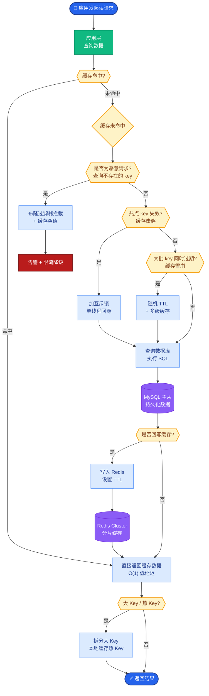

# AI 编程工具中如何控制 Token 成本?有哪些优化策略

**Token 成本控制** 是 AI 编程工具的核心工程问题，直接决定了产品的利润率和响应速度。

**成本来源分析:**
- 每次请求都携带大量上下文（System Prompt + 项目文件内容 + 对话历史）。
- Agent 模式下的多轮迭代（如 Test-Generate-Fix 循环），每轮都重复发送长上下文，导致指数级成本膨胀。
- 代码仓库索引和检索（Embedding + 向量搜索）也有持续的 Token 和算力成本。

**优化策略:**

**1. Prompt Caching (提示词缓存):**
- **原理**：利用 LLM 推理引擎的 KV Cache 机制，对于重复出现的 Prefix（如 System Prompt、工具定义、不变的文件头），仅计算一次并在后续请求中复用。
- **适用场景**：System Prompt、项目基础配置、未被修改的源码文件。
- **效果**：在长对话或多轮 Agent 循环中，可节省 50-90% 的重复计算成本（如 Anthropic, Claude 的 Caching 特性）。

**2. 上下文压缩:**
- **对话摘要**：对老旧的对话历史进行滚动摘要，保留关键决策和上下文信息，丢弃冗余的寒暄。
- **文件切片与过滤**：
  - 不发送整个文件，利用 AST（抽象语法树）仅提取相关类或函数。
  - 基于 Lineage（代码依赖关系）图，只发送被修改函数及其上游依赖。
- **工具返回截断**：当 Shell 执行结果或 Error Log 过长时，只提取头部和尾部关键信息。

**3. 模型分级:**
- **小模型**：用于格式化代码、简单的重命名、语法检查。利用 Llama-3-8B 或 Haiku 等低成本模型。
- **大模型**：用于架构设计、复杂 Bug 分析、逻辑生成。利用 GPT-4o 或 Claude 3.5 Sonnet。
- **Router 机制**：通过一个轻量级分类器判断任务难度，自动路由到最合适的模型层。

**4. 代码检索优化:**
- **精准检索**：通过 LSP（Language Server Protocol）获取当前光标位置的 Symbol 信息，结合关键词检索（BM25），只拉取相关的 5-10 个文件。
- **Glob/Grep 替代 RAG**：对于明确的文件名或类名搜索，直接使用文件系统工具，避免生成 Embedding 的开销（参考 Claude Code 策略）。
- **缓存机制**：对未变更文件的 Embedding 或检索结果进行本地缓存。

**实战案例:**
某代码助手在处理 "重构 Service 层" 任务时，最初将整个 `src/` 目录打包进 Prompt，导致单次请求成本超过 $0.5 且极易超时。后来引入 **AST 解析器**，只提取被修改函数及其直接上下游的代码片段（约 200 tokens），配合 Project Map（文件清单），成本降至 $0.01 以下，且准确率因噪音减少而提升。

**代码示例 (Python - AST 提取):**
```python
import ast

def extract_function_snippet(file_path, target_func_name):
    """仅提取目标函数的源码，减少 Token 消耗"""
    with open(file_path, 'r', encoding='utf-8') as f:
        source = f.read()
    
    tree = ast.parse(source)
    for node in ast.walk(tree):
        if isinstance(node, ast.FunctionDef) and node.name == target_func_name:
            # 获取函数的起止行号
            return ast.get_source_segment(source, node)
    return None

# 只发这个 snippet 进去，而不是整个文件
snippet = extract_function_snippet("user_service.py", "login")
```

**架构与成本控制流程图:**
```text
用户请求
   │
   ▼
┌─────────────┐    是否缓存?
│   Router    ├─────────┬──────────┐
└──────┬──────┘         │          │
       │               No         Yes
       ▼               │          │
  ┌─────────┐           │          ▼
  │ 模型分级 │           │    ┌──────────┐
  │ (大小模型)│           │    │ Prompt   │
  └────┬────┘           │    │ Caching  │
       │                │    └────┬─────┘
       ▼                │          │
  ┌─────────┐           │          ▼
  │ 上下文  │◄──────────┴──────────┐
  │ 压缩策略│                      │
  └────┬────┘                      │
       │                           │
       ▼                           ▼
  ┌─────────┐              ┌────────────┐
  │ 精准检索 │              │   LLM      │
  │ (避免RAG)│              │  Inference │
  └─────────┘              └─────┬──────┘
```


## 核心流程图



## 记忆要点

- 成本来源：长上下文重复发送、Agent多轮迭代、代码索引检索。
- 核心策略：Prompt Caching(省50-90%)、上下文压缩(摘要/AST切片)、模型分级。
- 检索优化：LSP精准定位、Glob替代RAG(省Embedding成本)、缓存未变更文件。
- 实战技巧：只发被修改函数及其依赖的Snippet，而非整个文件。


## 结构化回答

**30 秒电梯演讲：** 通过缓存、压缩和分级策略降低推理Token消耗——打个比方，像寄快递一样：尽量复用包装、压缩体积、按距离选快递

**展开框架：**
1. **成本来源** — 长上下文重复发送、Agent多轮迭代、代码索引检索。
2. **核心策略** — Prompt Caching(省50-90%)、上下文压缩(摘要/AST切片)、模型分级。
3. **检索优化** — LSP精准定位、Glob替代RAG(省Embedding成本)、缓存未变更文件。

**收尾：** 以上三点都能配合实战聊。我可以展开任一要点，比如「如何量化每次编程任务的 Token 成本」这类追问您感兴趣吗？

## 视频脚本

> 预计时长：4 分钟 | 由浅入深

| 时间 | 画面/字幕 | 口播台词 | 讲解要点 |
|------|----------|----------|----------|
| 0:00 | 标题卡 | "AI 编程工具中如何控制 Token 成本，30 秒讲清楚。" | 开场钩子 |
| 0:40 | 概念定义动画 | "一句话：通过缓存、压缩和分级策略降低推理Token消耗" | 核心定义 |
| 1:20 | 成本来源图解 | "长上下文重复发送、Agent多轮迭代、代码索引检索。" | 成本来源 |
| 2:00 | 核心策略图解 | "Prompt Caching(省50-90%)、上下文压缩(摘要/AST切片)、模型分级。" | 核心策略 |
| 2:40 | 检索优化图解 | "LSP精准定位、Glob替代RAG(省Embedding成本)、缓存未变更文件。" | 检索优化 |
| 3:20 | 总结卡 | "记好这几条，面试不慌。下期见。" | 收尾 |

---

## 延伸：LLM应用的成本优化策略有哪些?Token级别如何精细化管理

> 合并自 `ai-h-028`（相似度 76%）

- **成本优化全景:**

- **1. 模型路由(省40-70%):**
  简单分类用 Flash/Haiku,复杂推理用 Sonnet/Opus.
  ```text
  ┌─────────┐      Complex?      ┌──────────────┐
  │  Query  │ ──────────────────>│ Large Model  │
  └─────────┘                     │ (GPT-4/Claude)│
      │ No                        └──────────────┘
      ▼
  ┌──────────────┐
  │ Small Model  │
  │ (GPT-3.5/Llama)│
  └──────────────┘
  ```

- **2. Prompt Caching(省50-80%系统prompt):**
  OpenAI/Anthropic 支持前缀缓存. 只要 System Prompt 不变，Token 仅在第一次调用计费，后续调用的 Cache Hit 读取成本极低。

- **3. 上下文压缩(省30-50%):**
  对话摘要替代完整历史,工具输出截断 (去除冗余的 HTML/JSON 字段)。

- **4. 批量推理(省50%):**
  OpenAI Batch API (24小时内返回),价格减半。适合非实时离线任务。

- **5. 结构化输出省Token:**
  JSON 比自然语言更紧凑,用 schema 约束输出长度。

- **6. 模型蒸馏:**
  用大模型生成训练数据,蒸馏到小模型 (如 GPT-4 -> Llama-3-8B)。

- **实战案例：** 在处理长文档总结任务时，通过 LlamaIndex 的 `ContextWindowAutoMerge` 优化，仅在节点相关时才加载完整 chunk，而非将所有 RAG 检索到的 20 个片段全部塞入 Prompt，使得单次调用 Token 数从 12k 降至 4k，成本降低 66% 且准确率未受影响。

- **关键代码示例 (语义缓存):**
```python
from datetime import timedelta
from langchain.globals import set_llm_cache
from langchain.cache import GPTCache
from gptcache import Cache
from gptcache.adapter.api import init_similar_cache

# 初始化基于向量相似度的缓存
init_similar_cache(
    cache_obj=Cache(),
    data_dir="./cache",
    similarity_threshold=0.9, # 相似度大于0.9则命中
    similarity_positive=False
)
set_llm_cache(GPTCache(cache_obj=cache))
```

- **优化策略对比：**

| 策略 | 适用场景 | 节省比例 | 实现难度 |
| :--- | :--- | :--- | :--- |
| **模型路由** | 任务难度差异大 | 40-70% | 中 (需路由模型) |
| **Prompt Caching** | 长System Prompt | 50-90% | 低 (API支持) |
| **语义缓存** | 高重复问题 | 80-99% | 中 (需维护向量库) |
| **微调/蒸馏** | 超高频调用 | >90% | 高 (需训练) |

- **成本监控:**
  每次调用记录 `cost = input_tokens * input_price + output_tokens * output_price`

- **## 常见考点**
1. Semantic Caching (语义缓存) 和 Exact Caching (精确缓存) 的区别？（语义缓存基于 Embedding 相似度，容忍度参数 `threshold` 设多少合适？）
2. 如何评估模型路由的准确性？（需要一个由“金标准大模型”预分类的测试集）
3. Batch API 的限制是什么？（50MB 请求体大小，24小时延迟，不支持流式输出）

- **## 易错点**
1. **Prompt Caching 的失效条件**：很多人误以为只要 System Prompt 不变就能永久缓存，但实际上如果在 System Prompt 之后插入了任何动态用户输入（哪怕是占位符），缓存指针就会中断。必须确保静态内容位于请求的最前面且未被动态内容打断。
2. **Output Token 的成本忽略**：往往只关注压缩 Prompt（Input Token），忽略了模型生成内容的长度控制。对于某些“话痨”模型，如果 Output Token 不加限制（如 `max_tokens`），其成本可能远超 Input。

- **## 面试追问**
1. 如果模型路由使用的“小模型”本身也有调用成本且响应慢，如何设计路由机制才能保证整体性价比和延迟是正收益的？
2. 在高并发场景下，语义缓存的向量数据库检索延迟可能成为瓶颈，你会如何优化这个环节（如使用近似搜索或分层缓存）？
3. OpenAI 等厂商的 Prompt Caching 有时间窗口限制，对于极低频的长 Prompt 任务，缓存失效后如何应对成本突增？

## 记忆要点

- 模型路由省40-70%：简单任务用小模型，复杂推理用大模型，按需分发。
- Prompt缓存省50-80%：System Prompt不变时复用，仅首次计费，需防动态内容打断。
- 上下文压缩与批处理：摘要替代历史、截断冗余输出，离线任务用Batch API降半价。
- Token管理：控制Output长度，用JSON约束格式，监控Input/Output成本公式。
- 语义缓存：基于向量相似度命中高重复问题，设置阈值(如0.9)平衡准确与召回。


## 结构化回答

**30 秒电梯演讲：** 通过模型分级、缓存与压缩降低Token消耗——打个比方，能用小电机不用大引擎，重复指令只说一次

**展开框架：**
1. **模型路由省40-** — 模型路由省40-70%：简单任务用小模型，复杂推理用大模型，按需分发。
2. **Prompt缓存** — Prompt缓存省50-80%：System Prompt不变时复用，仅首次计费，需防动态内容打断。
3. **上下文压缩与批处** — 上下文压缩与批处理：摘要替代历史、截断冗余输出，离线任务用Batch API降半价。

**收尾：** 以上三点都能配合实战聊。我可以展开任一要点，比如「Prompt Caching的命中率如何提升」这类追问您感兴趣吗？

## 视频脚本

> 预计时长：2 分钟 | 由浅入深

| 时间 | 画面/字幕 | 口播台词 | 讲解要点 |
|------|----------|----------|----------|
| 0:00 | 标题卡 | "LLM应用的成本优化策略有哪些，30 秒讲清楚。" | 开场钩子 |
| 0:30 | 概念定义动画 | "一句话：通过模型分级、缓存与压缩降低Token消耗" | 核心定义 |
| 1:00 | 模型路由省40-70%图解 | "简单任务用小模型，复杂推理用大模型，按需分发。" | 模型路由省40-70% |
| 1:30 | 总结卡 | "记好这几条，面试不慌。下期见。" | 收尾 |

---

## 延伸：如何控制 LLM 应用的 Token 成本?有哪些实用策略

> 合并自 `ai-h-060`（相似度 75%）

- **Token 成本控制策略**

1. **模型路由**:简单问题用小模型(GPT-3.5),复杂问题用大模型(GPT-4)
2. **语义缓存**:相同/相似的问题直接返回缓存结果
3. **上下文压缩**:长对话定期摘要,避免上下文膨胀
4. **Prompt 精简**:移除冗余指令,用更短的 system prompt
5. **批量处理**:Batch API(OpenAI 有 50% 折扣)
6. **流式输出**:提前终止不完整的回答
7. **Fine-tune 小模型**:微调 7B 替代 GPT-4 API

- **实战案例**：在一个客服问答场景中，我们发现每日 30% 的流量是重复的“发货时间查询”，引入语义缓存后，API 调用成本直接下降了 25%，且响应延迟从 500ms 降至 20ms。

- **对比表格：主流成本优化策略**
| 策略 | 适用场景 | 优势 | 风险 |
|------|---------|------|------|
| 模型路由 | 任务难度差异大 | 成本/质量平衡最优 | 路由判断本身有额外开销 |
| 语义缓存 | 高频重复问题 | 成本几乎为0，极速响应 | 时效性数据可能导致回答过时 |
| 上下文压缩 | 长对话应用 | 显著降低长文本消耗 | 摘要过程可能丢失细节 |

- **一句话理解**:80% 的请求可以用 20% 的成本覆盖--关键是做好模型路由和缓存。

- **语义缓存架构**
```
用户 Query
    │
    ▼
计算 Embedding
    │
    ▼
┌─────────────────────┐
│   向量数据库         │
│  ├─ Query Embedding │
│  └─ Answer Cache    │
└──────┬──────────────┘
       │
       ▼
  向量相似度搜索
    (Cosine > 0.95)
       │
   ┌───┴───┐
   ▼       ▼
Hit     Miss
   │       │
   ▼       ▼
返回   调用 LLM
缓存    (并写入缓存)
```

- **代码示例**：实现基于 Embedding 的简单缓存检查
```python
import numpy as np

def check_cache(query_embedding, cache_embeddings, threshold=0.95):
    # 计算余弦相似度
    similarities = np.dot(cache_embeddings, query_embedding) / \
                   (np.linalg.norm(cache_embeddings, axis=1) * np.linalg.norm(query_embedding))
    max_idx = np.argmax(similarities)
    if similarities[max_idx] >= threshold:
        return True, max_idx
    return False, None
```

- **边界情况补充**：
1. **缓存一致性**：当系统 Prompt 或知识库更新后，如何清除或更新旧的语义缓存（避免“知识过期”）。
2. **多模态输入**：当 Query 包含图片或文档时，Embedding 缓存策略失效，需退化为 Hash 缓存或不缓存。
3. **输入长度限制**：极端长的输入会导致 Embedding 计算成本过高，此时应跳过缓存检索直接调用模型。
4. **阈值敏感度**：对于问答类任务，相似度阈值需设高（>0.95）防止误命中；但对于创意生成类，阈值可适当放宽。

- **## 常见考点**
1. **模型路由策略**: 如何判断一个问题简单还是复杂？（可以使用小模型先打分，或者基于 Prompt 长度、关键词规则判断）
2. **缓存失效**: 如何处理 LLM 缓存的时效性问题？（设置 TTL，或者利用上下文摘要的 Hash 作为 Key）
3. **上下文窗口管理**: 当对话历史超过模型 Token 限制时，如何处理？（滑动窗口保留最近 N 条，或使用摘要技术压缩旧对话）

- ## 易错点
1. **盲目使用语义缓存**：用户名、ID 等高特异性关键词相似度极高但含义完全不同，必须设计 Deduplication Key（如用户ID+Query Hash）防止串号。
2. **忽略路由成本**：用 GPT-4 来判断路由本身就是一种巨大的成本浪费，应使用极轻量级的模型或规则引擎来做路由。

- ## 面试追问
1. 如果用户对缓存的答案不满意点了“踩”，你的系统如何实时处理并更新缓存策略？
2. 在低资源环境下，如何权衡“摘要压缩”带来的额外 Token 成本与它节省的上下文成本？
3. 批量处理 API 有哪些限制（如最长等待时间），在实时性要求高的场景下如何使用？

## 记忆要点

- 核心策略：模型路由（大小模型分流）和语义缓存（高频问题复用）是降本大头。
- 语义缓存：用向量相似度匹配，命中率可达 30%，需设阈值（>0.95）防误命中。
- 上下文压缩：长对话定期摘要，避免历史 Token 膨胀导致成本指数级上升。
- 批量处理：利用 Batch API 折扣，适合离线任务，但会增加延迟。
- 避坑指南：路由判断本身要轻量，别用 GPT-4 做路由，否则成本得不偿失。


## 结构化回答

**30 秒电梯演讲：** 通过路由、缓存和压缩等手段降低Token消耗——打个比方，能坐公交不开专车，能 reused 就不重新造

**展开框架：**
1. **核心策略** — 模型路由（大小模型分流）和语义缓存（高频问题复用）是降本大头。
2. **语义缓存** — 用向量相似度匹配，命中率可达 30%，需设阈值（>0.95）防误命中。
3. **上下文压缩** — 长对话定期摘要，避免历史 Token 膨胀导致成本指数级上升。

**收尾：** 以上三点都能配合实战聊。我可以展开任一要点，比如「语义缓存如何判断'相似'」这类追问您感兴趣吗？

## 视频脚本

> 预计时长：2 分钟 | 由浅入深

| 时间 | 画面/字幕 | 口播台词 | 讲解要点 |
|------|----------|----------|----------|
| 0:00 | 标题卡 | "控制 LLM 应用的 Token 成本，30 秒讲清楚。" | 开场钩子 |
| 0:30 | 概念定义动画 | "一句话：通过路由、缓存和压缩等手段降低Token消耗" | 核心定义 |
| 1:00 | 核心策略图解 | "模型路由（大小模型分流）和语义缓存（高频问题复用）是降本大头。" | 核心策略 |
| 1:30 | 总结卡 | "记好这几条，面试不慌。下期见。" | 收尾 |
