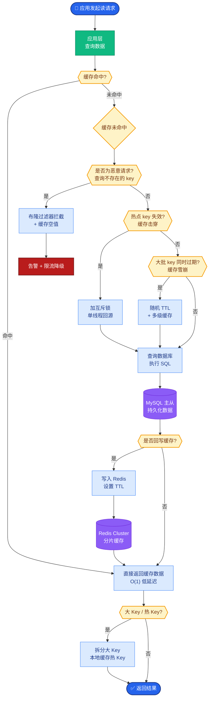

# 大模型部署有哪些主流框架?各自适合什么场景

- **主流推理框架对比**

| 框架 | 特点 | 适合场景 |
|------|------|--------|
| **vLLM** | PagedAttention, 高吞吐 | 生产服务, 高 QPS |
| **Ollama** | 一键部署, 简单易用 | 本地/个人使用 |
| **TGI** (HuggingFace) | 功能全面 | HuggingFace 生态 |
| **TensorRT-LLM** | NVIDIA 最优, 极致性能 | NVIDIA GPU 生产 |
| **SGLang** | 结构化生成, 快 | 复杂输出格式 |

- **实战案例:**
在部署 70B 参数模型时，使用 HuggingFace Transformers 原生推理并发量仅为 2 QPS 且显存爆满（占满 80GB）。切换到 **vLLM** 并启用 PagedAttention 后，通过调整 `gpu_memory_utilization=0.9`，QPS 提升至 20+，且支持 Continuous Batching，P99 延迟降低了 60%。

- **代码示例 (Bash - vLLM 启动):**
```bash
# 启动 vLLM 服务，开启 Tensor Parallelism
python -m vllm.entrypoints.openai.api_server \
    --model meta-llama/Llama-2-70b-chat-hf \
    --tensor-parallel-size 4 \
    --gpu-memory-utilization 0.95 \
    --max-model-len 4096 \
    --dtype half
```

- **选择建议**
- 个人/开发:Ollama
- 生产服务:vLLM(最佳综合性价比)
- NVIDIA 环境 + 极致性能:TensorRT-LLM
- 需要 GPU 调度:Ray Serve + vLLM

- **vLLM 内部核心工作流**
```
LLM Engine (vLLM)
    │
    ▼
┌─────────────────────────────────────────┐
│     Scheduler (调度器)                  │
│  - 管理 Block 表                        │
│  - 决定 Batch 中执行哪些 Sequence       │
└───────┬───────────────────────────────────┘
        │
        ▼
┌─────────────────────────────────────────┐
│     Block Manager (显存管理)            │
│  - PagedAttention (KV Cache 分页)       │
│  - 预分配 Cache Engine                  │
└───────┬───────────────────────────────────┘
        │
        ▼
┌─────────────────────────────────────────┐
│     Model Executor (执行器)             │
│  - GPU Worker (CUDA Graphs 加速)        │
│  - 计算 Attention 输出                  │
└─────────────────────────────────────────┘
```

- **常见考点:**
1. **PagedAttention**: 为什么 vLLM 比传统 HuggingFace Transformers 快？（解决了 KV Cache 预分配导致的显存浪费和碎片问题）
2. **Continuous Batching**: vLLM 如何实现连续批处理？（在 Batch 内随时移除完成的请求并插入新请求，无需等待整个 Batch 完成）
3. **TensorRT-LLM**: 为什么它推理速度最快？（使用了 NVIDIA 专用的 Kernel 融合、FP8 量量和 Inflight Batching 技术）

- **边界情况**
- **显存 OOM 处理**：当并发请求激增导致 GPU 显存不足时，框架应具备「排队拒绝」策略（如返回 503 或排队等待），而非直接导致服务进程崩溃。
- **长序列首字延迟（TTFT）**：对于输入 32k+ token 的超长上下文，prefill 阶段耗时极长。需考虑采用 Speculative Decoding（投机采样）或 SplitFuse 等技术优化首字生成速度。
- **多 LoRA 服务**：在一个基座模型上加载多个 LoRA 适配器时，如何处理频繁的 LoRA 权重切换导致的性能损耗？（通常需要支持 LoRA 权重的常驻显存或动态批量调度）。

- **## 面试追问**
1. vLLM 的 PagedAttention 和操作系统的虚拟内存管理有什么异同？它带来的主要性能瓶颈是什么？
2. 在多卡推理场景下，Tensor Parallelism (张量并行) 和 Pipeline Parallelism (流水线并行) 分别适合什么情况？vLLM 默认使用哪种？
3. 如何量化推理框架的实际性能？除了 QPS 和 Latency，还需要关注哪些指标（如 Token Throughput, GPU Utilization, Memory Bandwidth）？

- **## 易错点**
1. **混淆 Batch Size 概念**：vLLM 中的 `max_num_batched_tokens` 和传统的 `static_batch_size` 不同。Continuous Batching 意味着物理 Batch 中的 Sequence 是动态增减的，不能简单类比。
2. **忽略量化精度陷阱**：虽然 INT4/INT8 量化能减少显存并提升速度，但可能导致模型在特定任务（如代码生成、数学推理）上出现「精度崩塌」。上线前必须进行充分的 Evaluator 测试。

## 核心流程图



## 记忆要点

- 框架选型：vLLM(生产高吞吐)、Ollama(本地一键)、TensorRT-LLM(NVIDIA极致性能)。
- vLLM核心：PagedAttention(显存分页)解决碎片，Continuous Batching提升并发。
- 性能指标：关注QPS、TTFT(首字延迟)、Token吞吐量、GPU利用率。
- 实战建议：个人用Ollama，生产首选vLLM，多卡推理用Tensor Parallelism。

## 结构化回答

**30 秒电梯演讲：** 优化大模型推理性能和资源利用率的底层框架——打个比方，vLLM像高效的公交车道，Ollama像私家车，TensorRT-LLM像赛车

**展开框架：**
1. **框架选型** — vLLM(生产高吞吐)、Ollama(本地一键)、TensorRT-LLM(NVIDIA极致性能)。
2. **vLLM核心** — PagedAttention(显存分页)解决碎片，Continuous Batching提升并发。
3. **性能指标** — 关注QPS、TTFT(首字延迟)、Token吞吐量、GPU利用率。

**收尾：** 以上三点都能配合实战聊。我可以展开任一要点，比如「vLLM 为什么比 Transformers 快」这类追问您感兴趣吗？

## 视频脚本

> 预计时长：2 分钟 | 由浅入深

| 时间 | 画面/字幕 | 口播台词 | 讲解要点 |
|------|----------|----------|----------|
| 0:00 | 标题卡 | "大模型部署有哪些主流框架，30 秒讲清楚。" | 开场钩子 |
| 0:30 | 概念定义动画 | "一句话：优化大模型推理性能和资源利用率的底层框架" | 核心定义 |
| 1:00 | 框架选型图解 | "vLLM(生产高吞吐)、Ollama(本地一键)、TensorRT-LLM(NVIDIA极致性能)。" | 框架选型 |
| 1:30 | 总结卡 | "记好这几条，面试不慌。下期见。" | 收尾 |

### 视频流程图


