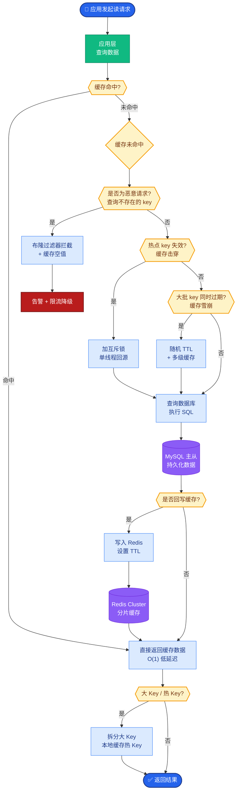

# 什么是模型量化(Quantization)?INT8 和 INT4 有什么区别

- **量化** 将模型权重从 FP16(16位浮点)压缩到更低位(INT8/INT4),减少显存和加速推理.

| 精度 | 每参数 | 7B 模型大小 | 质量 |
|------|--------|------------|------|
| FP16 | 2 bytes | 14 GB | 100% |
| INT8 | 1 byte | 7 GB | ~99% |
| INT4 | 0.5 bytes | 3.5 GB | ~95% |

- **实战案例**：在做移动端部署时，我们将 7B 模型量化为 INT4，使得模型可在 8GB 显存的消费级显卡上流畅运行，虽然中文生成偶尔出现多字，但在阅读理解任务上影响微乎其微。

- **INT8 vs INT4**
- INT8:质量损失极小,显存减半
- INT4:显存极低,但质量有一定下降(复杂推理/代码可能受影响)

- **对比表格：量化方法选型**
| 方法 | 原理 | 优点 | 缺点 |
|------|------|------|------|
| GPTQ | 基于二阶信息进行权重量化 | 通用性强，效果稳定 | 量化速度慢，需要校准集 |
| AWQ | 激活感知量化，保留1%显著权重 | 推理效果优于GPTQ，量化快 | 实现稍复杂 |
| BitsAndBytes | 动态量化/LoRA兼容 | 无需预处理，显存占用极低 | 推理速度可能不如静态量化 |

- **常用方法**:GPTQ(训练后量化)、AWQ(激活感知量化)、GGUF(llama.cpp 格式)

- **选择建议**:生产优先 INT8,资源极度受限用 INT4.

- **量化计算示意图**
```
FP16 权重矩阵: [1.234, -0.567, 2.891, ...]
       │
       │ (Quantize: W = Scale * (W_int - Zero_point))
       ▼
INT4 权重矩阵: [  7,   -3,    8, ...]
       │
       │ (Dequantize / INT8 GEMM Kernel)
       ▼
   快速矩阵乘法 (GPU 加速)
```

- **代码示例**：使用 BitsAndBytes 加载 4bit 模型
```python
from transformers import AutoModelForCausalLM, BitsAndBytesConfig

# 配置 4-bit 量化
bnb_config = BitsAndBytesConfig(
    load_in_4bit=True,
    bnb_4bit_compute_dtype=torch.float16,
    bnb_4bit_use_double_quant=True,
)

model = AutoModelForCausalLM.from_pretrained(
    "meta-llama/Llama-2-7b-hf",
    quantization_config=bnb_config,
)
```

- **边界情况补充**：
1. **Outliers（离群点）**：LLM 权重中存在极少量的极值（如 >6σ），这些值对 INT4 量化极度敏感，是导致质量崩坏的主因，AWQ/SpQR 等方法专门处理此问题。
2. **激活量化**：仅量化权重只能省显存，若要加速推理，需量化 KV Cache 和激活值，但这容易导致数值溢出。
3. **微调后的量化**：经过全量微调（SFT）的模型，其权重分布可能发生变化，直接使用通用校准集量化效果可能变差，建议使用微调时的数据进行校准。
4. **MoE 架构**：混合专家模型中，不同 Expert 的数值分布差异大，需要针对每个 Expert 单独进行量化，否则精度损失严重。

- **## 常见考点**
1. **AWQ vs GPTQ**: AWQ 为什么效果通常比 GPTQ 好？（AWQ 保留了 1% 的关键权重不进行量化，激活感知量化减少了量化误差）
2. **KV Cache 量化**: 除了模型权重，KV Cache 也可以量化，这对显存有什么帮助？（极大降低推理时的显存占用，允许更大的 Batch Size）
3. **量化对硬件的要求**: 运行 INT4 量化模型是否需要特殊的 GPU 支持？（现代 GPU 通常支持 INT8/INT4 运算指令，如 NVIDIA Tensor Cores）

- ## 易错点
1. **混淆显存减少与推理加速**：量化（特别是 W4A16）主要是为了省显存，推理速度不一定变快（因为需要 Dequantize 操作），只有 W4A4 或 W4A8 才可能有显著加速。
2. **Zero Point 忽略**：在非对称量化中忽略 Zero Point 会导致数值范围偏移，特别是在量化激活值时必须考虑 Zero Point。

- ## 面试追问
1. 为什么 LLaMA 等模型在 INT4 量化下依然能保持较好的逻辑能力，而传统的 BERT 模型量化后下降明显？
2. 在端侧部署（如手机）时，除了权重量化，还有哪些关键的算子优化手段？
3. 如果量化后的模型在某些特定领域（如数学推理）表现崩坏，你会如何针对性修复？


## 核心流程图



## 记忆要点

- 定义：量化将 FP16 压缩至 INT8/INT4，核心目的是省显存，推理加速需配合特定算子。
- 对比：INT8 质量无损（99%），显存减半；INT4 显存极低（1/4），但复杂推理质量有损。
- 方法：GPTQ 通用稳定，AWQ 保留关键权重效果更好，生产优先 INT8，端侧受限用 INT4。
- 易错点：量化主要省显存，W4A16 模式下推理速度不一定变快，甚至可能变慢。
- 关键挑战：离群值处理是量化难点，AWQ 通过保留 1% 显著权重解决精度崩坏。


## 结构化回答

**30 秒电梯演讲：** 降低参数数值精度以减少显存占用并加速计算——打个比方，把高清照片压缩成标清，体积小了但细节有点损失

**展开框架：**
1. **定义** — 量化将 FP16 压缩至 INT8/INT4，核心目的是省显存，推理加速需配合特定算子。
2. **对比** — INT8 质量无损（99%），显存减半；INT4 显存极低（1/4），但复杂推理质量有损。
3. **方法** — GPTQ 通用稳定，AWQ 保留关键权重效果更好，生产优先 INT8，端侧受限用 INT4。

**收尾：** 以上三点都能配合实战聊。我可以展开任一要点，比如「GPTQ 和 AWQ 有什么区别」这类追问您感兴趣吗？

## 视频脚本

> 预计时长：2 分钟 | 由浅入深

| 时间 | 画面/字幕 | 口播台词 | 讲解要点 |
|------|----------|----------|----------|
| 0:00 | 标题卡 | "模型量化(Quantization)，30 秒讲清楚。" | 开场钩子 |
| 0:30 | 概念定义动画 | "一句话：降低参数数值精度以减少显存占用并加速计算" | 核心定义 |
| 1:00 | 定义图解 | "量化将 FP16 压缩至 INT8/INT4，核心目的是省显存，推理加速需配合特定算子。" | 定义 |
| 1:30 | 总结卡 | "记好这几条，面试不慌。下期见。" | 收尾 |
