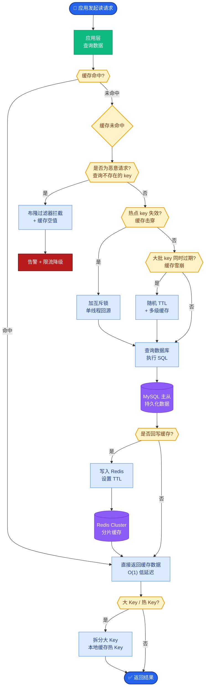
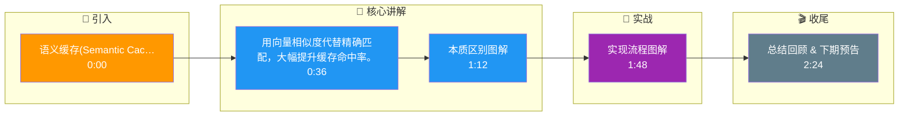

# 语义缓存(Semantic Cache)如何实现?它和普通缓存有什么本质区别

- **语义缓存** 不做精确匹配,而是基于**语义相似度**判断是否命中缓存.

- **普通缓存 vs 语义缓存**

| 维度 | 普通缓存 | 语义缓存 |
|------|---------|---------|
| 匹配方式 | key 精确匹配 | 向量相似度 |
| 命中条件 | 完全相同 | 语义相同('年假几天' = '有多少天年假') |
| 存储 | KV Store | 向量数据库 |
| 命中率 | 低(~5%) | 高(~20-40%) |
| 检索复杂度 | O(1) | O(logN) (ANN索引) |
| 成本 | 极低 | 低(需Embedding计算) |

- **实战案例**：在电商客服场景中，若用户问“怎么退货”命中缓存，但后续追问“运费谁出”，普通缓存无法处理，而语义缓存需结合对话历史向量进行多轮检索。常见踩坑：阈值设置过低导致“取消订单”命中了“查询订单状态”，造成严重业务错误。

- **代码示例**：
```python
# Python: 使用 Redis Search 实现语义缓存检索
import numpy as np
from redis.commands.search.query import Query

def get_semantic_cache(query_vector, threshold=0.92):
    # 创建向量搜索查询 (K=1, 寻找最近邻)
    q = Query("*=>[KNN 1 @vector $vec AS score]").sort_by("score").return_fields("answer", "score").dialect(2)
    res = client.ft("idx:faq_cache").search(q, query_params={"vec": query_vector.tobytes()})
    
    if res.docs and (1 - float(res.docs[0].score)) > threshold:
        return res.docs[0].answer
    return None
```

- **实现架构图**

```text
用户请求
   │
   ▼
┌──────────────┐
│  Embedding   │  (将Query转化为向量)
│   Model      │
└──────┬───────┘
       │ Vector
       ▼
┌──────────────┐
│ 向量数据库检索 │  (ANN搜索，如HNSW索引)
│ (FAISS/Redis) │
└──────┬───────┘
       │ Top-K 结果 + Score
       ▼
   ┌─────┐
   │判断?│  Score > 阈值? && 语义上下文匹配?
   └──┬──┘
      │
  Yes │      No
      ▼        │
┌─────────┐    │    ┌────────────┐
│返回缓存 │    │    │  调用 LLM  │
│  答案   │    │    │ (生成答案) │
└─────────┘    │    └─────┬──────┘
               │          │
               │          ▼
               │    ┌──────────────┐
               │    │ 写入语义缓存 │
               │    │ (Vector+Ans) │
               │    └──────────────┘
               └─────> 返回答案
```

- **关键设计决策**

1. **相似度阈值**
- 太高(0.98)→ 命中率低,省不了钱
- 太低(0.85)→ 可能返回错误答案
- 推荐:0.90~0.95,配合人工抽检调优

2. **缓存有效期 (TTL)**
- 事实型问题:长 TTL(7天)
- 时效型问题:短 TTL(1小时)或不缓存
- 用 LLM 分类 query 类型自动设置 TTL

3. **防止'串味'**
- 多租户隔离:不同用户的缓存分开
- 角色/Prompt 隔离:不同 system prompt 的缓存分开
- 方法:将 system_prompt_hash + user_query_vector 作为复合 key

4. **成本收益**
- Embedding 成本(~$0.0001/query)远低于 LLM 调用(~$0.02/query)
- 缓存命中率 30% → 节省 ~30% API 成本
- 典型 ROI:语义缓存的基建成本在 1-2 个月内回本

- **补充：缓存一致性与失效机制**
- **主动失效**: 当知识库文档更新时，计算受影响文档的向量范围，批量删除对应缓存。
- **重写机制**: LLM 返回答案时，可以并行生成多个改写问句的向量一并存入，提高命中率（如存入“如何请假”、“请假流程”等相似Query）。

## 常见考点
1. **如何解决语义漂移问题？**
   - 关注阈值设定和上下文哈希隔离，防止跨租户或跨Prompt的误命中。
2. **向量数据库选型依据？**
   - 考查内存/磁盘索引、延迟和支持的距离度量方式。
3. **如何处理多轮对话缓存？**
   - 需要将历史对话摘要作为向量的一部分，或仅对最后一轮独立Query进行缓存，讨论设计权衡。

## 核心流程图



## 记忆要点

- 本质区别：普通缓存精确匹配 Key，语义缓存基于向量相似度匹配，命中率更高。
- 实现流程：Query -> Embedding -> 向量库 ANN 检索 -> 相似度阈值判断（>0.92）。
- 关键参数：阈值设太高命中率低，太低易误答，推荐 0.90-0.95 并结合人工抽检。
- 防串味：复合 Key 设计（租户ID + Prompt Hash + Query Vector），隔离不同上下文。
- 成本收益：Embedding 成本远低于 LLM 调用，30% 命中率可省约 30% API 费用。

## 结构化回答

**30 秒电梯演讲：** 用向量相似度代替精确匹配，大幅提升缓存命中率。——打个比方，像 recognizing 意思而不是死记硬背，问"多少天假"和"年假几天"都能找到答案。

**展开框架：**
1. **本质区别** — 普通缓存精确匹配 Key，语义缓存基于向量相似度匹配，命中率更高。
2. **实现流程** — Query -> Embedding -> 向量库 ANN 检索 -> 相似度阈值判断（>0.92）。
3. **关键参数** — 阈值设太高命中率低，太低易误答，推荐 0.90-0.95 并结合人工抽检。

**收尾：** 以上三点都能配合实战聊。我可以展开任一要点，比如「如何处理'差一个字但意思完全不同'的情况」这类追问您感兴趣吗？

## 视频脚本

> 预计时长：3 分钟 | 由浅入深

| 时间 | 画面/字幕 | 口播台词 | 讲解要点 |
|------|----------|----------|----------|
| 0:00 | 标题卡 | "语义缓存(Semantic Cache)如何实现，30 秒讲清楚。" | 开场钩子 |
| 0:36 | 概念定义动画 | "一句话：用向量相似度代替精确匹配，大幅提升缓存命中率。" | 核心定义 |
| 1:12 | 本质区别图解 | "普通缓存精确匹配 Key，语义缓存基于向量相似度匹配，命中率更高。" | 本质区别 |
| 1:48 | 实现流程图解 | "Query -> Embedding -> 向量库 ANN 检索 -> 相似度阈值判断（>0.92）。" | 实现流程 |
| 2:24 | 总结卡 | "记好这几条，面试不慌。下期见。" | 收尾 |

### 视频流程图




