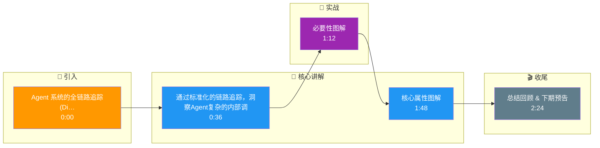

# Agent 系统的全链路追踪(Distributed Tracing)如何实现?OpenTelemetry 在 Agent 中怎么用

- **Agent 为什么比传统服务更需要 Trace?**

**传统服务：** Request → DB → Response(2-3 个 span)
Agent 系统:Request → Router → Planner → Tool1 → Tool2 → LLM → Validator → Response(10-20 个 span)

- **实战案例**：在排查 Agent 幻觉问题时，通过 Trace 发现某 Tool 返回了错误数据（HTTP 200 但 body 含 error 字段），导致 LLM 编造了答案。经验：必须在 Tool Span 中记录 response 的摘要或校验状态，而不仅是 HTTP status code。

- **Trace 架构图**

```text
Trace ID: x-agent-12345 (Root Span: User Request)
│
├─ [Span 1] Agent:Router (意图分类, 50ms)
│   └─ Attributes: intent="search_knowledge", confidence=0.98
│
├─ [Span 2] Agent:Planner (任务规划, 1.2s)
│   ├─ Input: User Query
│   └─ Output: Plan=["Search DB", "Summarize"]
│
├─ [Span 3] Agent:Executor:Step_1 (工具调用组)
│   │
│   ├─ [Span 3.1] Tool:Search (向量检索, 80ms)
│   │   └─ [Span 3.1.1] Embedding:Model (Query向量化, 20ms)
│   │
│   └─ [Span 3.2] Tool:Database (SQL 查询, 150ms)
│       └─ Events: ["SQL: SELECT * FROM ...", "Rows: 5"]
│
├─ [Span 4] LLM:Generate (最终回答, 2.5s)
│   ├─ Attributes: model="gpt-4", prompt_tokens=800, completion_tokens=200
│   └─ Events: ["Prompt Start", "Generation Start", "Generation End"]
│
└─ [Span 5] Agent:Validator (安全/合规检查, 100ms)
    └─ Result: Pass=True

**Total Latency: ~4.1s | Total Cost: $0.05**
```

- **OpenTelemetry 在 Agent 中的实践**

- **代码示例**：
```python
from opentelemetry import trace

def call_llm(prompt):
    tracer = trace.get_tracer(__name__)
    with tracer.start_as_current_span("llm.generation") as span:
        # 记录关键输入输出属性
        span.set_attribute("llm.model", "gpt-4o")
        span.set_attribute("llm.prompt_length", len(prompt))
        span.set_attribute("gen_ai.system", "openai")
        
        try:
            response = client.chat.completions.create(model="gpt-4o", messages=prompt)
            # 记录Token消耗，用于成本核算
            usage = response.usage
            span.set_attribute("llm.total_tokens", usage.total_tokens)
            return response
        except Exception as e:
            span.record_exception(e)
            span.set_status(trace.Status(trace.StatusCode.ERROR, str(e)))
            raise
```

- **关键 Span 属性**
```python
span.set_attribute('llm.model', 'gpt-4')
span.set_attribute('llm.prompt_tokens', 500)
span.set_attribute('llm.completion_tokens', 800)
span.set_attribute('llm.cost_usd', 0.026)
span.set_attribute('tool.name', 'search')
span.set_attribute('tool.success', True)
span.set_attribute('agent.step', 3)
span.set_attribute('agent.max_steps', 10)
```

- **Span 类型标准化**
1. **LLM Span**:模型调用(prompt, completion, tokens, model)
2. **Tool Span**:工具调用(tool_name, params, result, latency)
3. **Retrieval Span**:RAG 检索(query, chunks, scores)
4. **Agent Span**:Agent 步骤(step_num, thought, action)

- **日志 vs Trace vs Metrics 对比**

| 类型 | 作用 | 数据内容 | 典型场景 |
|------|------|----------|----------|
| 日志 | 排错细节 | 非结构化文本 (Full Prompt/Error Stack) | 本地 Debug, 审计 |
| Trace | 链路分析 | 结构化 Span (Latency, Parent/Child) | 性能瓶颈定位, 端到端排查 |
| Metrics | 趋势监控 | 聚合数值 (P99, QPS, Error Rate) | 告警, 大盘监控 |

- **工具选择**
- 开源:Jaeger + OpenTelemetry + Langfuse
- 商业:LangSmith, Phoenix (Arize), Datadog LLM
- 最小方案:OpenTelemetry + stdout JSON logs + grep

- **补充：链路传播与上下文**
- 在 Agent 循环中，必须使用 `propagate` 注入 headers，确保异步调用 Tool 或子 Agent 时 TraceID 不丢失。

## 核心流程图

```mermaid
flowchart TD
    Start([🚀 SpringBoot 启动<br/>main 方法]):::start
    SpringApplication[SpringApplication.run<br/>启动入口]:::process
    PrepareEnv[准备 Environment<br/>加载 application.yml]:::process
    ContextQ{{应用上下文?<br/>Servlet/Reactive}}:::decision
    ServletCtx[AnnotationConfigCtx<br/>传统 MVC]:::process
    ReactiveCtx[ReactiveWebCtx<br/>WebFlux]:::process
    Refresh[refresh 刷新容器<br/>核心入口]:::process
    BeanFactory[BeanFactory<br/>IoC 容器]:::store
    BeanDef[BeanDefinition<br/>扫描 @Component/@Bean]:::process
    ScanQ{{配置方式?<br/>注解/XML}}:::decision
    AnnoScan[ComponentScan<br/>ClassPathBeanDefinitionScanner]:::process
    XmlScan[XmlBeanDefinitionReader<br/>解析 XML]:::process
    Instantiate[实例化 Bean<br/>反射 newInstance]:::process
    Populate[属性填充<br/>依赖注入 @Autowired]:::process
    AwareQ{{实现 Aware 接口?}}:::decision
    Aware[BeanNameAware / ContextAware<br/>回调注入]:::process
    InitQ{{自定义初始化?}}:::decision
    PostConstruct[@PostConstruct<br/>初始化方法]:::process
    AOPQ{{需要 AOP 增强?<br/>切面 @Aspect}}:::decision
    Proxy[创建动态代理<br/>JDK/CGLIB]:::process
    ProxyChain[代理链<br/>MethodInvocation]:::process
    Final([✅ Bean 就绪 可用]):::start

    Start --> SpringApplication --> PrepareEnv --> ContextQ
    ContextQ -->|传统| ServletCtx --> Refresh
    ContextQ -->|响应式| ReactiveCtx --> Refresh
    Refresh --> BeanFactory --> BeanDef --> ScanQ
    ScanQ -->|注解| AnnoScan --> Instantiate
    ScanQ -->|XML| XmlScan --> Instantiate
    Instantiate --> Populate --> AwareQ
    AwareQ -->|是| Aware --> InitQ
    AwareQ -->|否| InitQ
    InitQ -->|是| PostConstruct --> AOPQ
    InitQ -->|否| AOPQ
    AOPQ -->|是| Proxy --> ProxyChain --> Final
    AOPQ -->|否| Final

    classDef start fill:#2563eb,stroke:#1e3a8a,color:#fff,stroke-width:2px;
    classDef process fill:#dbeafe,stroke:#3b82f6,color:#1e3a8a;
    classDef decision fill:#fef3c7,stroke:#f59e0b,color:#78350f,stroke-width:2px;
    classDef store fill:#8b5cf6,stroke:#6d28d9,color:#fff;

```

## 记忆要点

- 必要性：Agent 链路长（10+ Span），传统 Trace 无法透视 LLM 思维和 Tool 调用细节。
- 核心属性：LLM Span 记录 Model/Tokens/Cost，Tool Span 记录 Name/Input/Success 状态。
- 最佳实践：不仅记录 HTTP 状态，更要记录 Tool 返回内容的摘要或校验状态，防 HTTP 200 但内容错。
- 工具选型：使用 OpenTelemetry 标准，通过 Attributes 和 Events 结构化记录 Prompt/Response。
- 排查价值：通过 Trace 定位幻觉源头（如 Tool 返回错误数据），而非仅看总耗时。

## 结构化回答

**30 秒电梯演讲：** 通过标准化的链路追踪，洞察Agent复杂的内部调用和成本。——打个比方，像给Agent装了GPS和行车记录仪，每一步去哪、花多少钱、堵在哪里都一清二楚。

**展开框架：**
1. **必要性** — Agent 链路长（10+ Span），传统 Trace 无法透视 LLM 思维和 Tool 调用细节。
2. **核心属性** — LLM Span 记录 Model/Tokens/Cost，Tool Span 记录 Name/Input/Success 状态。
3. **最佳实践** — 不仅记录 HTTP 状态，更要记录 Tool 返回内容的摘要或校验状态，防 HTTP 200 但内容错。

**收尾：** 以上三点都能配合实战聊。我可以展开任一要点，比如「如何采样以减少 Trace 存储」这类追问您感兴趣吗？

## 视频脚本

> 预计时长：3 分钟 | 由浅入深

| 时间 | 画面/字幕 | 口播台词 | 讲解要点 |
|------|----------|----------|----------|
| 0:00 | 标题卡 | "Agent 系统的全链路追踪(Distributed Tracing)如何实现，30 秒讲清楚。" | 开场钩子 |
| 0:36 | 概念定义动画 | "一句话：通过标准化的链路追踪，洞察Agent复杂的内部调用和成本。" | 核心定义 |
| 1:12 | 必要性图解 | "Agent 链路长（10+ Span），传统 Trace 无法透视 LLM 思维和 Tool 调用细节。" | 必要性 |
| 1:48 | 核心属性图解 | "LLM Span 记录 Model/Tokens/Cost，Tool Span 记录 Name/Input/Succes" | 核心属性 |
| 2:24 | 总结卡 | "记好这几条，面试不慌。下期见。" | 收尾 |

### 视频流程图




