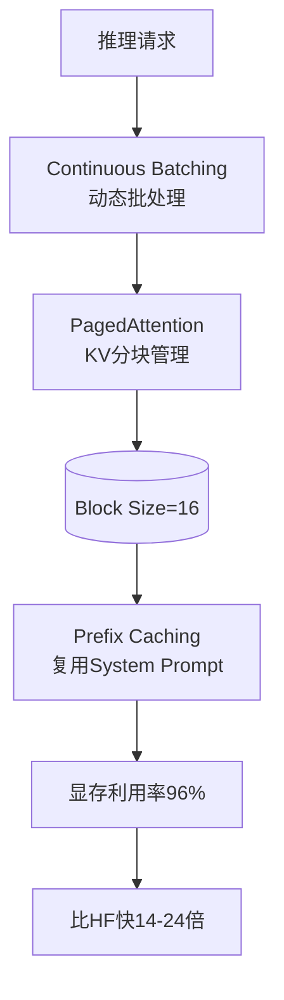
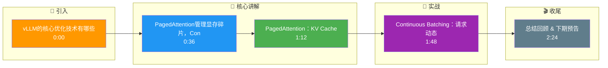

# vLLM的核心优化技术有哪些？

vLLM是当前最流行的开源LLM推理框架，核心优化：

1. **PagedAttention**：
- 将KV Cache分块管理（类似OS虚拟内存分页）
- 消除显存碎片，显存利用率从60%提升到96%+
- 支持Copy-on-Write，Parallel Sampling共享前缀

2. **Continuous Batching（连续批处理）**：
- 传统Static Batching：一个batch中所有请求要同时完成
- Continuous Batching：每个iteration动态调度，完成一个请求立即放入新请求
- GPU利用率大幅提升

3. **Tensor Parallelism（张量并行）**：
- 将模型权重切分到多GPU
- 支持NCCL通信

4. **其他优化**：
- Prefix Caching：缓存相同前缀的KV（如system prompt）
- Speculative Decoding：投机采样加速
- Quantization：支持AWQ、GPTQ量化模型

- **技术对比 (vLLM vs HuggingFace Transformers)**

| 特性 | HuggingFace (Static) | vLLM (PagedAttention + Continuous) |
|------|---------------------|------------------------------------|
| 内存管理 | 预分配连续内存 (易碎片) | PagedAttention (非连续分页) |
| Batch 调度 | 静态 (等最长请求结束) | 连续 (动态进出) |
| 显存利用率 | ~60-70% | >90% |
| 吞吐量 | 低 (受限于 batch size) | 高 (24x 提升) |
| 适用场景 | 单任务/微调 | 高并发在线服务 |

- **实战案例**：在某在线客服系统中，使用 vLLM 替换 TGI 后，相同 A100 显存支持的最大并发数从 50 提升至 200，且 P99 延迟降低了 40%。踩坑：Block Size 设置不当（如过大）会导致小请求显存浪费，需要根据平均请求长度调整。

- **代码示例**：
```python
from vllm import LLM, SamplingParams

# 初始化 vLLM 引擎，启用 Block 机制
llm = LLM(
    model="meta-llama/Llama-2-7b-hf",
    tensor_parallel_size=2,  # 2卡张量并行
    block_size=16,           # 关键：Block Size 设置
    enable_prefix_caching=True
)

sampling_params = SamplingParams(temperature=0.7, top_p=0.95, max_tokens=100)
outputs = llm.generate(["Hello, my name is", "The future of AI is"], sampling_params)
```

性能：比HuggingFace Transformers快14-24倍，接近商用API吞吐量。

- **补充：PagedAttention 内部机制**
- **Block 表**: vLLM 为每个 Sequence 维护一个 Block 表，映射逻辑 Block 到物理 Block，支持非连续内存分配，解决内存碎片。
- **迭代级调度**: 调度器在每个解码步骤结束后，根据已完成和新加入的请求重组 Batch，无需等待 Batch 中所有请求结束。

## 常见考点
1. **vLLM 的 Block Size 如何选择？**
   - 通常设为 16，需权衡显存管理开销和内存粒度。太小导致 Block Table 过大，太大致内部浪费。
2. **Continuous Batching 和 Orca 有什么区别？**
   - Orca 是 Continuous Batching 的一种早期实现，vLLM 结合 PagedAttention 进一步提升了显存管理效率。
3. **vLLM 如何处理 Prefix Caching 的失效？**
   - 引用计数管理，当所有引用该 Prefix 的请求结束后，释放对应的物理 Block。



## 记忆要点

- PagedAttention：KV Cache 分块管理，消除显存碎片，利用率从 60% 提至 96%。
- Continuous Batching：请求动态进出 Batch，无需等最长请求结束，吞吐大幅提升。
- 核心优势：结合两者，比 HuggingFace 快 14-24 倍，显存利用率接近极致。
- 关键配置：Block Size 通常设 16，Prefix Caching 可复用 System Prompt KV。
- 适用场景：高并发在线服务首选，单任务微调场景优势不明显。

## 结构化回答

**30 秒电梯演讲：** PagedAttention管理显存碎片，Continuous Batching动态调度计算。——打个比方，像把仓库格子化管理货物，且送货员走完一单立刻接下一单，不空跑。

**展开框架：**
1. **PagedAtt** — PagedAttention：KV Cache 分块管理，消除显存碎片，利用率从 60% 提至 96%。
2. **Continuo** — Continuous Batching：请求动态进出 Batch，无需等最长请求结束，吞吐大幅提升。
3. **核心优势** — 结合两者，比 HuggingFace 快 14-24 倍，显存利用率接近极致。

**收尾：** 以上三点都能配合实战聊。您想深入聊哪一块？

## 视频脚本

> 预计时长：3 分钟 | 由浅入深

| 时间 | 画面/字幕 | 口播台词 | 讲解要点 |
|------|----------|----------|----------|
| 0:00 | 标题卡 | "vLLM的核心优化技术有哪些，30 秒讲清楚。" | 开场钩子 |
| 0:36 | 概念定义动画 | "一句话：PagedAttention管理显存碎片，Continuous Batching动态调度计算。" | 核心定义 |
| 1:12 | 要点图解 | "PagedAttention：KV Cache 分块管理，消除显存碎片，利用率从 60% 提至 96%。" | 要点 |
| 1:48 | 要点图解 | "Continuous Batching：请求动态进出 Batch，无需等最长请求结束，吞吐大幅提升。" | 要点 |
| 2:24 | 总结卡 | "记好这几条，面试不慌。下期见。" | 收尾 |

### 视频流程图




