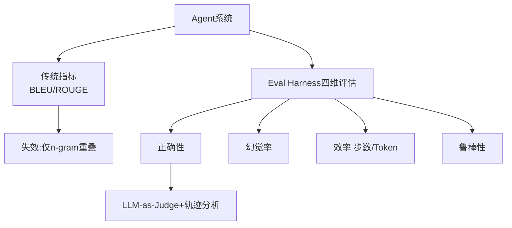

# 评测 Agent 系统质量时，传统 NLP 指标（如 BLEU/ROUGE）有哪些局限性？Eval Harness 框架通常采用什么维度进行自动化评估？

传统 NLP 指标主要基于 n-gram 重叠度，衡量的是文本表面的相似性，这在开放性的 Agent 任务中完全失效。Agent 的核心是“解决问题”而非“生成文本”，因此需要评估其工具调用的正确性、规划的逻辑性以及最终结果的准确性。Eval Harness 等现代评测框架通常采用基于 LLM-as-a-Judge 的多维度评估，包括：1) 正确性：工具输出或最终答案是否正确；2) 幻觉率：是否生成了不存在的事实；3) 效率：步数和 Token 消耗；4) 鲁棒性：面对干扰或错误时的恢复能力。这种基于模型打分和轨迹分析的方法更能反映 Agent 的实际能力。

**实战案例**：在订票 Agent 评测中，我们发现 BLEU 分数很高但 Agent 经常调用错误的航班 ID，引入轨迹分析后成功定位了“工具参数匹配错误”这一缺陷。

**对比表格**：

| 维度 | 传统 NLP 指标 (BLEU/ROUGE) | Agent 评测 |
| :--- | :--- | :--- |
| **核心目标** | 文本相似度 | 任务完成度 |
| **逻辑判断** | 无法检测 | 支持复杂推理评估 |
| **幻觉检测** | 极弱 | 强 (As-a-Judge) |
| **适用场景** | 机器翻译/摘要 | 工具调用/自主规划 |

**代码示例** (Python - 模拟评测):
```python
def evaluate_agent_trajectory(trace, expected_tool):
    # 检查关键工具调用是否存在
    tool_calls = [step['tool'] for step in trace if step.get('tool')]
    
    if expected_tool not in tool_calls:
        return { "score": 0, "reason": f"Missing critical tool: {expected_tool}" }
    
    return { "score": 1, "reason": "Success" }
```

## 易错点
1. **混淆流程正确性与结果正确性**：在多步推理任务中，Agent 可能流程（工具调用序列）正确但因外部环境错误导致结果失败。一个好的评估体系应区分“Agent 执行错误”和“环境错误”，而非仅根据最终结果打分。
2. **过度依赖单一 LLM Judge**：LLM-as-a-Judge 可能存在位置偏见或自身幻觉，极易对长上下文或复杂逻辑产生误判，因此通常需要引入多个模型投票或与规则验证结合使用。

## 边界情况
1. **死循环检测**：在评估效率维度时，必须设定最大步数阈值。Agent 可能陷入逻辑死循环（如在两个状态间无限跳转），此时若无强制中断机制，会导致评估资源耗尽。
2. **空输出与格式错误**：Agent 可能因 Prompt 理解偏差返回空字符串或非 JSON 格式数据。自动化评估框架需具备容错解析能力，将这类“格式错误”视为特定类别的任务失败，而非直接崩溃。

## 面试追问
1. **如何评估 Agent 在面对不确定或动态变化环境时的适应性？**
2. **在 LLM-as-a-Judge 模式下，如何解决评估模型本身的成本和延迟问题？**
3. **除了准确率，针对 Code Agent 这类特定场景，你认为还需要引入哪些特定的评测指标？**

## 技术原理

传统 NLP 指标在 Agent 场景失效的根源，在于它们衡量的是"文本生成质量"而非"问题解决能力"。两者的评估范式根本不同：

- **n-gram 重叠的局限**：BLEU/ROUGE 统计生成文本与参考答案的 n-gram 重叠度，假设"字面相似=质量好"。这对机器翻译、摘要这类"有标准答案且答案唯一"的任务有效。但 Agent 任务的答案开放——订票 Agent 可以用不同措辞确认订单，只要调对了航班 ID 就是正确的。字面不同但语义相同的回答会被 BLEU 打低分，反之调错 ID 但措辞像参考答案的会被打高分。
- **LLM-as-a-Judge 的原理**：用一个强模型（如 GPT-4）作为裁判，按维度（正确性、幻觉率、效率、鲁棒性）对 Agent 的轨迹和结果打分。裁判模型能理解语义等价、推理合理性、工具调用正确性，远超 n-gram 匹配。代价是裁判模型自身可能有偏见（位置偏差、长度偏见）和幻觉。
- **轨迹分析的关键性**：Agent 的价值在"怎么解决问题"而非"最终文本"。轨迹分析检查每一步的 Thought、Action、Observation 是否合理——即使最终结果对，中间调用了错误工具再纠回来也说明规划能力差。反之流程对但环境报错导致结果错，不应归咎于 Agent。区分"流程错误"和"环境错误"是公平评估的前提。

## 注意事项

1. **区分流程正确与结果正确**：多步推理里 Agent 可能流程对但因外部环境错误导致结果失败，评估体系要能区分"Agent 执行错误"和"环境错误"，而非仅看最终结果打分。
2. **别单一依赖 LLM Judge**：LLM-as-a-Judge 有位置偏见和自身幻觉，对长上下文复杂逻辑易误判，需引入多模型投票或与规则验证结合。
3. **死循环要设最大步数**：评估效率维度时必须设阈值，Agent 可能陷入两状态无限跳转，无强制中断会耗尽评估资源。
4. **格式错误要容错**：Agent 返回空字符串或非 JSON 时，评估框架需容错解析，把"格式错误"视为特定类别的任务失败而非直接崩溃。

## 对比表

| 维度 | BLEU/ROUGE | LLM-as-a-Judge | 轨迹分析 | 规则验证 |
|:---|:---|:---|:---|:---|
| **衡量对象** | 文本字面相似 | 语义合理性 | 工具调用序列 | 确定性结果 |
| **能否测推理** | 不能 | 能 | 能 | 不能 |
| **成本** | 极低 | 高（调裁判模型） | 中 | 低 |
| **偏见风险** | 无 | 有（位置/长度偏见） | 低 | 无 |
| **适用场景** | 翻译、摘要 | 开放式问答 | Agent 工具调用 | 数学题、代码 |

## 代码示例

```python
# Agent 评测的多维度评估框架
def evaluate_agent(agent, test_cases, max_steps=20):
    results = {"correctness": [], "hallucination": [], "efficiency": [], "robustness": []}
    for case in test_cases:
        trace = []  # 记录 Thought/Action/Observation 轨迹
        for step in range(max_steps):  # 死循环防护
            action = agent.act(case, trace)
            trace.append(action)
            if action.is_final: break

        # 1. 正确性：LLM-as-a-Judge 判断结果对错
        results["correctness"].append(judge_correctness(trace, case.expected))
        # 2. 幻觉率：检查是否调用了不存在的工具或编造事实
        results["hallucination"].append(check_hallucination(trace))
        # 3. 效率：步数和 Token 消耗
        results["efficiency"].append({"steps": len(trace), "tokens": sum(t.tokens for t in trace)})
        # 4. 鲁棒性：输入扰动后结果是否稳定
        perturbed = run_with_perturbation(agent, case)
        results["robustness"].append(results_match(trace, perturbed))

    return aggregate_scores(results)

# 区分"流程错误"和"环境错误"（公平评估）
def classify_failure(trace, expected):
    if trace.tools_called_correctly() and not trace.result_correct:
        return "ENVIRONMENT_ERROR"  # 流程对但环境报错，不归咎 Agent
    return "AGENT_ERROR"
```




## 记忆要点

- 传统指标局限：BLEU/ROUGE只测n-gram重叠，Agent任务完全失效。
- 核心转变：从文本相似度→任务完成度与逻辑轨迹。
- 四维评估：正确性、幻觉率、效率(步数/Token)、鲁棒性。
- 评测方法：LLM-as-a-Judge多维度打分+轨迹分析。
- 易错点：需区分流程正确与结果正确；勿单一依赖LLM Judge。


## 结构化回答

**30 秒电梯演讲：** 从测文本表面相似度转向测任务完成度与思维轨迹。——打个比方，传统指标像批改作文（看字写得像不像），Agent评测像监考实操（看手术刀拿得对不对、病人有没有救活）。

**展开框架：**
1. **传统指标局限** — BLEU/ROUGE只测n-gram重叠，Agent任务完全失效。
2. **核心转变** — 从文本相似度→任务完成度与逻辑轨迹。
3. **四维评估** — 正确性、幻觉率、效率(步数/Token)、鲁棒性。

**收尾：** 以上三点都能配合实战聊。您想深入聊哪一块？

## 视频脚本

> 预计时长：2 分钟 | 由浅入深

| 时间 | 画面/字幕 | 口播台词 | 讲解要点 |
|------|----------|----------|----------|
| 0:00 | 标题卡 | "评测 Agent 系统质量时，传统 NLP 指标（如 BLEU/ROUGE）有哪，30 秒讲清楚。" | 开场钩子 |
| 0:30 | 概念定义动画 | "一句话：从测文本表面相似度转向测任务完成度与思维轨迹。" | 核心定义 |
| 1:00 | 传统指标局限图解 | "BLEU/ROUGE只测n-gram重叠，Agent任务完全失效。" | 传统指标局限 |
| 1:30 | 总结卡 | "记好这几条，面试不慌。下期见。" | 收尾 |
