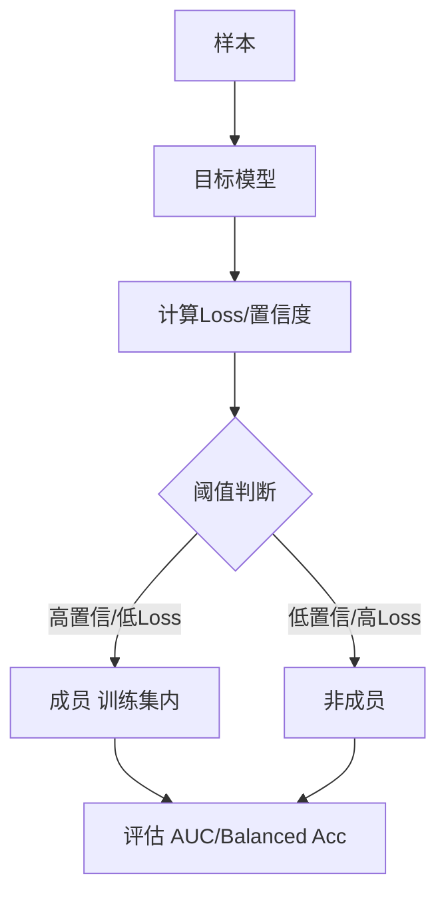

# Membership Inference Attack（成员推断攻击）的原理是什么？如何评估大模型对该攻击的防御能力？

成员推断攻击旨在判断特定数据是否属于模型训练集。其原理是利用模型对训练数据（成员）与非训练数据（非成员）在输出置信度或损失值上的统计差异，训练一个二分类器来区分两者。评估防御能力时，需构建包含训练与非训练样本的影子数据集，计算攻击者区分两者的准确率。若准确率接近随机猜测（50%），说明防御较强；显著高于 50% 则表明存在隐私泄露风险。

## 易错点
1. **混淆数据泄露与过拟合**：虽然过拟合容易导致成员推断攻击成功率上升，但并不代表过拟合是唯一原因。有时模型虽不过拟合，但对训练数据的置信度分布仍与非训练数据有显著差异（即记忆效应），这同样构成隐私风险。
2. **误判攻击成功率**：在实际评估中，攻击者的准确率需与“不攻击时的先验猜测”对比。例如，如果数据集中 90% 都是成员，那么一个恒定预测为“是”的模型准确率也有 90%，但这并不代表模型有隐私漏洞，必须使用 AUC 或 Balanced Accuracy 等指标。

## 边界情况
1. **影子模型与目标模型架构不一致**：攻击者通常无法获取与目标模型完全相同的影子模型。当影子模型容量小于目标模型时，攻击效果往往被低估；反之则可能高估。
2. **对抗性样本防御带来的误判**：某些防御机制（如差分隐私或输出正则化）可能会刻意降低模型对所有样本（包括成员和非成员）的置信度，这虽然降低了攻击成功率，但也可能使模型丧失正常的预测能力（即过度防御导致模型不可用）。

## 面试追问
1. **在实际工业场景中，攻击者通常无法获取模型的 Logits 或 Loss，只能访问输出文本。这种“黑盒”情况下的成员推断攻击通常怎么做？**
2. **差分隐私（DP）是目前防御成员推断攻击的有效手段，请谈谈它对模型训练收敛速度和最终性能的具体影响。**
3. **除了准确率，还有哪些指标可以更精细地量化模型的隐私泄露风险（如 Precision, Recall, F1-score 在攻击中的意义）？**

## 技术原理

成员推断攻击（MIA）的核心原理是**模型对"见过的数据"和"没见过的数据"行为不同**——模型在训练集上反复见过样本，会产生"记忆效应"，导致对成员样本的损失更低、置信度更高、预测更确定。

- **行为差异的来源**：
  1. **过拟合**：模型在训练集上拟合得更充分，loss 远低于测试集。这是最直接的信号——若模型对某样本 loss 极低，大概率是训练集成员。
  2. **记忆效应**：即使不过拟合，模型也会对见过的样本产生轻微的置信度偏移（更"自信"）。这种细微差异在单个样本上难以察觉，但在统计上可被分类器捕获。
- **攻击的两种范式**：
  1. **白盒（基于 loss/confidence）**：攻击者能拿到模型的 logits 或 loss。直接设阈值——loss 低于 τ 判为成员。简单粗暴，准确率高。
  2. **黑盒（基于影子模型）**：攻击者只能查询模型得到预测概率。用"影子模型"模拟目标模型——训练多个影子模型，知道它们的训练集（成员）和测试集（非成员），用这些样本的输出训练一个"攻击分类器"，再把它应用到目标模型的输出上做成员判断。这是 Shokri 等人 2017 年提出的经典方法。
- **评估的关键**：攻击准确率必须与"先验基线"对比。若数据集 90% 是成员，一个恒定预测"是"的分类器也有 90% 准确率，但这不代表模型有漏洞。必须用 AUC 或 Balanced Accuracy（正负样本各算 recall 取平均）消除类别不平衡的影响。

## 代码示例

基于 loss 阈值的白盒攻击 + 影子模型的黑盒攻击骨架：

```python
import numpy as np
import torch
from sklearn.metrics import roc_auc_score
from sklearn.neural_network import MLPClassifier

# ---- 白盒攻击：基于 loss 阈值 ----
def mia_whitebox_loss(model, samples, labels, threshold):
    """loss 低于阈值判定为成员"""
    with torch.no_grad():
        logits = model(samples)
        losses = torch.nn.functional.cross_entropy(logits, labels, reduction='none')
    is_member_pred = (losses < threshold).numpy()
    return is_member_pred, losses.numpy()

# ---- 黑盒攻击：影子模型 ----
def train_shadow_attack(target_arch, train_data_in, train_data_out,
                        query_fn_target):
    """训练影子模型 + 攻击分类器"""
    # 1. 训练多个影子模型，构造攻击训练集
    attack_X, attack_y = [], []
    for _ in range(num_shadow_models):
        shadow = clone(target_arch)
        # 影子模型的"成员"是它训练用到的样本
        shadow.fit(shadow_in_samples, shadow_in_labels)
        # 对成员和非成员样本查询输出概率
        for x in shadow_in_samples:
            attack_X.append(query_proba(shadow, x))
            attack_y.append(1)   # 成员
        for x in shadow_out_samples:
            attack_X.append(query_proba(shadow, x))
            attack_y.append(0)   # 非成员
    # 2. 训练攻击分类器（区分成员 vs 非成员的概率分布）
    attack_clf = MLPClassifier(hidden_layer_sizes=(64,))
    attack_clf.fit(attack_X, attack_y)
    # 3. 应用到目标模型上
    target_proba = [query_fn_target(x) for x in test_samples]
    preds = attack_clf.predict(target_proba)
    return preds

def evaluate_mia(true_labels, pred_labels, pred_scores):
    """必须用 AUC / Balanced Accuracy，不能只看 accuracy"""
    auc = roc_auc_score(true_labels, pred_scores)
    tn = sum((t == 0 and p == 0) for t, p in zip(true_labels, pred_labels))
    tp = sum((t == 1 and p == 1) for t, p in zip(true_labels, pred_labels))
    neg = sum(t == 0 for t in true_labels)
    pos = sum(t == 1 for t in true_labels)
    balanced_acc = (tp / pos + tn / neg) / 2 if pos and neg else 0
    return {"AUC": auc, "BalancedAcc": balanced_acc,
            "verdict": "防御强" if abs(auc - 0.5) < 0.05 else "存在隐私泄露"}
```

## 注意事项

- **准确率必须与先验对比**：类别不平衡时普通 accuracy 会误导。数据集若 90% 是成员，恒定预测"是"也有 90% 准确率。必须用 AUC（不受类别比例影响）或 Balanced Accuracy。
- **过拟合不是唯一原因**：即使模型泛化良好（train/val loss 接近），记忆效应仍会造成成员与非成员的细微置信度差异，构成隐私风险。不能只看是否过拟合来评估风险。
- **影子模型架构不一致会偏估**：攻击者通常无法获取与目标完全相同的模型架构。影子模型容量小于目标会低估攻击效果，反之高估。评估时应尝试多种容量的影子模型取上界。
- **防御手段有代价**：差分隐私（DP-SGD）和输出正则化能降低成员推断成功率，但会牺牲模型精度和收敛速度。需在隐私预算 $\epsilon$ 和模型效用间权衡，过度防御会让模型不可用。



## 记忆要点

- 核心目标：判别样本是否属于模型训练集(成员 vs 非成员)。
- 利用差异：成员与非成员在置信度或Loss上的表现不同。
- 评估方法：构建影子数据集，攻击准确率接近50%则防御强。
- 过拟合≠唯一原因：记忆效应也会导致置信度差异。
- 易错点：准确率需与先验对比，必须用AUC或Balanced Accuracy。


## 结构化回答

**30 秒电梯演讲：** 通过模型行为差异推断数据是否曾“见过”，评估数据隐私泄露风险。——打个比方，就像老师通过学生对考题的反应（答得快且准还是犹豫不决）来推测这道题是不是平时作业里的原题。

**展开框架：**
1. **核心目标** — 判别样本是否属于模型训练集(成员 vs 非成员)。
2. **利用差异** — 成员与非成员在置信度或Loss上的表现不同。
3. **评估方法** — 构建影子数据集，攻击准确率接近50%则防御强。

**收尾：** 以上三点都能配合实战聊。您想深入聊哪一块？

## 视频脚本

> 预计时长：2 分钟 | 由浅入深

| 时间 | 画面/字幕 | 口播台词 | 讲解要点 |
|------|----------|----------|----------|
| 0:00 | 标题卡 | "Membership Inference Attack（成员推断攻击）的原理是什，30 秒讲清楚。" | 开场钩子 |
| 0:30 | 概念定义动画 | "一句话：通过模型行为差异推断数据是否曾“见过”，评估数据隐私泄露风险。" | 核心定义 |
| 1:00 | 核心目标图解 | "判别样本是否属于模型训练集(成员 vs 非成员)。" | 核心目标 |
| 1:30 | 总结卡 | "记好这几条，面试不慌。下期见。" | 收尾 |
