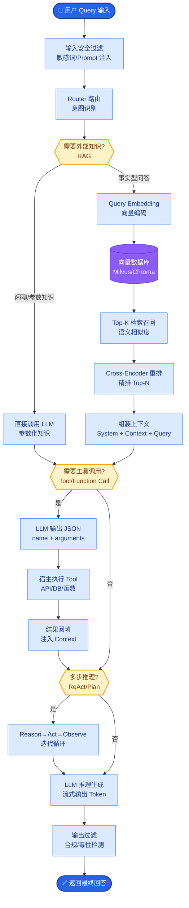

# 相比于传统的 Mean Average Precision (MAP)，RAGAS 框架引入的核心指标有哪些？它们分别评估什么维度？

RAGAS 是专门用于评估 RAG 系统的框架，它引入了基于 LLM 的生成式指标，比传统检索指标更能反映端到端的质量。核心指标包括：

1.  **Faithfulness (忠实度)**：评估生成答案中的每一个主张是否都能从给定的上下文中推断出来。它衡量的是“幻觉”程度，即模型是否在编造检索内容之外的信息。
2.  **Answer Relevancy (答案相关性)**：评估生成的答案是否直接解决了用户的问题。防止模型答非所问（如问题问了“怎么修车”，回答却全是“车的历史”）。
3.  **Context Precision (上下文精确度)**：评估检索到的上下文排在前面的文档是否真正相关。衡量检索系统的排序能力。
4.  **Context Recall (上下文召回率)**：评估检索到的上下文是否包含了回答问题所需的所有关键信息。衡量检索系统的查全能力。

这些指标通常通过 LLM 作为 Judge，通过精细的 Prompt 打分来实现，从而实现了无需人工标注的自动化评估。

### 指标对比详解
| 指标 | 评估对象 | 核心问题 | 依赖数据 | 对应传统指标类比 |
| :--- | :--- | :--- | :--- | :--- |
| **Context Precision** | 检索器 | 检索结果是否排得对（相关在前）？ | Query, Contexts | Mean Reciprocal Rank (MRR) |
| **Context Recall** | 检索器 | 检索结果是否包含所有真相？ | Ground Truth, Contexts | Hit Rate / Recall |
| **Faithfulness** | 生成器 | 答案是否依据检索内容？ | Answer, Contexts | (无直接传统对应，防幻觉) |
| **Answer Relevancy** | 生成器 | 答案是否切题？ | Question, Answer | (无直接传统对应，防跑题) |

### 实战案例
- **Faithfulness 调优**：在一次医疗问答 RAG 系统中，Faithfulness 分数突然下降。经排查，发现是因为 Prompt 中加入了“请详细解释”导致模型过度引申，检索到的文档中未包含详细药理机制，从而被判定为幻觉。修改 Prompt 为严格限定“仅基于上下文”后，分数回升。
- **成本控制**：全量评估 1000 条数据使用 GPT-4 成本过高。我们在训练集上用 GPT-4跑分建立基准，然后在每日监控中使用 GPT-3.5-Turbo 进行相对评估，成本降低了 90% 且趋势保持一致。

### 代码示例 (Python - 使用 RAGAS 评估)
```python
from ragas import evaluate
from ragas.metrics import faithfulness, answer_relevancy, context_precision
from datasets import Dataset

# 结果必须是 ragas 期望的特定格式
data_samples = {
    'question': ['用户姓名是什么？'],
    'answer': ['用户姓名是张三'],
    'contexts': [['张三是一名工程师...']],
    'ground_truth': ['张三']
}
dataset = Dataset.from_dict(data_samples)

# 运行评估，指定指标
result = evaluate(
    dataset, 
    metrics=[faithfulness, answer_relevancy, context_precision]
)
print(result.to_pandas())
```

### RAGAS 评估维度图
```text
                 User Question (Input)
                         │
           ┌─────────────┴─────────────┐
           │   RAG System (Target)     │
           │  ┌─────────────────────┐  │
           │  │ Retriever           │  │
           │  └──────────┬─────┬─────┘  │
           │             │     │        │
           │             ▼     ▼        │
           │      Contexts (Docs)     │
           │             │     │        │
           │  ┌──────────▼─────▼─────┐  │
           │  │ Generator (LLM)     │  │
           │  └──────────┬──────────┘  │
           └─────────────┼─────────────┘
                         │
                 ┌───────▼────────┐
                 │  Answer (Out)  │
                 └───────┬────────┘
                         │
      ┌──────────────────┼──────────────────┐
      ▼                  ▼                  ▼
┌──────────┐      ┌──────────┐      ┌──────────┐
│   Faith  │      │Relevancy │      │Context   │
│  fulness │      │          │      │ Metrics  │
└──────────┘      └──────────┘      └──────────┘
```

## 边界情况
- **数据依赖缺失**：计算 Context Recall 必须依赖 Ground Truth（标准答案），在实际生产中往往难以获取全量标注，容易导致该指标无法落地。
- **LLM Judge 偏见**：使用 GPT-3.5 作为 Judge 时，对于某些长尾领域的专业术语（如法律、医疗）可能判断错误，需微调 Judge 模型或使用更强的模型（如 GPT-4）。
- **非结构化数据**：RAGAS 默认对文本有效，如果检索内容包含图片、表格等多模态数据，直接使用 RAGAS 可能导致解析失败或评分极低。

## 面试追问
1. RAGAS 的 `answer_relevancy` 是如何计算的？如果模型回答“我不知道”，该指标得分会变高还是变低？
2. 在没有 Ground Truth 的情况下（即仅有 Query 和 Answer），如何构建一套近似的自动化评估流程？
3. 如何解决 LLM-as-a-Judge 模式的“长度偏差”（即倾向于给更长的回答打高分）？

## 易错点
1. **混淆 Precision 和 Recall**：在 RAG 上下文中，Context Precision 关注的是检索结果的**排序质量**（是不是相关的都在前面），而 Context Recall 关注的是**内容覆盖度**（是不是该有的信息都有了），二者常被混淆。
2. **忽视计算成本**：误以为 RAGAS 可以免费高频运行。实际上每次评估都需要消耗 LLM Token，大规模测试（如万级数据）成本极高，需采用采样评估策略。

## 核心流程图



## 记忆要点

- Faithfulness（忠实度）：评估答案是否依据上下文，衡量幻觉程度。
- Answer Relevancy（答案相关性）：评估答案是否切题，防止答非所问。
- Context Precision（上下文精确度）：评估检索排序能力，相关文档是否在前。
- Context Recall（上下文召回率）：评估检索查全能力，是否包含所有关键信息。
- RAGAS 使用 LLM 作为 Judge，实现无需人工标注的自动化生成式评估。

## 结构化回答

**30 秒电梯演讲：** 用 LLM 充当法官，从检索和生成两端自动评估 RAG 质量与幻觉。——打个比方，传统 MAP 只检查“考点覆盖率”，RAGAS 则像阅卷老师，既检查“参考资料（上下文）”全不全、准不准，也检查“答卷（生成）”有没有瞎编、有没有跑题。

**展开框架：**
1. **Faithful** — Faithfulness（忠实度）：评估答案是否依据上下文，衡量幻觉程度。
2. **Answer R** — Answer Relevancy（答案相关性）：评估答案是否切题，防止答非所问。
3. **Context** — Context Precision（上下文精确度）：评估检索排序能力，相关文档是否在前。

**收尾：** 以上三点都能配合实战聊。您想深入聊哪一块？

## 视频脚本

> 预计时长：2 分钟 | 由浅入深

| 时间 | 画面/字幕 | 口播台词 | 讲解要点 |
|------|----------|----------|----------|
| 0:00 | 标题卡 | "相比于传统的 Mean Average Precision (MAP)，30 秒讲清楚。" | 开场钩子 |
| 0:30 | 概念定义动画 | "一句话：用 LLM 充当法官，从检索和生成两端自动评估 RAG 质量与幻觉。" | 核心定义 |
| 1:00 | 要点图解 | "Faithfulness（忠实度）：评估答案是否依据上下文，衡量幻觉程度。" | 要点 |
| 1:30 | 总结卡 | "记好这几条，面试不慌。下期见。" | 收尾 |

### 视频流程图


