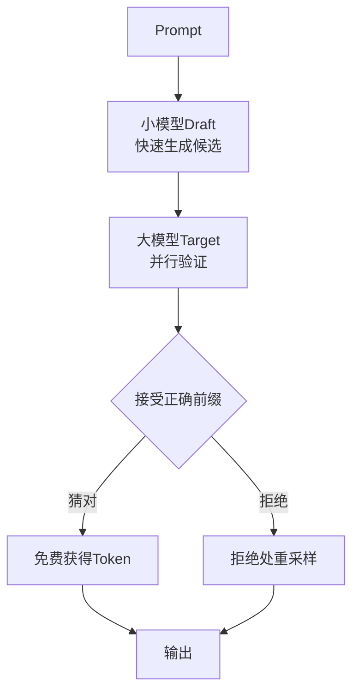
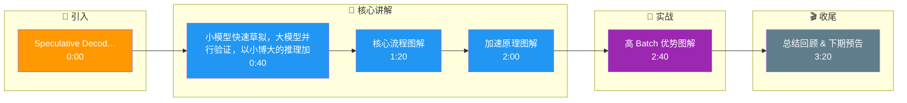

# Speculative Decoding（投机解码）的原理是什么？在高batch场景下如何加速推理？

投机解码通过小模型并行生成多个token，大模型验证+修正，实现无损加速。

## 核心流程
1. **Draft阶段**：小模型（如7B）快速生成k个候选token
2. **Verify阶段**：大模型（如70B）并行验证k个token
3. **接受/拒绝**：接受正确前缀，从第一个错误token重新生成

## 加速原理
- 小模型生成速度快10x+
- 大模型并行验证k个token，只多花1次forward
- 期望接受率>70%，等效加速1.5-2.5x

## 变体
- **Medusa**：多头并行投机，无需独立draft model
- **树状投机**：构建候选树，并行验证多条路径
- **PEARL**：基于n-gram的轻量投机

## 高batch场景优势
- GPU利用率更高（验证阶段计算密集）
- 与PagedAttention组合效果好

### 实战案例
- **Draft Model 选型**：在 Llama-3-70B 的服务中，我们尝试用 Llama-3-8B 作为 Draft Model。实测发现，虽然小模型推理快，但由于 8B 和 70B 的分布差异，Accept Rate（接受率）仅为 45%。后来微调了 8B 模型以对齐 70B 的输出分布，接受率提升至 75%，整体吞吐量提升了 1.8 倍。
- **延迟波动**：投机解码在 Draft 阶段是串行的，如果 Draft Model 意外变慢，会增加首字延迟（TTFT）。我们在高并发 Batch 下限制了 Spec Length（投机长度）动态调整策略，避免长序列 Draft 占用过多时间。

### 代码示例 (伪代码 - 投机解码逻辑)
```python
# 伪代码展示投机解码核心逻辑
def speculative_decode(prompt, draft_model, target_model, max_spec_steps=5):
    # 1. Draft 阶段：小模型快速生成 k 个 token
    draft_tokens = []
    for _ in range(max_spec_steps):
        next_token = draft_model.generate(prompt + draft_tokens)
        draft_tokens.append(next_token)

    # 2. Verify 阶段：大模型并行验证所有候选 token
    # 将 prompt + 所有 draft_tokens 作为一个 batch 输入
    full_sequence = prompt + draft_tokens
    logits = target_model.forward(full_sequence)
    
    # 3. 并行校验采样
    verified_tokens = []
    for i, token in enumerate(draft_tokens):
        if verify_token(logits[i], token):
            verified_tokens.append(token)
        else:
            # 拒绝：从第 i 个位置重新采样，并丢弃后续 draft
            new_token = sample(logits[i])
            verified_tokens.append(new_token)
            break
            
    return verified_tokens
```

### 投机解码变体对比
| 算法/策略 | Draft 来源 | 接受率特点 | 优势 | 劣势 |
| :--- | :--- | :--- | :--- | :--- |
| **标准 Speculative Decoding** | 独立小模型 | 中等 (50-70%) | 实现简单，易于替换模型 | 需维护两个模型，内存开销大 |
| **Medusa** | 主模型附加 Heads | 较高 (结构化) | 显存占用低（共享基础层） | 需训练多组 Head，训练成本高 |
| **Lookahead Decoding** | n-gram 匹配 | 高（简单文本） | 无需额外模型，推理级训练 | 复杂语义场景效果差 |
| **EAGLE (based Logits)** | 浅层网络特征 | 高 (80%+) | 极高的接受率和速度 | 依赖特定特征的提取，实现复杂 |



## 记忆要点

- 核心流程：小模型快速生成候选，大模型并行验证，接受正确前缀，拒绝处重采样。
- 加速原理：利用小模型速度快，大模型并行验证只花一次 Forward，期望加速 1.5-2.5x。
- 高 Batch 优势：验证阶段计算密集，GPU 利用率高，常与 PagedAttention 组合。
- 关键指标：接受率决定加速比，需确保 Draft Model 与 Target Model 分布对齐。

## 结构化回答

**30 秒电梯演讲：** 小模型快速草拟，大模型并行验证，以小博大的推理加速。——打个比方，经理让实习生先写草稿，自己只负责快速审阅签字，减少加班。

**展开框架：**
1. **核心流程** — 小模型快速生成候选，大模型并行验证，接受正确前缀，拒绝处重采样。
2. **加速原理** — 利用小模型速度快，大模型并行验证只花一次 Forward，期望加速 1.5-2.5x。
3. **高 Batch** — 高 Batch 优势：验证阶段计算密集，GPU 利用率高，常与 PagedAttention 组合。

**收尾：** 以上三点都能配合实战聊。我可以展开任一要点，比如「draft model如何选择？对生成质量有什么影响」这类追问您感兴趣吗？

## 视频脚本

> 预计时长：4 分钟 | 由浅入深

| 时间 | 画面/字幕 | 口播台词 | 讲解要点 |
|------|----------|----------|----------|
| 0:00 | 标题卡 | "Speculative Decoding（投机解码）的原理是什么，30 秒讲清楚。" | 开场钩子 |
| 0:40 | 概念定义动画 | "一句话：小模型快速草拟，大模型并行验证，以小博大的推理加速。" | 核心定义 |
| 1:20 | 核心流程图解 | "小模型快速生成候选，大模型并行验证，接受正确前缀，拒绝处重采样。" | 核心流程 |
| 2:00 | 加速原理图解 | "利用小模型速度快，大模型并行验证只花一次 Forward，期望加速 1.5-2.5x。" | 加速原理 |
| 2:40 | 高 Batch 优势图解 | "验证阶段计算密集，GPU 利用率高，常与 PagedAttention 组合。" | 高 Batch 优势 |
| 3:20 | 总结卡 | "记好这几条，面试不慌。下期见。" | 收尾 |

### 视频流程图




