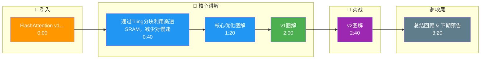

# FlashAttention v1/v2/v3的核心改进分别是什么？为什么能减少内存访问？

FlashAttention通过IO-aware的tiling策略将Attention从O(N²)内存降低到O(N)。

## v1核心改进（2022）
- **Tiling分块**：将QKV分成小块加载到SRAM，分块计算attention
- **在线Softmax（Online Softmax）**：不需要完整N×N矩阵，增量更新归一化
- **Kernel融合**：QK^T→softmax→dropout→AV全在一个kernel内
- **内存**：O(N²) → O(N)

## v2改进（2023）
- **更好的工作分区**：减少shared memory bank conflict
- **Warp-level优化**：改进线程分配和reduction
- **减少non-matmul FLOPs**
- A100上加速1.5-2x（vs v1）

## v3改进（2024）
- **H100 Tensor Core FP8支持**
- **异步加载**：通过TMA（Tensor Memory Access）
- **低精度计算**：BF16/FP8
- H100上速度接近理论峰值

## 为什么快
- 核心是**减少HBM（显存）读写次数**
- 传统：多次读写N×N矩阵
- FlashAttention：分块在SRAM计算，只读写一次

### 1. 实战案例
- 在优化LLM长文本推理时，未使用FlashAttention导致序列长度超过4k时显存溢出（OOM），替换后支持至32k且吞吐量提升30%。
- **踩坑**：v1在A100上非F16输入时会回退到低效实现，务必确保输入为`torch.float16`或`bfloat16`。

### 2. 代码示例 (Triton伪代码 - 在线Softmax核心)
```python
# 简化的Online Softmax逻辑 (Triton-like)
# 每个block处理一个Q行与K列块的计算
m_prev = -float('inf') # 之前的最大值
l_prev = 0.0           # 之前的归一化因子
acc = 0.0              # 累加输出

# 迭代加载K,V的块
for k_start in range(0, N, BLOCK_SIZE):
    k_block = load_k(k_start) # 加载K块到SRAM
    qk = q @ k_block.T         # 计算局部QK^T
    
    # 增量更新Softmax
    m_curr = max(m_prev, max(qk, axis=1))
    l_curr = l_prev * exp(m_prev - m_curr) + sum(exp(qk - m_curr), axis=1)
    
    # 更新累加器 O
    acc = (acc * exp(m_prev - m_curr)) + (exp(qk - m_curr) @ v_block)
    
    m_prev, l_prev = m_curr, l_curr

out = acc / l_curr
```

### 3. 对比表格
| 特性 | Standard Attention | FlashAttention v1 | FlashAttention v2 | FlashAttention v3 |
| :--- | :--- | :--- | :--- | :--- |
| **算法复杂度 (HBM)** | O(N²) | O(N) | O(N) | O(N) |
| **并行策略** | Layer-level | Block-level (串行迭代) | **Warp-level (并行)** | Warp/TMA (流水线) |
| **数值稳定性** | 高 (完整矩阵) | 高 (Online Softmax) | 高 | 高 (FP8需Scaling) |
| **主要瓶颈** | 显存带宽 | Shared Mem | Non-matmul Ops | Compute (Tensor Core) |
| **适用硬件** | 全部 | Ampere+ (A100) | Ampere+ (A100) | Hopper (H100) |
| **反向传播** | 需存N²矩阵 | 重计算 (省显存) | 更高效的并行重计算 | 异步重计算 |

```mermaid
flowchart TD
    classDef start fill:#4CAF50,color:#fff
    classDef process fill:#2196F3,color:#fff
    classDef decision fill:#FF9800,color:#fff
    classDef special fill:#9C27B0,color:#fff
    classDef error fill:#f44336,color:#fff
    classDef info fill:#607D8B,color:#fff
    class HBM start
    class IO process
    class K decision
    class N special
    class O error
    class Online info
    class Output start
    class Q process
    class QKV decision
    class SRAM special
    class Softmax error
    class Tile info
    class aware start
    class br process
    QKV[Q/K/V矩阵] --> Tile[Tiling分块<br/>IO-aware]
    Tile --> SRAM[(SRAM<br/>快速缓存)]
    SRAM --> Online[Online Softmax<br/>不存N^2矩阵]
    Online --> HBM[(HBM<br/>O(N)访问)]
    HBM --> Output[输出]
```

## 记忆要点

- 核心优化：IO-aware Tiling 分块计算，将 HBM 访问从 O(N²) 降至 O(N)。
- v1：引入分块和在线 Softmax，Kernel 融合减少读写。
- v2：优化工作分区和 Warp-level 并行，减少非矩阵运算，A100 加速明显。
- v3：利用 H100 FP8 Tensor Core 和 TMA 异步加载，速度接近理论峰值。

## 结构化回答

**30 秒电梯演讲：** 通过Tiling分块利用高速SRAM，减少对慢速HBM的读写访问。——打个比方，做心算时把数字记在草稿纸上，而不是每次都去翻书（HBM），快得多。

**展开框架：**
1. **核心优化** — IO-aware Tiling 分块计算，将 HBM 访问从 O(N²) 降至 O(N)。
2. **v1** — 引入分块和在线 Softmax，Kernel 融合减少读写。
3. **v2** — 优化工作分区和 Warp-level 并行，减少非矩阵运算，A100 加速明显。

**收尾：** 以上三点都能配合实战聊。我可以展开任一要点，比如「FlashAttention如何处理causal mask」这类追问您感兴趣吗？

## 视频脚本

> 预计时长：4 分钟 | 由浅入深

| 时间 | 画面/字幕 | 口播台词 | 讲解要点 |
|------|----------|----------|----------|
| 0:00 | 标题卡 | "FlashAttention v1/v2/v3的核心改进分别是什么，30 秒讲清楚。" | 开场钩子 |
| 0:40 | 概念定义动画 | "一句话：通过Tiling分块利用高速SRAM，减少对慢速HBM的读写访问。" | 核心定义 |
| 1:20 | 核心优化图解 | "IO-aware Tiling 分块计算，将 HBM 访问从 O(N²) 降至 O(N)。" | 核心优化 |
| 2:00 | v1图解 | "引入分块和在线 Softmax，Kernel 融合减少读写。" | v1 |
| 2:40 | v2图解 | "优化工作分区和 Warp-level 并行，减少非矩阵运算，A100 加速明显。" | v2 |
| 3:20 | 总结卡 | "记好这几条，面试不慌。下期见。" | 收尾 |

### 视频流程图




