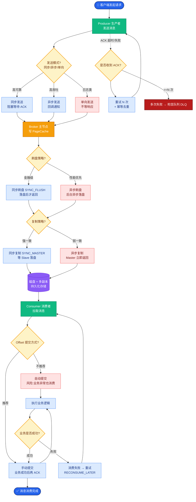

# Prefill-Decode分离（PD分离）是什么？为什么能提升推理效率？

PD分离将推理的两个阶段分开调度到不同GPU上，是当前解决大模型推理算力浪费和延迟波动的核心架构之一。

## 两个阶段的区别
| | Prefill阶段 | Decode阶段 |
|---|---|---|
| 输入 | 整个prompt | 上一步生成的1个token |
| 计算量 | 大（O(N^2)） | 小（O(N)|
| 特点 | 计算密集 | 内存密集 |
| GPU利用率 | 高（Compute-bound） | 低（Memory-bound） |

## PD分离架构流程图

```text
用户请求队列
    │
    ▼
┌─────────────────┐
│  调度器/路由器   │
│  (Batching)     │
└────────┬────────┘
         │
         ├──────────────────────┐
         ▼                      ▼
  ┌─────────────┐         ┌─────────────┐
  │ Prefill GPU │         │ Decode GPU  │
  │  (H100/A100) │         │  (L40S/L4)  │
  │             │         │             │
  │ 1. Attention│         │ 1. Attention│
  │ 2. FFN      │         │ 2. FFN      │
  │ 3. 生成KV   │         │ 3. 读取KV   │
  └──────┬──────┘         └──────┬──────┘
         │ KV Cache (RDMA)│     │
         └────────────────>┘     │
                            新Token生成
```

## 核心策略与细节
1. **Prefill节点**：
   - 使用高算力GPU（如H100）快速处理Prompt。
   - **细节**：Prefill阶段主要受限于算力，HBM带宽往往不是瓶颈，因此高TFLOPS卡性价比最高。

2. **Decode节点**：
   - 使用多张低成本、高显存带宽GPU（如L4）并行Decode。
   - **细节**：Decode阶段主要受限于显存带宽（Memory-bound），对单卡算力要求低。利用L4的高显存带宽优势可以显著降低TTFT（Time To First Token）后的Token生成延迟。

3. **KV Cache传输**：
   - Prefill完成后将KV Cache传给Decode节点。
   - **关键细节**：这是架构的关键路径。通常使用 **RDMA (Remote Direct Memory Access)** 技术实现零拷贝网络传输，避免跨节点传输时的CPU中断和内存拷贝开销。若KV Cache很大（如长文本场景），需考虑分级传输或压缩。

## 优势
- **硬件异构性利用**：Prefill和Decode各自利用最合适的硬件，降低TCO（总拥有成本）。
- **资源利用率最大化**：避免了Decode阶段占用昂贵的高算力卡导致的资源闲置。
- **隔离性**：Prefill的突发长请求不会挤占Decode节点的计算资源，从而稳定了端到端的延迟。

## 挑战与边界条件
- **KV Cache传输延迟**：跨节点传输带来的网络延迟可能抵消计算加速收益。**边界条件**：当Prompt长度非常短（如N<10）时，分离带来的网络开销可能超过计算收益，此时耦合架构可能更优。
- **负载均衡更复杂**：需要动态调整Prefill和Decode集群的比例，否则会出现 Decode 队列积压 或 Prefill 节点空闲。
- **一致性**：在连续批处理中，如何将完成Prefill的请求无缝插入到Decode节点的Batch中，需要复杂的调度器设计（如vLLM的Prefix Caching支持）。

## 实战案例
在处理某SaaS客户的RAG检索增强场景时，我们发现当Prompt长度超过4k且并发请求激增时，耦合架构下的TTFT（首字延迟）会出现剧烈抖动。采用PD分离架构后，我们将8张A100拆分为2张Prefill（高算力）和6张Decode（高带宽），TTFT P99延迟降低了40%，但遇到了偶发的RDMA丢包导致KV Cache传输失败的问题，最终通过增加IB网卡的冗余链路解决。

## 代码示例 (Python - vLLM调度逻辑模拟)
```python
class PDSeparationScheduler:
    def __init__(self, prefill_rpc_client, decode_node_queues):
        self.prefill_client = prefill_rpc_client  # Prefill节点RPC客户端
        self.decode_queues = decode_node_queues    # Decode节点本地队列

    def on_prefill_complete(self, req_id, kv_cache_tensor):
        # 关键：Prefill完成后，通过RDMA传输KV Cache指针
        # 此处仅做逻辑示意，实际通过IB Verbs发送内存地址
        target_node = self.select_decode_node()
        
        # 异步传输KV Cache，不阻塞Prefill GPU
        self.prefill_client.send_kv_remote(
            dest_addr=target_node.ip,
            rkey=kv_cache_tensor.rkey, 
            addr=kv_cache_tensor.data_ptr()
        )
        
        # 将请求元数据推入Decode节点的调度队列
        self.decode_queues[target_node.id].enqueue(req_id)
```

## 常见考点
1. **追问**：在什么情况下 PD 分离反而会降低性能？（答：Prompt极短、网络带宽不足、KV Cache过大导致传输时间长于计算时间）。
2. **追问**：如何解决 Prefill 和 Decode 节点之间的 KV Cache 传输延迟问题？（答：使用 RDMA/InfiniBand，或者计算-传输流水线重叠）。
3. **追问**：除了分离 GPU，调度层面有什么优化？（答：Continuous Batching、Iteration Level Scheduling）。


## 核心流程图



## 记忆要点

- 核心区别：Prefill算力密集(O(N²))用高算力卡，Decode内存密集(O(N))用高带宽卡。
- 架构流程：Prefill生成KV，通过RDMA传输给Decode节点，实现硬件异构利用。
- 边界条件：Prompt极短时网络开销大于收益，耦合架构更优。需解决KV传输延迟。


## 结构化回答

**30 秒电梯演讲：** 将Prefill（计算密集）和Decode（内存密集）拆分到不同资源。——打个比方，像流水线一样，有人专门负责备料（Prefill），有人专门负责打包。

**展开框架：**
1. **核心区别** — Prefill算力密集(O(N²))用高算力卡，Decode内存密集(O(N))用高带宽卡。
2. **架构流程** — Prefill生成KV，通过RDMA传输给Decode节点，实现硬件异构利用。
3. **边界条件** — Prompt极短时网络开销大于收益，耦合架构更优。需解决KV传输延迟。

**收尾：** 以上三点都能配合实战聊。我可以展开任一要点，比如「PD分离的KV Cache传输如何优化」这类追问您感兴趣吗？

## 视频脚本

> 预计时长：4 分钟 | 由浅入深

| 时间 | 画面/字幕 | 口播台词 | 讲解要点 |
|------|----------|----------|----------|
| 0:00 | 标题卡 | "Prefill-Decode分离（PD分离）是什么，30 秒讲清楚。" | 开场钩子 |
| 0:40 | 概念定义动画 | "一句话：将Prefill（计算密集）和Decode（内存密集）拆分到不同资源。" | 核心定义 |
| 1:20 | 核心区别图解 | "Prefill算力密集(O(N²))用高算力卡，Decode内存密集(O(N))用高带宽卡。" | 核心区别 |
| 2:00 | 架构流程图解 | "Prefill生成KV，通过RDMA传输给Decode节点，实现硬件异构利用。" | 架构流程 |
| 2:40 | 边界条件图解 | "Prompt极短时网络开销大于收益，耦合架构更优。需解决KV传输延迟。" | 边界条件 |
| 3:20 | 总结卡 | "记好这几条，面试不慌。下期见。" | 收尾 |
