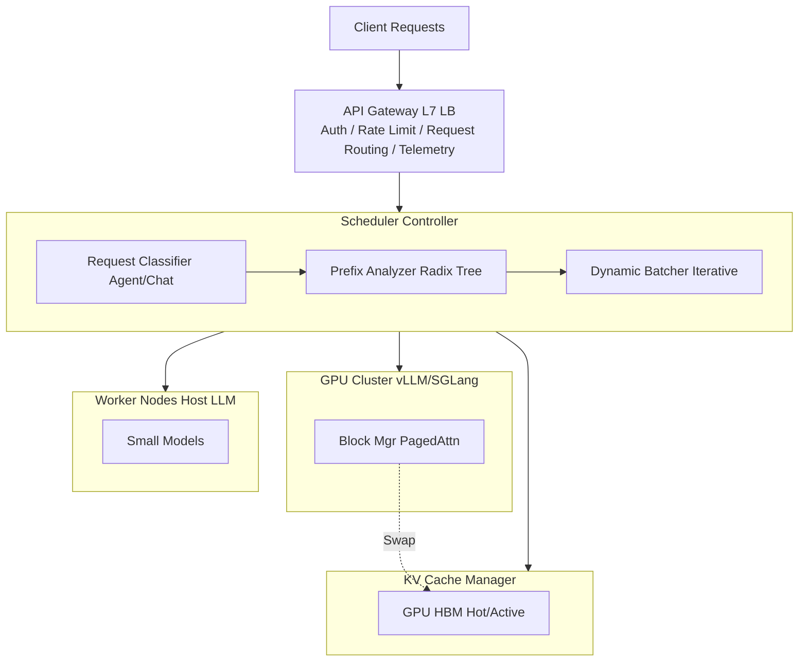

# 【智谱Infra面经】设计一个支持 1M 上下文 + 多模态的高并发 Agent Serving 系统，如何处理调度、KV 管理和负载均衡？

**百万级 Agent Serving 系统设计（增强版）：**

**整体架构：**



**1. 调度策略：Prefix Caching + Iterative Scheduling**
- **问题**：1M 上下文导致 Batch Size 极小（可能仅为 1），显存利用率低，且 Pre-fill 耗时极长（几十秒）。
- **解法**：
  - **Prefill/Decode 分离**：使用专用的 Prefill 节点处理长上下文编码，Decode 节点专注于高吞吐生成。
  - **Radix Tree 调度**：对于 Agent 场景中重复的 System Prompt 或工具定义，利用 Radix Tree 共享 KV Block，仅解码 Unique Part。

**2. KV 管理与多模态：**
- **KV Cache 分层存储**：
  - **L1 (GPU HBM)**：存储最近 20% 的活跃 KV Tokens（高频访问）。
  - **L2 (CPU RAM / NVMe)**：存储长尾的历史 KV Tokens。当需要回溯时异步加载（类似 vLLM 的 Swap 机制）。
- **多模态处理**：
  - 图片/视频通过 Vision Encoder 编码为 Feature Vectors，视作特殊的 Token Embedding 拼接到 LLM 输入序列。
  - 优化：压缩视觉特征（如 CLIP pooling）减少 Prefix 长度。

**3. 负载均衡**
- **一致性哈希**：基于 Session ID 或 User ID 进行路由，保证多轮对话的 KV Cache 在同一 GPU 节点，避免跨节点传输 KV。
- **预测性扩容**：监控 Prefill Queue 长度，若长文本请求堆积，动态扩容 Prefill 专用实例。

**实战案例：**
某金融 Agent 接入 500 页 PDF 作为上下文，首次请求耗时 45s。通过 Radix Cache 复用 PDF 文本的 KV，后续同一文档的提问只需处理 User Query 的 Pre-fill，耗时降至 0.5s。

**代码示例 (Python - LLM Engine 伪代码):**
```python
# 模拟调度器逻辑：优先复用前缀
if request.prefix_hash in radix_cache:
    # 命中缓存，仅解码新部分
    cached_blocks = radix_cache.get(request.prefix_hash)
    scheduler.schedule(request, kv_blocks=cached_blocks)
else:
    # 未命中，进入 Pre-fill 队列（可能需排队）
    prefill_queue.enqueue(request)
```

## 常见考点
1. **Iterative Scheduling 相比 Continuous Batching 的优势？**（Continuous Batching 需等整个 batch 内最慢的请求完成步进，Iterative 可让完成的请求先出，更适合长短不一的 1M 场景）
2. **如何处理 1M 长度下的 Attention 计算延迟？**（使用 Ring Attention 或 Block Sparse Attention，如 Longformer 架构）
3. **多模态特征占用的显存通常比文本大多少？如何优化？**（图片特征通常维度高且序列长，可使用 Feature Linear Projection 或 VQ-VAE 进行压缩量化）


## 记忆要点

- 调度策略：Prefill/Decode分离，长上下文用专用Prefill节点，避免阻塞Decode
- KV管理：Radix Tree共享System Prompt前缀，分层存储（GPU热数据+CPU冷数据）
- 多模态处理：图片通过VLM编码，特征存入KV Cache或独立索引
- 负载均衡：基于请求长度和计算量动态调度，优先保证高并发短请求的SLA


## 结构化回答

**30 秒电梯演讲：** 通过KV分层管理和前缀复用最大化算力利用率。——打个比方，像图书馆管理，热门书放手边（GPU），旧书放书架（CPU），封存书放仓库（SSD）。

**展开框架：**
1. **调度策略** — Prefill/Decode分离，长上下文用专用Prefill节点，避免阻塞Decode
2. **KV管理** — Radix Tree共享System Prompt前缀，分层存储（GPU热数据+CPU冷数据）
3. **多模态处理** — 图片通过VLM编码，特征存入KV Cache或独立索引

**收尾：** 以上三点都能配合实战聊。我可以展开任一要点，比如「KV Cache 从 CPU 换回 GPU 有多快？—— PCIe 4.0 约 64GB/s，1M token KV（~10GB）约 0.15s」这类追问您感兴趣吗？

## 视频脚本

> 预计时长：4 分钟 | 由浅入深

| 时间 | 画面/字幕 | 口播台词 | 讲解要点 |
|------|----------|----------|----------|
| 0:00 | 标题卡 | "【智谱Infra面经】设计一个支持 1M 上下文 + 多模态的高并发 Agent，30 秒讲清楚。" | 开场钩子 |
| 0:40 | 概念定义动画 | "一句话：通过KV分层管理和前缀复用最大化算力利用率。" | 核心定义 |
| 1:20 | 调度策略图解 | "Prefill/Decode分离，长上下文用专用Prefill节点，避免阻塞Decode" | 调度策略 |
| 2:00 | KV管理图解 | "Radix Tree共享System Prompt前缀，分层存储（GPU热数据+CPU冷数据）" | KV管理 |
| 2:40 | 多模态处理图解 | "图片通过VLM编码，特征存入KV Cache或独立索引" | 多模态处理 |
| 3:20 | 总结卡 | "记好这几条，面试不慌。下期见。" | 收尾 |
