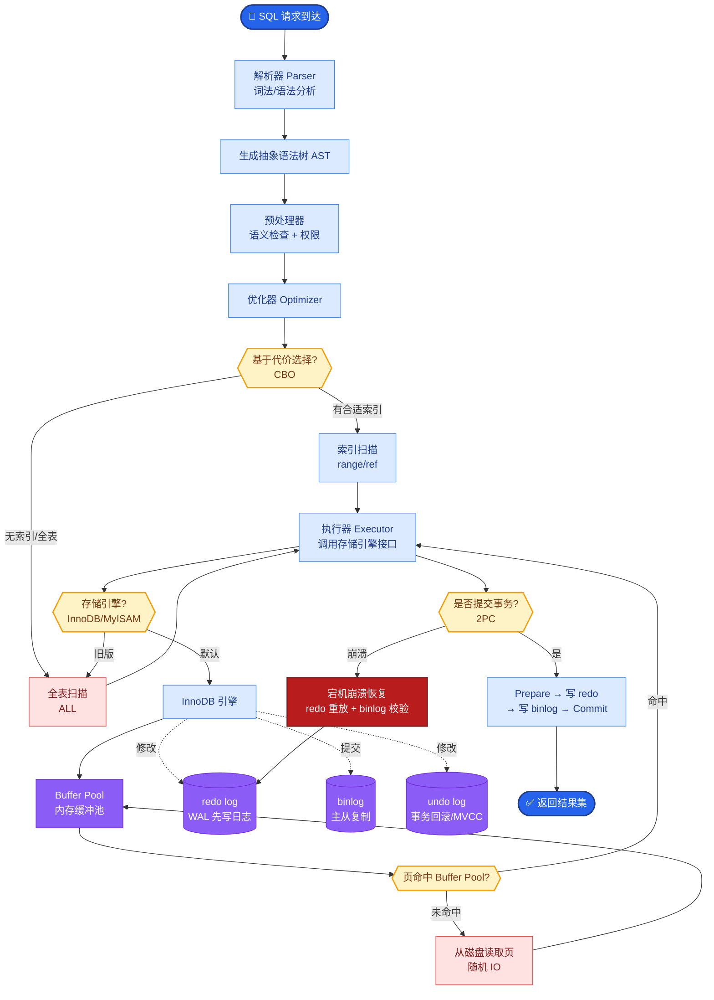
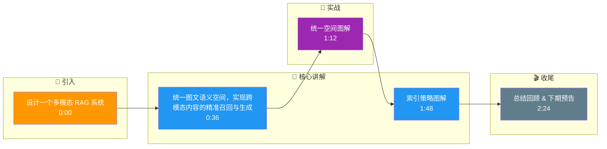

# 如何设计一个多模态 RAG 系统？支持图文混合检索，用户可以用文字搜索图片、用图片搜索相关文档。

【场景分析】
多模态RAG挑战：跨模态语义对齐、图文联合索引、多模态上下文组装、模态间引用关联。

【实战案例】
在电商客服场景中，用户上传一张“生锈的燃气灶”照片询问清洁方法。系统需通过CLIP检索到包含“燃气灶维护”的PDF文档片段，而不是仅检索出类似的商品图片。若仅用文本embedding搜索“清洁”，容易漏掉图中关键实体，必须依赖图片embedding进行跨模态召回。

【整体架构】
1. 多模态文档摄入：
   - 图片：CLIP/BLIP-2生成图像Embedding + OCR提取文字
   - 表格：结构化解析 → Markdown + 文本摘要
   - 图文混合页：图文分离 + 关联标注
2. 统一向量空间：
   - 使用多模态Embedding模型（CLIP / Jina-CLIP-V2）
   - 文本和图像映射到同一向量空间，支持跨模态检索
   - 向量库：Milvus多向量字段（文本向量 + 图像向量）
3. 多模态检索策略：
   - 文搜文：Text Embedding → 文档chunk
   - 文搜图：Text Embedding → CLIP空间 → 图像
   - 图搜文：Image Embedding → CLIP空间 → 文档
   - 混合搜：图文联合查询 → 多路召回 → 融合排序
4. 多模态生成：
   - 使用多模态LLM（GPT-4o / Claude 3.5 Sonnet）
   - 上下文包含文本chunk + 图像引用 + 表格结构
   - 生成回答时标注图片来源和页码

【关键代码示例 (Python/Pinecone)】
```python
# 混合检索：同时输入文本和图片
import base64
from PIL import Image

def hybrid_search(query_text, image_path):
    # 1. 编码图片为向量
    image = Image.open(image_path)
    img_emb = clip_model.get_image_features(image)
    
    # 2. 编码文本为向量 (注意：需与图片同一模型)
    text_emb = clip_model.get_text_features(query_text)
    
    # 3. 向量库查询：使用两路向量进行加权或混合查询
    results = index.query(
        vector=[img_emb, text_emb], 
        top_k=5, 
        include_metadata=True
    )
    return results
```

【模型选型对比】
| 模型/方案 | 适用场景 | 优势 | 劣势 |
| :--- | :--- | :--- | :--- |
| **CLIP (ViT-B/32)** | 通用图文匹配 | 社区支持好，部署简单 | 对细粒度文本（如表格、小字）理解弱 |
| **Jina-CLIP** | 高性能文本检索 | 文本检索精度大幅提升 | 图像侧特征略逊于专用大模型 |
| **ColPali (Late Interaction)** | 复杂文档页面解析 | 完美保留页面布局信息 | 推理延迟高，计算成本大 |
| **Qwen2-VL / GPT-4o** | 理解与生成端 | 强大的视觉理解与定位能力 | API调用成本高，不适合纯检索索引 |

【系统架构图】
```text
┌─────────────┐      ┌──────────────┐      ┌─────────────────┐
│   用户输入   │─────▶│  查询编码层   │─────▶│  混合检索引擎    │
│ (Text/Image)│      │(CLIP Encoder)│      │ (HNSW/IVF_PQ)  │
└─────────────┘      └──────────────┘      └────────┬────────┘
                                                  │
                    ┌─────────────────────────────┼─────────────────────────────┐
                    │                             │                             │
                    ▼                             ▼                             ▼
           ┌───────────────┐             ┌───────────────┐             ┌───────────────┐
           │   图文索引库   │             │  元数据过滤层  │             │  重排序模块    │
           │ (Text Vectors │             │ (Page/Title)  │             │ (Cross-Modal) │
           │  Image Vectors│             └───────┬───────┘             └───────┬───────┘
           └───────┬───────┘                     │                             │
                   │                             │                             │
                   ▼                             ▼                             ▼
           ┌─────────────────────────────────────────────────────────────────────┐
│                           上下文组装 │
│      [Chunk Text] + [Image Base64] + [Metadata]                     │
           └───────────────────────────────┬─────────────────────────────────────┘

## 核心流程图



## 记忆要点

- 统一空间：使用CLIP等多模态模型将图文映射到同一向量空间，支持跨模态检索
- 索引策略：向量库存储多向量字段，图片提取OCR文本辅助索引
- 检索流程：图文联合查询，多路召回后融合排序，支持文搜图、图搜文
- 生成阶段：多模态LLM(如GPT-4o)接收文本+图片上下文，生成带引用的回答

## 结构化回答

**30 秒电梯演讲：** 统一图文语义空间，实现跨模态内容的精准召回与生成。——打个比方，把文字和图片翻译成同一种“外语”，让它们能互相理解并关联。

**展开框架：**
1. **统一空间** — 使用CLIP等多模态模型将图文映射到同一向量空间，支持跨模态检索
2. **索引策略** — 向量库存储多向量字段，图片提取OCR文本辅助索引
3. **检索流程** — 图文联合查询，多路召回后融合排序，支持文搜图、图搜文

**收尾：** 以上三点都能配合实战聊。我可以展开任一要点，比如「如何处理含大量表格的PDF文档的检索」这类追问您感兴趣吗？

## 视频脚本

> 预计时长：3 分钟 | 由浅入深

| 时间 | 画面/字幕 | 口播台词 | 讲解要点 |
|------|----------|----------|----------|
| 0:00 | 标题卡 | "设计一个多模态 RAG 系统，30 秒讲清楚。" | 开场钩子 |
| 0:36 | 概念定义动画 | "一句话：统一图文语义空间，实现跨模态内容的精准召回与生成。" | 核心定义 |
| 1:12 | 统一空间图解 | "使用CLIP等多模态模型将图文映射到同一向量空间，支持跨模态检索" | 统一空间 |
| 1:48 | 索引策略图解 | "向量库存储多向量字段，图片提取OCR文本辅助索引" | 索引策略 |
| 2:24 | 总结卡 | "记好这几条，面试不慌。下期见。" | 收尾 |

### 视频流程图




