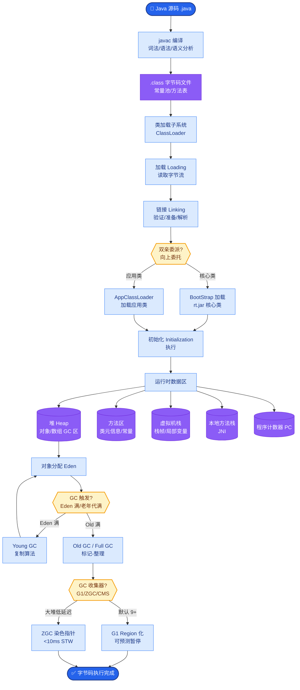

# 如何设计RAG系统的幻觉治理方案？确保生成的回答忠实于检索到的文档。

【场景分析】
RAG幻觉根源：LLM忽略检索上下文自行编造、检索结果不相关但LLM强行回答、上下文矛盾时LLM随机选择。

【实战案例】
在金融财报问答中，用户询问“某公司2024年Q1净利润”，但检索到的文档仅包含2023年数据。若未做充足性校验，LLM可能基于预训练知识“幻觉”出一个错误的数字。引入Faithfulness Checker后，系统检测到上下文中无“2024”关键词，直接触发拒答机制，避免了合规风险。

【三层防御体系】
1. 检索层（预防幻觉）：
   - 高质量检索：混合检索 + Cross-encoder重排序
   - 相关性阈值：检索分数低于阈值时返回「知识库中未找到相关信息」
   - 充足性判断：使用小模型判断「检索结果是否足以回答问题」
2. 生成层（控制幻觉）：
   - 强约束Prompt：「仅基于以下参考文档回答，不可使用外部知识」
   - 结构化输出：要求模型逐句标注来源chunk ID
   - 低温度生成：temperature=0.1~0.3，减少随机性
   - Chain-of-Verification：先生成回答，再让LLM自查每句话是否有来源支持
3. 后处理层（检测幻觉）：
   - NLI（自然语言推理）校验：逐句判断回答与来源文档的蕴含关系
   - 引用匹配：回答中的事实陈述必须能在chunk中找到原文支撑
   - 置信度评分：综合检索分数 + NLI分数 + LLM自评
   - 低置信度兜底：降级为「根据现有资料，可能...」或人工转接

【关键代码示例 (LangChain/NLI)】
```python
from langchain.prompts import PromptTemplate

# 1. 约束Prompt生成
gen_prompt = PromptTemplate.from_template(
    "请依据Context回答问题。Context中未包含的信息请直接回答'未知'。\n"
    "Context: {context}\nQuestion: {question}"
)

# 2. 后处理NLI校验 (伪代码)
def verify_hallucination(answer, context):
    nli_prompt = f"""前提: {context} 
假设: {answer}
关系是? (Entailment, Contradiction, Neutral)"""
    result = nli_model.predict(nli_prompt)
    return result == "Entailment"
```

【治理策略对比】
| 策略维度 | 关键技术 | 实现成本 | 准确率影响 | 适用场景 |
| :--- | :--- | :--- | :--- | :--- |
| **输入侧** | Hybrid Search, Rerank | 中 | 大幅提升召回准确性 | 对准确率要求极高的通用问答 |
| **生成侧** | 系统提示词, 温度设为0 | 低 | 可能降低回答丰富度 | 事实性问答，禁止创作类场景 |
| **验证侧** | NLI模型, CoT验证 | 高 (多一次LLM调用) | 有效过滤明显幻觉 | 金融、医疗等高风险合规领域 |

【幻觉治理流程图】
```text
┌──────────┐    ┌───────────┐    ┌─────────────┐    ┌─────────────┐
│ 用户提问  │───▶│ 检索模块   │───▶│  上下文     │───▶│  LLM 生成   │
└──────────┘    └─────┬─────┘    │   充足性?   │    └──────┬──────┘
                      │         └─────┬───────┘             │
                      ▼               │No                  ▼
               ┌──────────┐          ▼             ┌──────────────┐
               │相关性过滤 │────▶ 拒绝回答            │ 强约束输出   │
               │(Threshold)│                        │(引用+低Temp) │
               └──────────┘                        └──────┬───────┘
                                                          │
                                                          ▼
                                                  ┌───────────────┐
                                                  │   后处理校验   │
                                                  │ (NLI/FactCheck)│
                                                  └───────┬───────┘
                                                          │
                                      ┌─────────────────────┴─────────────────────┐
                                      │                                             │
                                      ▼ Pass                                       ▼ Fail
                              ┌───────────────┐                            ┌───────────────┐
                              │   输出结果    │                            │  拒绝/降级    │


## 核心流程图



## 记忆要点

- 预防层：混合检索+Rerank提升召回，设相关性阈值，不足时拒答
- 生成层：强约束Prompt(仅基于Context)，低Temperature，要求标注来源ID
- 检测层：NLI模型校验回答与文档的蕴含关系，低置信度触发兜底策略
- 核心逻辑：先判断检索内容是否充足，生成后验证事实是否忠实于原文


## 结构化回答

**30 秒电梯演讲：** 检索预防、生成约束、后校验三层联动的全流程幻觉治理。——打个比方，像严谨的学术写作，先查资料，再只写有的，最后交叉核对。

**展开框架：**
1. **预防层** — 混合检索+Rerank提升召回，设相关性阈值，不足时拒答
2. **生成层** — 强约束Prompt(仅基于Context)，低Temperature，要求标注来源ID
3. **检测层** — NLI模型校验回答与文档的蕴含关系，低置信度触发兜底策略

**收尾：** 以上三点都能配合实战聊。我可以展开任一要点，比如「如何区分'幻觉'和'模型正确但用户不理解'的情况」这类追问您感兴趣吗？

## 视频脚本

> 预计时长：3 分钟 | 由浅入深

| 时间 | 画面/字幕 | 口播台词 | 讲解要点 |
|------|----------|----------|----------|
| 0:00 | 标题卡 | "设计RAG系统的幻觉治理方案，30 秒讲清楚。" | 开场钩子 |
| 0:36 | 概念定义动画 | "一句话：检索预防、生成约束、后校验三层联动的全流程幻觉治理。" | 核心定义 |
| 1:12 | 预防层图解 | "混合检索+Rerank提升召回，设相关性阈值，不足时拒答" | 预防层 |
| 1:48 | 生成层图解 | "强约束Prompt(仅基于Context)，低Temperature，要求标注来源ID" | 生成层 |
| 2:24 | 总结卡 | "记好这几条，面试不慌。下期见。" | 收尾 |
