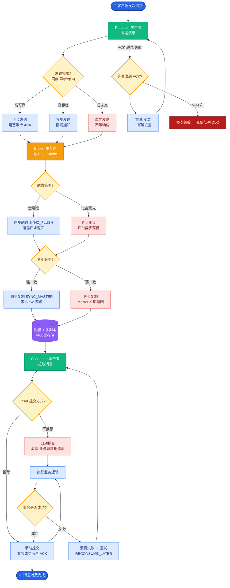

# 如何设计大规模文档处理的RAG Pipeline？日均新增10万+文档，需要实时索引和低延迟查询。

【场景分析】
Chunking是RAG最关键的预处理环节——分块太大有信息稀释，太小丢失上下文，错位切分破坏语义完整性。

【实战案例】
在处理法律长文档时，若简单按512 Token切分，常将“合同条款”与“生效日期”切断在相邻两块。当用户查询“合同何时生效”时，仅检索到条款内容的Chunk无法回答。使用“父文档索引”策略：按自然段落/章节切分大块作为上下文，再细切小块用于精准召回，完美解决了上下文缺失问题。

【分块策略矩阵】
1. 固定窗口分块：
   - 按Token数切分（如500 tokens），滑窗重叠100 tokens
   - 适用：纯文本、FAQ、聊天记录
   - 优点：简单稳定；缺点：可能切断句子
2. 语义分块（推荐）：
   - 基于句子边界 + 语义连贯性检测
   - 工具：spaCy/LangChain RecursiveCharacterTextSplitter
   - 策略：先按段落分，段落内按句子分，保持完整句子
   - 适用：文章、报告、文档
3. 结构化分块（Markdown/HTML）：
   - 按标题层级分块（H1→H2→H3）
   - 每个chunk携带父级标题作为上下文
   - 适用：技术文档、Wiki、产品手册
4. 表格/代码特殊处理：
   - 表格：整表作为chunk + 自然语言摘要
   - 代码：按函数/类边界分块
   - 公式：保留LaTeX完整性
5. 混合粒度分块（Advanced）：
   - 同时生成大chunk（1000t）和小chunk（200t）
   - 大chunk用于生成上下文，小chunk用于精准检索
   - 父子chunk关联：命中子chunk时召回父chunk

【关键代码示例 (LlamaIndex)】
```python
from llama_index.core.node_parser import SemanticSplitterNodeParser

# 基于语义相似度的动态分块
splitter = SemanticSplitterNodeParser(
    buffer_size=1, 
    breakpoint_percentile_threshold=95, # 相似度低于阈值则切分
    embed_model=embedding_model
)

# 递归分块（保持结构完整性）
from langchain.text_splitter import RecursiveCharacterTextSplitter
text_splitter = RecursiveCharacterTextSplitter(
    chunk_size=1000,
    chunk_overlap=200,
    length_function=len,
    separators=["\n\n", "\n", "。", "！", "？", " ", ""]
)
```

【分块策略对比】
| 分块方式 | 切分依据 | 优点 | 缺点 | 推荐场景 |
| :--- | :--- | :--- | :--- | :--- |
| **固定窗口** | Token/字符数 | 实现简单，可控性强 | 易截断语义，上下文断裂 | 通用日志、流水账文本 |
| **语义分块** | 句子/段落相似度 | 语义完整性好，召回相关性强 | 计算成本高（需额外推理） | 论文、技术文档、新闻 |
| **父子索引** | 包含关系 | 兼顾精准召回与丰富上下文 | 架构复杂，需关联查询 | RAG首选，特别是长文档QA |
| **递归分块** | 多级分隔符 | 优先保留结构，通用性强 | 对特定格式（如代码）仍需定制 | Markdown/HTML混合文档 |

【Chunk元数据设计】
- 必须携带：source_doc_id, page_num, section_title, chunk_type
- 权限标签：access_level, department
- 时间戳：created_at, updated_at

【参数调优】
- chunk_size: 256~1024 tokens（根据文档类型）
- overlap: 10%~20%的chunk_size
- 评测：不同参数下的Recall@K和答案质量

【父子索引示意图】
```text
原始文档: [================================================================================]
           │                                    │                                     │
      父Chunk 1 (Large)                父Chunk 2 (Large)                   父Chunk 3 (Large)
      [==================]            [==================]                 [==================]
           │      │      │                   │      │      │                      │
       子C1.1  子C1.2  子C1.3         子C2.1  子C2.2  子C2.3               子C3.1  ...
           │      │      │
           └──────┴──────┘
                  │
           检索命中: 子C1.2 (语义匹配度高)
                  │
           ┌──────┴──────┐
           ▼             ▼
    返回给LLM:      父Chunk 1 (提供完整上下文)
```

## 常见考点
1. **Chunk Size 对检索效果的影响**：为什么太大或太小都不好？（答：太小→语义不完整，向量指向性差；太大→噪声过多，Embedding稀释，且Token消耗大）。
2. **滑动窗口的作用**：Overlap 是为了解决什么问题？（答：解决语义边界切断问题，确保关键信息（如实体名词）不被截断在两个chunk之间）。
3. **父子索引的优缺点**：什么情况下必须用父子索引？（答：需要高精度检索（小chunk）但给LLM提供完整上下文（大chunk）时，或者为了减少向量化成本时）。


## 核心流程图



## 记忆要点

- 分块策略：语义分块优于固定窗口，父子索引兼顾精准召回与上下文完整性
- 结构化处理：Markdown按标题层级切分，表格整表存+摘要，代码按函数切分
- 元数据设计：必须包含Source、Page、Title、Time，支持权限过滤
- Pipeline优化：异步流式处理，批量Embedding，实时更新索引


## 结构化回答

**30 秒电梯演讲：** 异步解耦流水线结合批处理，实现高吞吐低延迟索引。——打个比方，像流水线工厂，分工明确，各环节独立扩容，瓶颈在哪加哪里。

**展开框架：**
1. **分块策略** — 语义分块优于固定窗口，父子索引兼顾精准召回与上下文完整性
2. **结构化处理** — Markdown按标题层级切分，表格整表存+摘要，代码按函数切分
3. **元数据设计** — 必须包含Source、Page、Title、Time，支持权限过滤

**收尾：** 以上三点都能配合实战聊。我可以展开任一要点，比如「如何处理超大文档（如500页PDF）的分块和索引」这类追问您感兴趣吗？

## 视频脚本

> 预计时长：3 分钟 | 由浅入深

| 时间 | 画面/字幕 | 口播台词 | 讲解要点 |
|------|----------|----------|----------|
| 0:00 | 标题卡 | "设计大规模文档处理的RAG Pipeline，30 秒讲清楚。" | 开场钩子 |
| 0:36 | 概念定义动画 | "一句话：异步解耦流水线结合批处理，实现高吞吐低延迟索引。" | 核心定义 |
| 1:12 | 分块策略图解 | "语义分块优于固定窗口，父子索引兼顾精准召回与上下文完整性" | 分块策略 |
| 1:48 | 结构化处理图解 | "Markdown按标题层级切分，表格整表存+摘要，代码按函数切分" | 结构化处理 |
| 2:24 | 总结卡 | "记好这几条，面试不慌。下期见。" | 收尾 |
