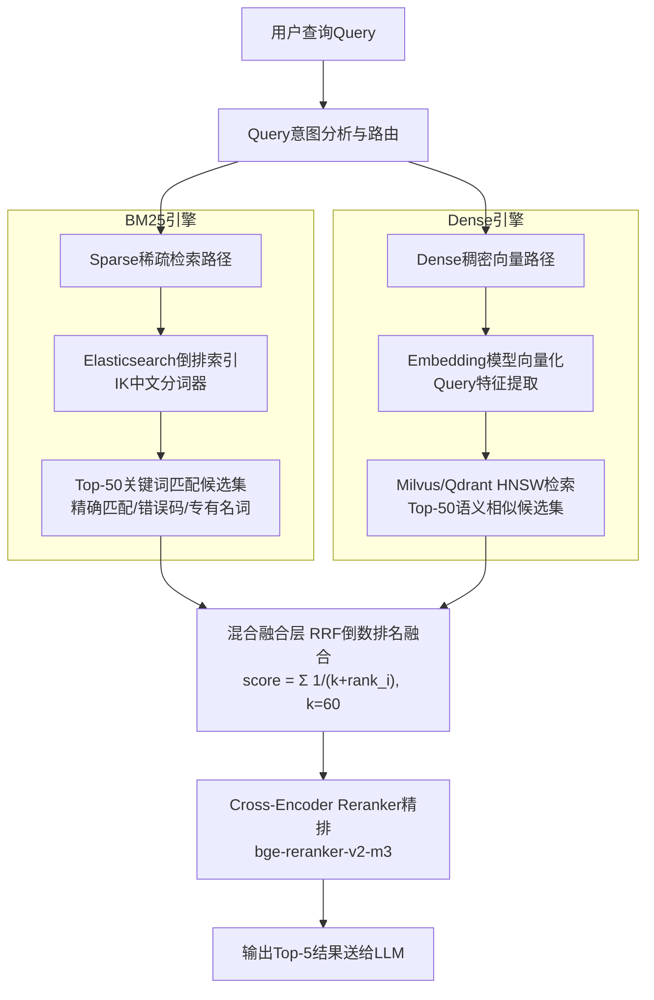
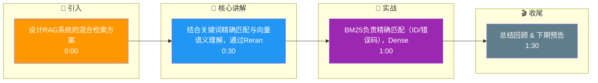

# 如何设计RAG系统的混合检索方案？结合BM25关键词检索和Dense向量检索的优势。

【场景分析】
纯向量检索擅长语义匹配但弱于精确关键词（产品名、错误码）；纯BM25擅长精确匹配但不懂同义改写。混合检索取两者之长。

**边界情况补充**：
- **同形异义词**：如查询"苹果"（指水果而非公司），混合检索可能在语义上偏向水果，BM25可能因关键词频率偏向公司，需通过意图识别微调权重。
- **极短查询**：如查询"API"，BM25会召回大量高频低质文档，需结合Dense的语义理解或Query Expansion（查询扩展）来过滤。

【实战案例】
在一个法律合规RAG系统中，法条引用要求极其精确。纯向量检索将"民法典第一千零一条"匹配到了"人格权编"的其他条款（语义接近），而混合检索通过BM25强制匹配到了精确条文ID，避免了合规风险。

【双路检索架构】
1. Sparse路径（BM25）：
   - Elasticsearch/OpenSearch全文本索引
   - 分词器：IK中文分词 + 标准英文分词
   - 优势：精确匹配、缩写、专有名词、错误码
   - 返回Top-50候选
2. Dense路径（向量）：
   - Embedding模型 → Milvus/Qdrant HNSW检索
   - 优势：语义相似、同义词、跨语言
   - 返回Top-50候选
3. 融合策略：
   - RRF（Reciprocal Rank Fusion）：score = Σ 1/(k+rank_i)，k=60
   - 加权融合：α×BM25_score + (1-α)×Dense_score
   - 线性插值需要先归一化两路分数（min-max或softmax）

**代码示例**：
```python
# 简单加权融合示例
import numpy as np

def weighted_merge(bm25_results, dense_results, alpha=0.5):
    # 归一化
    bm25_norm = (bm25_scores - bm25_scores.min()) / (bm25_scores.max() - bm25_scores.min())
    dense_norm = (dense_scores - dense_scores.min()) / (dense_scores.max() - dense_scores.min())
    return alpha * bm25_norm + (1 - alpha) * dense_norm
```

【Query路由优化】
- 意图分类：关键词型查询 → BM25权重↑；语义型查询 → Dense权重↑
- 混合型：动态调整权重
- 短查询（<3词）倾向BM25，长查询倾向Dense

【Rerank精排】
- 融合后Top-50 → Cross-encoder Reranker精排
- 模型：bge-reranker-v2-m3 / Cohere Rerank
- 输出Top-5给LLM生成
- Rerank提升MRR通常20%~40%

【评测对比】
| 策略 | Recall@10 | MRR | 延迟 |
|------|-----------|-----|------|
| 纯BM25 | 62% | 0.45 | 5ms |
| 纯Dense | 71% | 0.52 | 12ms |
| 混合+Rerank | 85% | 0.68 | 35ms |

## 易错点
1. **分数归一化的失效**：当BM25或Dense检索结果极其集中（如所有分数非常接近）或存在长尾异常高分时，Min-Max归一化会失效，导致融合后的权重由异常值主导，此时Rank-based融合（如RRF）更稳定。
2. **倒排索引与向量索引的一致性**：在分布式环境下，ES和Milvus的数据同步存在延迟。如果实时性要求高，需确保两边的索引更新是原子性的，否则会出现一边能查到一边查不到的幻觉数据。

## 面试追问
1. 除了BM25和Dense，你是否考虑过加入Hybrid Search的第三路（如Splade或ColBERT）？它们解决的核心痛点是什么？
2. 如何解决混合检索带来的额外延迟问题？是否有做缓存或异步处理的策略？
3. 对于多租户场景，如何保证混合检索在不同租户数据隔离下的公平性和性能？

## 流程图



## 记忆要点

- BM25负责精确匹配（ID/错误码），Dense负责语义理解（同义词/改写）
- 融合策略常用RRF（倒数排名融合）或加权线性插值（需归一化）
- RRF公式：Σ 1/(k+rank)，参数k通常取60，鲁棒性强
- 混合检索后接Reranker精排，可提升MRR 20%-40%

## 结构化回答

**30 秒电梯演讲：** 结合关键词精确匹配与向量语义理解，通过Rerank提升召回质量。——打个比方，像“查字典+懂语境”，BM25负责精准找词，向量负责理解意思。

**展开框架：**
1. **BM25负责精确** — BM25负责精确匹配（ID/错误码），Dense负责语义理解（同义词/改写）
2. **融合策略常用RR** — 融合策略常用RRF（倒数排名融合）或加权线性插值（需归一化）
3. **RRF公式** — Σ 1/(k+rank)，参数k通常取60，鲁棒性强

**收尾：** 以上三点都能配合实战聊。我可以展开任一要点，比如「RRF的k参数如何调优」这类追问您感兴趣吗？

## 视频脚本

> 预计时长：2 分钟 | 由浅入深

| 时间 | 画面/字幕 | 口播台词 | 讲解要点 |
|------|----------|----------|----------|
| 0:00 | 标题卡 | "设计RAG系统的混合检索方案，30 秒讲清楚。" | 开场钩子 |
| 0:30 | 概念定义动画 | "一句话：结合关键词精确匹配与向量语义理解，通过Rerank提升召回质量。" | 核心定义 |
| 1:00 | 要点图解 | "BM25负责精确匹配（ID/错误码），Dense负责语义理解（同义词/改写）" | 要点 |
| 1:30 | 总结卡 | "记好这几条，面试不慌。下期见。" | 收尾 |

### 视频流程图




