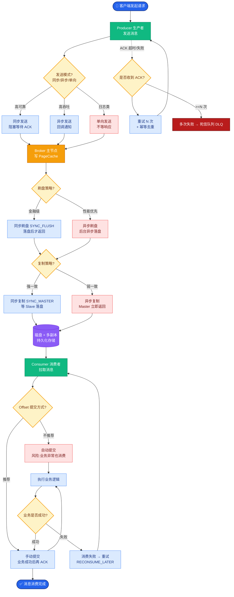

# 设计一个支持实时更新和增量索引的RAG系统。当知识库文档频繁变更时，如何保证检索结果的时效性？

【场景分析】
实时RAG的核心矛盾：索引更新需要时间，用户期望立即检索到最新内容。关键指标：索引延迟（文档更新到可检索的时间差）。

**边界情况补充**：
- **高频批量更新**：如每秒有数千次文档变更，Upsert操作可能会成为瓶颈，甚至导致向量库锁表，需引入批处理合并机制。
- **部分更新**：文档中某个字段变更（如价格）但不影响其他文本，是否需要重新Embedding全文？这涉及细粒度索引设计。

【实战案例】
电商促销RAG系统中，运营每分钟更新几十个活动规则。最初采用全量重建索引导致规则更新后10分钟才生效，引发客诉。后改为基于Debezium的CDC流式处理+向量库Upsert，将可见延迟降低至2秒以内。

【增量索引架构】
1. 变更检测：
   - CDC（Change Data Capture）：监听数据库binlog或文件系统事件（如Debezium）
   - Webhook：文档管理系统主动推送变更事件
   - 定时扫描+内容Hash比对：兜底方案，防止CDC丢包
2. 增量处理Pipeline：
   - 变更事件 → Kafka → 并行Consumer（提高吞吐）
   - 仅处理变更部分：文档Diff → 变更chunk识别（利用文本分块对齐算法）
   - 差异Embedding：只对变更chunk重新计算向量
   - 增量插入：向量库Upsert（Milvus/Pinecone支持，逻辑为删除旧向量ID+插入新向量）
3. 索引刷新策略：
   - Near Real-Time：向量库写入内存后立即可查（牺牲部分查询性能）
   - Soft Refresh：后台定期Compaction，合并Segment，优化查询性能
   - 双缓冲：新索引构建在影子集合 → 原子切换别名

**代码示例**：
```python
from pymilvus import Collection

def upsert_document(collection, doc_id, new_chunks):
    # 1. 删除旧向量 (部分向量库支持Upsert自动覆盖，此处模拟显式逻辑)
    collection.delete(f"doc_id == '{doc_id}'")
    
    # 2. 生成新向量
    new_vectors = [embed_model.encode(c) for c in new_chunks]
    data = [[doc_id]*len(new_chunks), new_chunks, new_vectors]
    
    # 3. 插入新数据
    collection.insert(data)
    collection.flush() # 确保可见性
```

【实时RAG数据流架构图】
┌──────────┐     ┌──────┐     ┌──────────────┐     ┌───────────┐
│Data Source│────>│ CDC  │────>│ Message Queue│────>│ Ingestor  │
│(DB/Files)│     │Worker│     │  (Kafka/Pulsar)│     │ (Parse/Chunk)│
└──────────┘     └──────┘     └──────────────┘     └───────────┘
                                                          │
                                                          ▼
                                                     ┌──────────┐
                                                     │ Embedding│
                                                     │  Service │
                                                     └──────────┘
                                                          │
                                                          ▼
┌─────────────┐    Query    ┌────────────────────────────────────┐
│   User App  │────────────>│           Vector Database          │
└─────────────┘

## 易错点
1. **删除操作的滞后**：在Milvus等向量库中，Delete操作通常是"标记删除"，真正的物理删除在Compaction时进行。如果在Compaction前立即查询，可能会查到已删除的旧数据（幽灵数据），业务上需容忍或通过版本号过滤。
2. **顺序一致性**：Kafka Consumer处理顺序可能乱序，导致先处理了"Update"再处理"Insert"，需在业务层处理事件顺序或依赖数据库事务日志的严格顺序。

## 面试追问
1. 如果向量库不支持Upsert，你会如何设计应用层逻辑来模拟实时更新？
2. 在CDC捕获binlog时，如何处理海量历史数据的冷启动和全量+增量的同步切换问题？
3. Embedding服务的高并发调用是实时链路的瓶颈，有什么优化手段（如批处理、量化模型）？


## 核心流程图



## 记忆要点

- 核心是CDC监听变更+消息队列异步处理+向量库Upsert
- Upsert逻辑为“删除旧ID+插入新向量”，保证原子性
- 高频更新场景需批处理合并，防止锁表或性能瓶颈
- 注意“标记删除”导致的幽灵数据，业务层需用版本号过滤


## 结构化回答

**30 秒电梯演讲：** 基于CDC监听和增量Upsert机制，实现文档变更的秒级同步。——打个比方，像即时通讯，发消息立刻推送，而不是等收信人手动刷新。

**展开框架：**
1. **核心是CDC监听** — 核心是CDC监听变更+消息队列异步处理+向量库Upsert
2. **Upsert逻辑** — Upsert逻辑为“删除旧ID+插入新向量”，保证原子性
3. **高频更新场景需批** — 高频更新场景需批处理合并，防止锁表或性能瓶颈

**收尾：** 以上三点都能配合实战聊。我可以展开任一要点，比如「如何处理高频小批量更新导致的索引碎片化」这类追问您感兴趣吗？

## 视频脚本

> 预计时长：3 分钟 | 由浅入深

| 时间 | 画面/字幕 | 口播台词 | 讲解要点 |
|------|----------|----------|----------|
| 0:00 | 标题卡 | "设计一个支持实时更新和增量索引的RAG系统。当知识库文档频繁变更时，30 秒讲清楚。" | 开场钩子 |
| 0:36 | 概念定义动画 | "一句话：基于CDC监听和增量Upsert机制，实现文档变更的秒级同步。" | 核心定义 |
| 1:12 | 要点图解 | "核心是CDC监听变更+消息队列异步处理+向量库Upsert" | 要点 |
| 1:48 | 要点图解 | "Upsert逻辑为“删除旧ID+插入新向量”，保证原子性" | 要点 |
| 2:24 | 总结卡 | "记好这几条，面试不慌。下期见。" | 收尾 |
