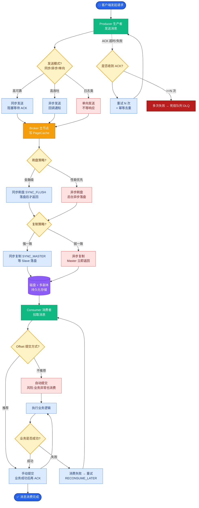

# 如何设计一个多Agent协作系统？例如多个AI Agent协同完成一个复杂的数据分析报告。

【场景分析】
多Agent协作核心挑战：任务分解、Agent间通信、结果聚合、错误传播控制、死锁检测。

**边界情况补充**：
- **循环依赖**：Agent A 等待 Agent B 的结果，而 Agent B 的逻辑又需要 Agent A 的确认，导致死锁。需在DAG图中检测环或设置超时机制。
- **状态发散**：当多个Agent并行修改共享状态时，可能出现冲突（如一个Agent删除了另一个Agent正在使用的数据），需引入锁机制或版本控制。
- **长上下文与截断**：在长链路协作中，上下文信息可能超过模型窗口限制，导致中间关键信息丢失。需设计“摘要Agent”或分层记忆机制。
- **幻觉传播**：若上游Agent产生错误结论，下游Agent会基于错误数据继续推理，导致“垃圾进垃圾出”。需在关键节点引入结果校验或反思机制。

【实战案例】
在构建自动化投研系统时，我们将研究员、数据分析师和报告撰写者设为独立Agent。曾遇到过Analyst Agent因为数据格式异常陷入重试死循环，导致整个系统挂起。引入Review Agent作为监控者检测心跳，并设置超时熔断机制后才解决。

【架构设计】
1. Agent角色定义：
   - Orchestrator（编排者）：接收任务 → 分解子任务 → 分配 → 聚合结果
   - Researcher（研究员）：收集数据、查询数据库、调用API
   - Analyst（分析师）：数据清洗、统计分析、生成图表
   - Writer（撰写者）：整合分析结果、撰写报告
   - Reviewer（审核者）：质量检查、事实核查
2. 通信模式：
   - 共享黑板：Agent读写共享状态空间（适合解耦，但可能产生竞争）
   - 消息传递：Agent间直接通信（如点对点，适合明确流程）
   - 事件驱动：任务完成事件触发下一步（适合异步松耦合）
3. 任务编排：
   - DAG任务图：任务依赖关系建模
   - 串行/并行混合：独立任务并行，有依赖的串行
   - 动态分配：根据Agent能力和负载动态调度

**代码示例**：
```python
def orchestrator_loop(task, max_steps=10):
    context = {"goal": task, "history": []}
    for _ in range(max_steps):
        # 1. Router决定下一步动作
        action = router_agent.decide(context)
        if action.type == "FINAL":
            return context["result"]
        
        # 2. 执行对应Agent
        result = execute_agent(action.agent_name, action.input)
        
        # 3. 更新共享状态
        context["history"].append({"agent": action.agent_name, "output": result})
    return "Error: Max steps reached"
```

【多Agent协作状态流转图】
┌──────────────┐
│   User Query │
└──────┬───────┘
       ▼
┌──────────────┐     1. Plan      ┌───────────────────┐
│Orchestrator  ├─────────────────>│ Task Graph (DAG)  │
│  (Manager)   │                  │ [Task A, B, C...] │
└──────┬───────┘                  └─────────┬─────────┘
       │                                    │
       │ 2. Dispatch                        │ 3. Execute
       ▼                                    ▼
┌──────────────┐                   ┌──────────────────┐
│ Message Queue│<──────────────────│ Agent A / B / C  │
│  (Event Bus) │    Publish Event  │ (Workers)        │
└──────┬───────┘                   └────────┬─────────┘
       │                                    │

## 面试追问
1. **一致性保障**：在共享黑板模式下，如果两个Agent同时修改同一个全局变量，你会采用乐观锁（CAS）还是悲观锁？各自的性能损耗如何？
2. **错误恢复**：如果Analyst Agent处理失败（如数据源超时），Orchestrator应该如何决策？是直接报错、重试还是降级处理（例如使用历史数据）？如何设计重试策略避免风暴？
3. **评估指标**：如何量化评估多Agent系统的协作效率？除了最终任务成功率，你会关注哪些中间指标（如单个Agent的Token消耗、轮次、空闲时间）？

## 易错点
1. **过度依赖Agent自主性**：试图让LLM完全自主决定所有流程，导致输出不可控。实际上核心流程应由代码/DAG强约束，LLM仅负责处理具体逻辑。
2. **忽视“人机协同”**：设计完全全自动的闭环，忽略了在关键决策点（如资金划转、发布报告）必须加入人工确认环节，否则风险极大。


## 核心流程图



## 记忆要点

- 核心组件：Orchestrator（编排）、Worker（执行）、Shared State（通信）
- 任务编排用DAG图建模，支持并行执行与依赖管理
- 通信模式选共享黑板（解耦）或消息传递（明确流程）
- 必须设置超时熔断与死锁检测，防止单点故障挂起系统


## 结构化回答

**30 秒电梯演讲：** 通过角色分工和协作机制，让多个AI Agent像团队一样协同完成复杂任务。——打个比方，像公司项目组，有PM分配任务，有程序员写代码，有测试找Bug，最后大家一起交付。

**展开框架：**
1. **核心组件** — Orchestrator（编排）、Worker（执行）、Shared State（通信）
2. **任务编排用DAG** — 任务编排用DAG图建模，支持并行执行与依赖管理
3. **通信模式选共享黑** — 通信模式选共享黑板（解耦）或消息传递（明确流程）

**收尾：** 以上三点都能配合实战聊。我可以展开任一要点，比如「多Agent之间的上下文如何高效共享而不爆炸」这类追问您感兴趣吗？

## 视频脚本

> 预计时长：3 分钟 | 由浅入深

| 时间 | 画面/字幕 | 口播台词 | 讲解要点 |
|------|----------|----------|----------|
| 0:00 | 标题卡 | "设计一个多Agent协作系统，30 秒讲清楚。" | 开场钩子 |
| 0:36 | 概念定义动画 | "一句话：通过角色分工和协作机制，让多个AI Agent像团队一样协同完成复杂任务。" | 核心定义 |
| 1:12 | 核心组件图解 | "Orchestrator（编排）、Worker（执行）、Shared State（通信）" | 核心组件 |
| 1:48 | 要点图解 | "任务编排用DAG图建模，支持并行执行与依赖管理" | 要点 |
| 2:24 | 总结卡 | "记好这几条，面试不慌。下期见。" | 收尾 |
