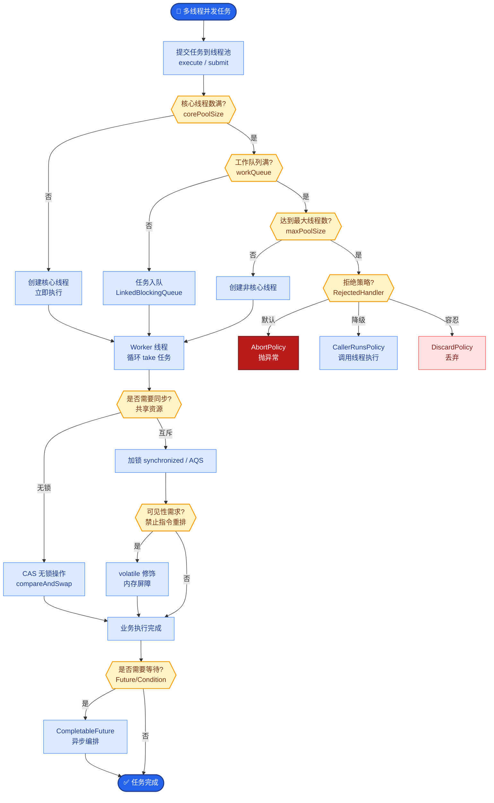

# 如何设计AI Agent的工具调用（Tool Calling）安全边界？防止Agent执行危险操作。

【场景分析】
Tool Calling风险：Agent可能被Prompt注入诱导执行未授权操作、调用错误的工具、传递危险参数。安全边界设计是生产级Agent的核心。

【实战案例】
某客服Agent曾被诱导调用"内部运维接口"删除用户订单，原因是对参数中的`"command": "rm -rf"`未做语义识别。引入注入检测层后，拦截率提升至99%。

【安全分层架构】
1. **工具注册与权限**：
   - 白名单机制：Agent只能调用注册过的工具
   - 分级权限：只读工具（查询）/ 写入工具（创建修改）/ 危险工具（删除/转账）
   - 租户隔离：不同租户可用的工具集合不同
2. **参数校验层（Gateway）**：
   - JSON Schema校验：调用参数必须符合预定义Schema（类型、必填项）
   - 范围限制：金额<上限、时间范围合法、ID格式正确（Regex校验）
   - 注入检测：参数值扫描Prompt注入模式（如"Ignore previous instructions"）
3. **执行前检查**：
   - 身份验证：当前用户是否有权限执行该操作（RBAC/ABAC）
   - 资源归属：操作的资源是否属于当前用户（防止越权访问IDOR）
   - 风险评估：操作的风险等级（low/medium/high/critical）
4. **Human-in-the-Loop**：
   - 高风险操作：Agent生成执行计划 → 人工确认 → 执行
   - 二次确认：敏感操作（删除、转账）需要额外验证（如OTP或弹窗）
   - 审计日志：记录完整的调用链（谁、何时、什么参数、结果）

【边界情况补充】
- **参数对抗样本攻击**：防御Base64编码、Unicode混淆、多语言同义词绕过注入检测（需多层解码+语义分析）。
- **工具副作用叠加**：防止同一会话内高频调用低风险工具造成“刷库”或“DoS”（需增加单用户频次限流）。
- **越狱指令隐藏**：攻击者可能将恶意指令藏在“思考”或长文本中间，需对Tool Call之外的Agent内部思维链进行审查。

【关键代码示例：参数校验与注入检测】
```python
from pydantic import BaseModel, validator
import re

class TransferRequest(BaseModel):
    amount: float
    target_account: str
    description: str

    @validator('amount')
    def check_limit(cls, v):
        if v > 10000:  # 单笔限额
            raise ValueError('Amount exceeds safety limit')
        return v

    @validator('description')
    def check_injection(cls, v):
        # 简单的Prompt注入模式检测
        if re.search(r'ignore|previous|system', v, re.IGNORECASE):
            raise ValueError('Potential prompt injection detected')
        return v
```

【Tool Calling 安全过滤流程图】
┌──────────┐   1. Tool Call   ┌──────────────┐   2. Schema   ┌──────────────┐
│   LLM    │────────────────>│  Security    │──────────────>│  Validation  │
│  Agent   │ (name, args)    │  Gateway     │   Check       │  (Regex/Type)│
└──────────┘                  └──────┬───────┘               └──────┬───────┘
                                     │                              │
                                     │ Fail                         │ Fail
                                     ▼                              ▼
                              ┌──────────────┐               ┌──────────────┐
                              │   Reject/    │

## 面试追问
1. 如果LLM生成的参数通过了Schema校验，但组合起来是恶意的（例如A接口正常，B接口正常，但AB组合造成了业务漏洞），如何防御？
2. 在高并发场景下，注入检测层（特别是正则匹配或语义分析）可能成为性能瓶颈，你有什么优化方案？

## 易错点
1. **过度依赖LLM自我约束**：仅在System Prompt中要求“不要执行危险操作”，而没有在代码层面设置强制拦截，这是极高风险的做法。
2. **权限粒度过粗**：仅区分“用户”和“管理员”，未将工具权限细化到具体的资源ID或数据范围，容易导致水平越权。


## 核心流程图



## 记忆要点

- 工具注册白名单，参数必须通过JSON Schema校验（类型/范围）
- 执行前做RBAC权限校验和资源归属检查，防越权
- 高危操作（删除/转账）必须Human-in-the-Loop二次确认
- 参数层需注入检测，扫描“ignore previous”等恶意指令


## 结构化回答


**30 秒电梯演讲：** 像操作系统的权限控制，普通用户不能删库，高危操作必须输入管理员密码确认。

**展开框架：**
1. **工具必须白名单注册** — 工具必须白名单注册，分级管理权限。
2. **Schema** — 参数需通过Schema校验和注入检测。
3. **高风险操作必须经** — 高风险操作必须经过人工确认。

**收尾：** 如何在不影响用户体验的前提下实现安全审批？


## 视频脚本

> 预计时长：3 分钟 | 由浅入深

| 时间 | 画面/字幕 | 口播台词 | 讲解要点 |
|------|----------|----------|----------|
| 0:00 | 标题卡 | "设计AI Agent的工具调用（Tool Calling）安全边界，30 秒讲清楚。" | 开场钩子 |
| 0:36 | 概念定义动画 | "一句话：构建多层防御网，在工具注册、参数校验、执行检查和人机确认四个环节严格管控。" | 核心定义 |
| 1:12 | 要点图解 | "工具注册白名单，参数必须通过JSON Schema校验（类型/范围）" | 要点 |
| 1:48 | 要点图解 | "执行前做RBAC权限校验和资源归属检查，防越权" | 要点 |
| 2:24 | 总结卡 | "记好这几条，面试不慌。下期见。" | 收尾 |
