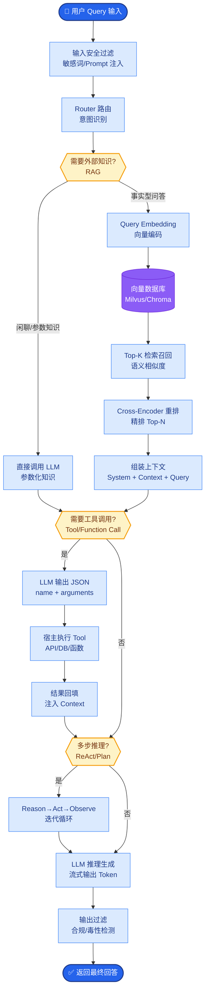
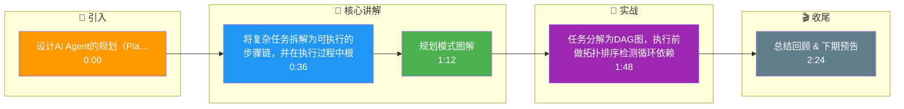

# 如何设计AI Agent的规划（Planning）与推理（Reasoning）引擎？让Agent能自主分解复杂任务。

【场景分析】
Agent规划能力是区分「聊天机器人」和「自主Agent」的关键。核心挑战：任务分解质量、计划可执行性、动态调整能力。

【实战案例】
在某电商运维Agent中，曾遇到因未处理API依赖导致“先调用订单详情（需登录）再执行登录”的顺序错误。通过引入“预检Hook”在执行前校验依赖状态，解决了此类逻辑死锁。

【核心架构流程】
以下是一个典型的 Planning Agent 数据流转架构图：

```text
┌─────────────┐     ┌─────────────────┐     ┌─────────────────┐
│   User      │────▶│  LLM Planner    │────▶│  Task Graph     │
│  (Complex   │     │  (DeComposer)   │     │  (DAG/Tree)     │
│   Request)  │     └────────┬────────┘     └────────┬────────┘
└─────────────┘              │                     │
                             ▼                     │
                    ┌─────────────────┐            │
                    │  Prompt/Context │            │
                    │  Engineering    │            │
                    └─────────────────┘            │
                             │                     │
                             ▼                     ▼
┌─────────────┐     ┌─────────────────┐     ┌─────────────────┐
│  Executor   │◀────│   Controller    │◀────│  Scheduler      │
│ (Tool Call) │     │  (State Mgr)    │     │  (Priority/Dep) │
└─────────────┘     └────────┬────────┘     └─────────────────┘
                             │
                             ▼
                    ┌─────────────────┐
                    │   Re-Planner    │◀───[Error/Feedback]
                    │  (Adjustment)   │
                    └─────────────────┘
```

【代码示例：DAG任务构建】
```python
class TaskNode:
    def __init__(self, id, action, dependencies=None):
        self.id = id
        self.action = action
        self.dependencies = dependencies or []
        self.status = "pending"

def build_plan(llm_response):
    # 解析LLM输出的步骤列表
    steps = llm_response['steps']
    tasks = {}
    for step in steps:
        # 简单依赖识别：依赖前一步的输出
        deps = [steps[i-1]['id']] if i > 0 else []
        tasks[step['id']] = TaskNode(step['id'], step['action'], deps)
    return tasks
```

【规划模式分类】
1. ReAct（Reasoning + Acting）：
   - Thought → Action → Observation 循环
   - 每一步先思考再行动，适合简单推理
2. Plan-and-Solve：
   - 先一次性规划全部分步步骤，再逐步执行
   - 适合步骤明确、依赖线性的任务
3. Tree of Thoughts (ToT)：
   - 探索多个可能的分支，进行评估或回溯
   - 适合解空间大的复杂问题（如数学推理、代码生成）

【边界情况补充】
- **循环依赖死锁**：LLM生成的计划可能出现A依赖B，B又依赖A的环状结构。在构建DAG时必须执行拓扑排序检测，一旦发现环立即触发重规划。
- **无限规划**：面对复杂任务，LLM可能陷入无限拆分（如“搜索A -> 分析A -> 搜索A的子项...”）。需设置最大执行步数（Max Steps）硬限制。
- **动态环境变化**：执行过程中外部状态发生变化（如库存突然售罄），导致原计划不可行。需要在每个节点执行后引入“状态校验”，触发局部重规划。

## 面试追问
1. 在多Agent协作场景下，如何处理多个Agent之间的规划冲突和资源竞争？
2. 当任务执行失败需要回滚时，基于DAG的规划引擎如何保证状态的一致性（类似数据库事务）？

## 易错点
1. **过度依赖一次性规划**：认为LLM能一次性生成完美的DAG，实际上长链条任务的中间步骤极易出错，必须支持“边执行边修正”的增量规划。
2. **忽略计划的Cost预估**：规划时仅考虑逻辑可行性，未评估Token消耗、时间成本或API调用费用，导致任务执行到一半因资源耗尽而中断。

## 核心流程图



## 记忆要点

- 规划模式：ReAct（循环推理）、Plan-and-Solve（先规划后执行）、ToT（树探索）
- 任务分解为DAG图，执行前做拓扑排序检测循环依赖
- 设置Max Steps硬限制，防止LLM陷入无限拆分
- 执行节点引入“状态校验”，失败时触发局部重规划

## 结构化回答

**30 秒电梯演讲：** 将复杂任务拆解为可执行的步骤链，并在执行过程中根据反馈动态调整。——打个比方，像写代码前先画流程图，遇到报错时回溯修改逻辑，而不是盲目执行。

**展开框架：**
1. **规划模式** — ReAct（循环推理）、Plan-and-Solve（先规划后执行）、ToT（树探索）
2. **任务分解为DAG** — 任务分解为DAG图，执行前做拓扑排序检测循环依赖
3. **设置Max St** — 设置Max Steps硬限制，防止LLM陷入无限拆分

**收尾：** 以上三点都能配合实战聊。我可以展开任一要点，比如「ReAct和Plan-and-Execute分别适合什么场景」这类追问您感兴趣吗？

## 视频脚本

> 预计时长：3 分钟 | 由浅入深

| 时间 | 画面/字幕 | 口播台词 | 讲解要点 |
|------|----------|----------|----------|
| 0:00 | 标题卡 | "设计AI Agent的规划（Planning）与推理（Reasoning）引擎，30 秒讲清楚。" | 开场钩子 |
| 0:36 | 概念定义动画 | "一句话：将复杂任务拆解为可执行的步骤链，并在执行过程中根据反馈动态调整。" | 核心定义 |
| 1:12 | 规划模式图解 | "ReAct（循环推理）、Plan-and-Solve（先规划后执行）、ToT（树探索）" | 规划模式 |
| 1:48 | 要点图解 | "任务分解为DAG图，执行前做拓扑排序检测循环依赖" | 要点 |
| 2:24 | 总结卡 | "记好这几条，面试不慌。下期见。" | 收尾 |

### 视频流程图




