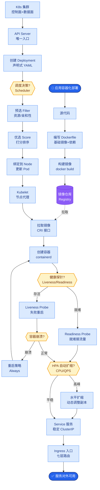
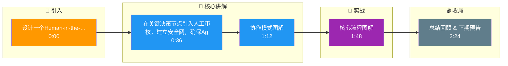

# 如何设计一个Human-in-the-Loop（人机协作）的AI Agent系统？在关键决策点引入人工审核。

【场景分析】
纯自主Agent在高风险场景不可接受（医疗、金融、法律）。Human-in-the-Loop在保持效率的同时确保安全性和准确性。

【实战案例】
在金融风控Agent中，直接执行“冻结账户”操作曾导致误冻VIP客户，引发投诉。后增加“高危动作双因素确认”机制，超过10万元的操作必须由安全员在独立的审核系统中输入Token放行。

【人机协作架构】
```text
┌──────────────────┐
│   User Input     │
└────────┬─────────┘
         ▼
┌──────────────────┐     ┌──────────────────┐
│   Agent Core     │────▶│ Risk Engine      │
│ (Plan/Exec)      │     │ (Score/Check)    │
└────────┬─────────┘     └────────┬─────────┘
         │                       │
         │                       ▼
         │              ┌──────────────────┐
         │              │ Score > Threshold?│
         │              └────────┬─────────┘
         │           Yes /      \ No
         │            /          \
         ▼           ▼            ▼
┌──────────────────┐  ┌──────────┐  ┌──────────────┐
│   Review UI      │  │ Execute  │  │ Direct Exec  │
│ (Human Approval) │  │ (Wait)   │  │ (Auto)       │
└────────┬─────────┘  └──────────┘  └──────────────┘
         │
         ▼
┌──────────────────┐
│ Feedback Loop    │◀────[Action Taken]
│ (Fine-tune)      │
└──────────────────┘
```

【代码示例：风险拦截与异步等待】
```python
def execute_with_guardrails(action):
    risk_score = risk_engine.calculate(action)
    if risk_score > THRESHOLD:
        # 发送审核事件并挂起任务
        review_id = audit_service.create_request(action)
        # 状态机进入 WAITING_APPROVAL 状态
        return State(status="WAITING", review_id=review_id)
    
    # 低风险直接执行
    return tool_executor.run(action)

# 人工审核回调处理
def handle_approval(review_id, approved):
    if approved:
        task = db.get_task_by_review(review_id)
        tool_executor.run(task.pending_action)
```

【人机协作模式】
1. Review-then-Act（先审后行）：
   - Agent生成执行计划 → 人工审核确认 → 自动执行
   - 适用：高风险操作（资金转账、合同发送、数据删除）
   - 延迟代价：增加人工审核时间（分钟~小时级）
2. Act-then-Review（先行后审）：
   - Agent自动执行 → 异常时人工复核
   - 适用：低风险但有审计需求的场景
3. Shadow Mode（影子模式）：
   - Agent生成建议但不执行，人工并行处理
   - 对比Agent建议和人工结果，持续校准
   - 适用：Agent上线前的验证阶段
4. Interactive Correction（交互修正）：
   - Agent输出初稿 → 用户修改 → Agent基于修正继续执行
   - 适用：创作类任务（写文案、画图）

【边界情况补充】
- **审核超时处理**：当人工审核长时间未响应（如审核员离线），任务不能无限期挂起。需设计超时机制（Timeout），自动触发降级策略（如拒绝操作或转交上级审批）。
- **执行环境漂移**：在“等待审核”期间，外部状态可能已改变（如物品已被他人购买）。人工点击“批准”前，系统必须重新校验前置条件是否依然满足。
- **审核疲劳**：若过多触发生工审核，审核员可能产生疲劳导致“点击通过”习惯。需设计动态阈值策略，对Agent行为准确率高的时段自动降低审核频率。

## 面试追问
1. 在影子模式下，如何量化评估Agent与人工操作的差异，并决定何时让Agent正式上线？
2. 如果审核员修改了Agent计划中的某个步骤（例如换了家供应商），后续依赖该步骤的操作，Agent如何自动适配新的参数或上下文？

## 易错点
1. **混淆人机交互与人工审核**：认为简单的“用户确认弹窗”就是HitL，真正的HitL通常涉及独立的风控系统、角色分离和审计追溯。
2. **缺乏回退通道**：设计了人工拒绝的逻辑，但拒绝后没有引导Agent进行自我修正或提供备选方案，导致流程直接死结束。

## 核心流程图



## 记忆要点

- 协作模式：先审后行（高风险）、先行后审（低风险）、影子模式（验证期）
- 核心流程：Agent执行 → 风险引擎打分 → 超阈值转人工审核
- 人工审核需独立系统与角色分离，确保审计追溯
- 设计超时降级策略，防止审核员离线导致任务无限挂起

## 结构化回答

**30 秒电梯演讲：** 在关键决策节点引入人工审核，建立安全网，确保Agent行为可控且准确。——打个比方，像自动驾驶的L2/L3级，机器负责大部分驾驶，但复杂路口或突发情况必须人接管。

**展开框架：**
1. **协作模式** — 先审后行（高风险）、先行后审（低风险）、影子模式（验证期）
2. **核心流程** — Agent执行 → 风险引擎打分 → 超阈值转人工审核
3. **人工审核需独立系** — 人工审核需独立系统与角色分离，确保审计追溯

**收尾：** 以上三点都能配合实战聊。我可以展开任一要点，比如「如何平衡人工审核的成本和安全性」这类追问您感兴趣吗？

## 视频脚本

> 预计时长：3 分钟 | 由浅入深

| 时间 | 画面/字幕 | 口播台词 | 讲解要点 |
|------|----------|----------|----------|
| 0:00 | 标题卡 | "设计一个Human-in-the-Loop（人机协作）的AI Agent系统，30 秒讲清楚。" | 开场钩子 |
| 0:36 | 概念定义动画 | "一句话：在关键决策节点引入人工审核，建立安全网，确保Agent行为可控且准确。" | 核心定义 |
| 1:12 | 协作模式图解 | "先审后行（高风险）、先行后审（低风险）、影子模式（验证期）" | 协作模式 |
| 1:48 | 核心流程图解 | "Agent执行 → 风险引擎打分 → 超阈值转人工审核" | 核心流程 |
| 2:24 | 总结卡 | "记好这几条，面试不慌。下期见。" | 收尾 |

### 视频流程图




