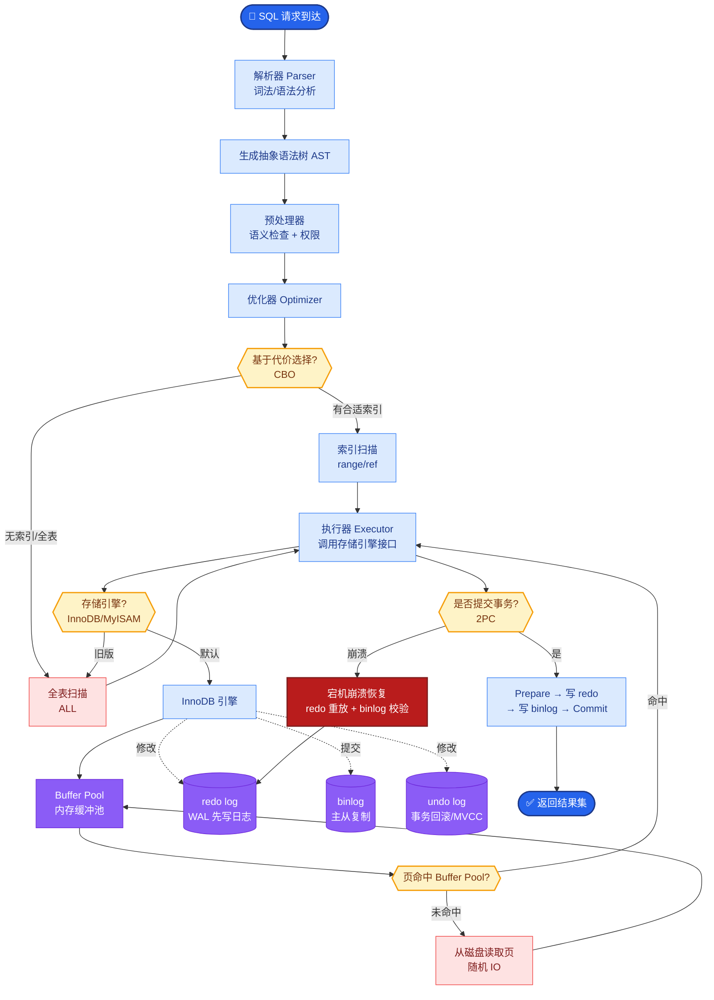

# 如何设计AI Agent的错误恢复机制？当Agent执行任务中途失败时，如何优雅地处理和恢复。

【场景分析】
Agent失败类型多样：工具调用失败、LLM输出格式错误、上下文超限、逻辑死循环、外部服务不可用。健壮的Agent必须有完善的错误恢复策略。

【实战案例】
在数据清洗Agent中，遇到过LLM生成包含Markdown代码块的JSON导致解析失败。通过增加“清洗中间层”，使用正则强行提取JSON内容后再传入解析器，将解析失败率从15%降至0%。

【错误恢复状态机】
```text
                    ┌───────────┐
                    │  Start    │
                    └─────┬─────┘
                          │
                          ▼
               ┌─────────────────────┐
               │   Execute Step      │─────┐
               └─────────┬───────────┘     │
                         │                 │
               ┌─────────▼─────────┐       │
               │    Error?         │       │ Success
               │ (Type Detection)  │       │
               └─────────┬─────────┘       │
           Yes │         │ No             │
      ┌─────────┴────┐    │                │
      ▼             ▼    ▼                ▼
┌──────────┐  ┌──────────┐    ┌──────────────┐
│Transient?│  │Critical? │    │    Next      │
└─────┬────┘  └────┬─────┘    │    Step      │
      │            │         └──────────────┘
      ▼            ▼
┌──────────┐  ┌──────────┐
│Retry (+  │  │Escalate  │
│Backoff)  │  │/Fallback │
└─────┬────┘  └──────────┘
      │            │
      ▼            ▼
[Limit?]──Yes─▶ [Fail/Halt]
      │ No
      ▼
[Resume]
```

【代码示例：带退避的重试装饰器】
```python
import time
from functools import wraps

def retry_with_backoff(max_retries=3, base_delay=1):
    def decorator(func):
        @wraps(func)
        def wrapper(*args, **kwargs):
            for attempt in range(max_retries):
                try:
                    return func(*args, **kwargs)
                except TransientError as e:
                    if attempt == max_retries - 1:
                        raise CriticalError("Max retries exceeded")
                    delay = base_delay * (2 ** attempt) # 指数退避
                    time.sleep(delay)
            return wrapper
    return decorator
```

【错误分类与恢复策略】
1. 瞬态错误：
   - 网络超时、API限流、临时不可用
   - 策略：指数退避重试（3次，间隔1s/2s/4s）
   - 超过重试次数 → 降级
2. 语义/格式错误：
   - LLM输出JSON格式错误、Token超限
   - 策略：Self-Reflection（将错误信息抛回LLM让其自我修正），或使用中间件清洗修复
3. 逻辑/业务错误：
   - 参数越界、权限不足、依赖资源不存在
   - 策略：询问用户（Ask for Help）或切换到备选方案

【边界情况补充】
- **重复失败导致的死循环**：Agent在两个不兼容的操作之间反复尝试并失败（如A要求先有B，B要求先有A）。需在状态机中记录“历史错误路径”，防止重复进入相同的状态组合。
- **部分成功的状态回滚**：长任务执行到第5步失败，前4步已产生副作用（如数据库写入）。需设计分布式事务或Compensation Action（补偿动作）来回滚已完成的步骤。
- **错误上下文丢失**：多次重试或Self-Reflection后，Prompt中堆满了错误日志，导致Context Window溢出。需在重试时对错误日志进行摘要压缩，而非直接追加原文。

## 面试追问
1. 当Agent进入“询问用户”的恢复分支，但用户长时间不回复时，任务状态应该如何流转？是持久化挂起还是直接取消？
2. 在多Agent协作中，如果下游Agent出错并要求上游Agent重试，如何保证整个链路的幂等性和数据一致性？

## 易错点
1. **混淆重试与幂等**：认为所有失败都可以重试。实际上，非幂等操作（如转账、发送邮件）的重试会导致严重后果，必须在重试前检查操作的幂等性。
2. **过度依赖自我修正**：LLM面对某些逻辑死结时无法通过Self-Reflection解决，反而会消耗大量Token。必须设置“修正失败”后的兜底策略（如转人工）。


## 核心流程图



## 记忆要点

- 错误分类：瞬态（重试）、语义（自修正）、逻辑（询问/降级）
- 瞬态错误用指数退避重试，超过次数转降级策略
- 长任务失败需设计补偿动作（Compensation）回滚已执行步骤
- 记录历史错误路径，防止Agent在相同状态间死循环


## 结构化回答

**30 秒电梯演讲：** 构建分类分级容错机制，自动检测异常并执行重试、回滚或降级操作。——打个比方，像程序的try-catch块，遇到bug不是直接崩，而是记录日志、尝试重连或提示用户。

**展开框架：**
1. **错误分类** — 瞬态（重试）、语义（自修正）、逻辑（询问/降级）
2. **瞬态错误用指数退** — 瞬态错误用指数退避重试，超过次数转降级策略
3. **长任务失败需设计** — 长任务失败需设计补偿动作（Compensation）回滚已执行步骤

**收尾：** 以上三点都能配合实战聊。我可以展开任一要点，比如「如何设计Agent的Checkpoint频率」这类追问您感兴趣吗？

## 视频脚本

> 预计时长：3 分钟 | 由浅入深

| 时间 | 画面/字幕 | 口播台词 | 讲解要点 |
|------|----------|----------|----------|
| 0:00 | 标题卡 | "设计AI Agent的错误恢复机制，30 秒讲清楚。" | 开场钩子 |
| 0:36 | 概念定义动画 | "一句话：构建分类分级容错机制，自动检测异常并执行重试、回滚或降级操作。" | 核心定义 |
| 1:12 | 错误分类图解 | "瞬态（重试）、语义（自修正）、逻辑（询问/降级）" | 错误分类 |
| 1:48 | 要点图解 | "瞬态错误用指数退避重试，超过次数转降级策略" | 要点 |
| 2:24 | 总结卡 | "记好这几条，面试不慌。下期见。" | 收尾 |
