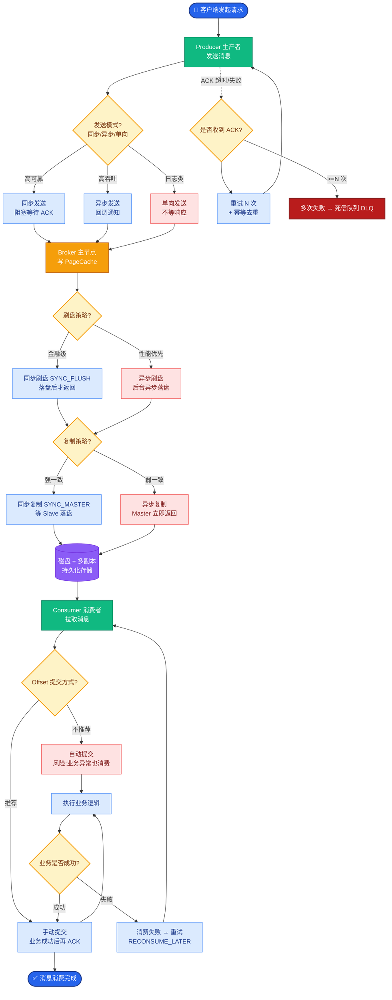

# 设计一个Self-hosted的Agent框架。公司要求完全私有化部署，不依赖外部LLM API。

【场景分析】
私有化部署Agent的核心约束：数据不出域、硬件资源有限、需要自主可控的模型和工具链。

【技术选型】
1. **模型层**：
   - 开源LLM：Qwen2.5-72B / Llama3-70B / DeepSeek-V3
   - 推理引擎：vLLM（高吞吐）/ TGI / llama.cpp（CPU部署）
   - Embedding：BGE-large-zh / bge-m3（中英双语）
   - Reranker：bge-reranker-v2-m3
2. **向量库**：
   - Milvus（分布式）/ Qdrant（轻量）/ Chroma（嵌入式）
   - 全部支持本地部署，无云依赖
3. **Agent框架**：
   - LangGraph（有状态、可控）/ 自研轻量框架
   - 避免 LangChain 的过度抽象，保持可控性
4. **工具层**：
   - 自定义Tool：Python函数 → Function Calling
   - 数据库连接：SQLAlchemy + 只读权限
   - API调用：内部微服务接口

**边界情况补充**：
- **硬件异构适配**：企业内部硬件可能不统一（如既有A800也有4090），推理框架需支持异构集群调度，或通过量化适配低显存显卡。
- **知识库时效性**：私有化数据通常是离线快照。需设计“增量更新管道”，在夜间低峰期自动同步内部Wiki/数据库变更到向量库。
- **模型漂移**：开源模型在特定垂直领域（如医疗、代码）可能能力退化。需准备领域微调SFT流程，使用企业私有数据持续强化模型。

【部署架构】
- GPU节点：2-4张A100/A800（LLM推理）
- CPU节点：向量库 + 应用服务 + 消息队列
- 存储：SSD本地存储 + NAS共享
- 网络：VPC内网，不暴露公网

【实战案例】
在某银行私有化部署中，因金融数据极度敏感，我们使用**vLLM + RocksDB** 实现了完全本地化的KV Cache存储，确保推理过程中间态数据也绝不出域，解决了审计合规痛点。

【关键代码】（LangGraph 自定义工具定义）
```python
from langchain_core.tools import tool
import requests

@tool
def query_internal_crm(customer_id: str) -> str:
    """安全查询内部CRM客户信息的工具（只读）"""
    # 实际工程中应通过内网网关调用，而非直接连接数据库
    resp = requests.post(
        "http://internal-gateway.crm/api/query",
        json={"id": customer_id, "token": "INTERNAL_AUTH_KEY"},
        timeout=5
    )
    return resp.text.get("data", "User not found")
```

【技术选型对比】
| 特性 | LangChain | LangGraph | 自研框架 |
| :--- | :--- | :--- | :--- |
| **控制力** | 低（封装过深，Debug难） | 高（基于状态机，流程可控） | 极高（完全定制） |
| **状态管理** | 依赖内存传递 | 内置Cycle图，支持持久化 | 需自行实现Redis存储 |
| **适合场景** | 快速POC、简单链路 | 复杂Agent工作流、多轮协作 | 性能极致优化、特殊逻辑 |
| **学习成本** | 低 | 中 | 高 |

```text
     ┌───────────────────────────────────────────────────────────┐
     │                    用户/业务系统                           │
     └────────────────────────┬──────────────────────────────────┘
                              │ HTTPS/gRPC
                              ▼
     ┌───────────────────────────────────────────────────────────┐
     │              API 网关 (鉴权/限流/审计)                      │
     └──────┬─────────────────────────────────────┬───────────────┘
            │                                     │
            ▼                                     ▼
     ┌──────────────┐
```

## 面试追问
1. **推理加速**：在显存受限的情况下，为了提高并发，你会选择 vLLM 的 PagedAttention 还是显存卸载到CPU？这对延迟的影响有多大？
2. **Function Calling 准确率**：开源模型通常比GPT-4在Function Calling上弱，如果Agent频繁选错工具或参数格式错误，你会如何工程化手段进行补救？
3. **成本控制**：私有化部署主要成本在于GPU采购。如果公司只能提供一张显卡给研发和测试共用，如何设计资源隔离机制防止测试任务耗尽显存导致线上崩溃？

## 易错点
1. **忽视运维监控**：认为部署完就结束了，实际上私有化模型很容易出现显存泄漏或CUDA OOM。必须监控GPU显存使用率和KV Cache碎片率。
2. **安全边界模糊**：虽然模型在本地，但Agent通过工具访问内网系统时，如果不做严格的权限管控（如RBAC），Agent可能成为攻击内网的跳板。


## 核心流程图



## 记忆要点

- 核心约束：数据不出域，选Qwen/Llama等开源模型，用vLLM/TGI本地推理。
- 架构选型：LangGraph优于LangChain，状态机可控，避免过度抽象。
- 工具集成：自定义Tool通过Function Calling调用，数据库只读，内网网关隔离。
- 异构适配：支持量化适配低显存卡，RAG增量更新保证知识时效。
- 实战痛点：用RocksDB存KV Cache确保中间态数据不落盘，满足审计合规。


## 结构化回答

**30 秒电梯演讲：** 基于开源模型和本地推理引擎，在受限硬件资源下构建安全可控的私有AI系统。——打个比方，像自建机房，不租阿里云，用自己的服务器和开源软件搭建内部系统，数据绝对安全。

**展开框架：**
1. **核心约束** — 数据不出域，选Qwen/Llama等开源模型，用vLLM/TGI本地推理。
2. **架构选型** — LangGraph优于LangChain，状态机可控，避免过度抽象。
3. **工具集成** — 自定义Tool通过Function Calling调用，数据库只读，内网网关隔离。

**收尾：** 以上三点都能配合实战聊。我可以展开任一要点，比如「开源72B模型与GPT-4的效果差距如何弥补」这类追问您感兴趣吗？

## 视频脚本

> 预计时长：3 分钟 | 由浅入深

| 时间 | 画面/字幕 | 口播台词 | 讲解要点 |
|------|----------|----------|----------|
| 0:00 | 标题卡 | "设计一个Self-hosted的Agent框架。公司要求完全私有化部署，30 秒讲清楚。" | 开场钩子 |
| 0:36 | 概念定义动画 | "一句话：基于开源模型和本地推理引擎，在受限硬件资源下构建安全可控的私有AI系统。" | 核心定义 |
| 1:12 | 核心约束图解 | "数据不出域，选Qwen/Llama等开源模型，用vLLM/TGI本地推理。" | 核心约束 |
| 1:48 | 架构选型图解 | "LangGraph优于LangChain，状态机可控，避免过度抽象。" | 架构选型 |
| 2:24 | 总结卡 | "记好这几条，面试不慌。下期见。" | 收尾 |
