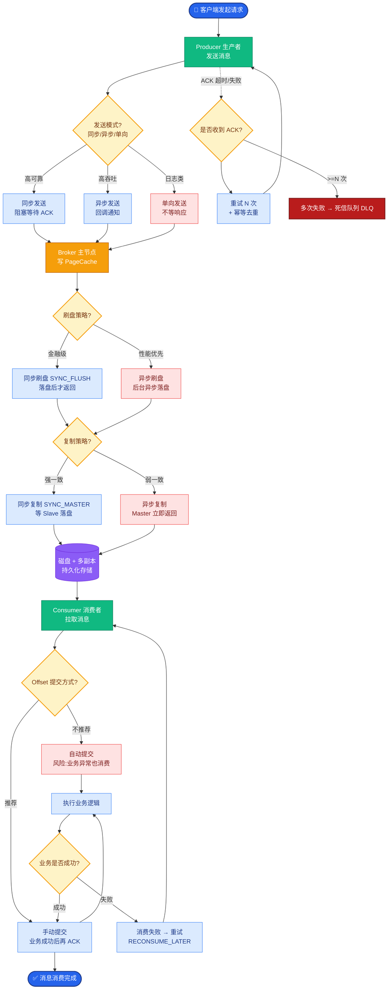

# 如何设计一个AI智能客服系统？要求能处理80%的常见问题，复杂问题转人工。

【场景分析】
AI客服核心目标：准确理解用户意图、快速解决问题、智能路由人工、持续学习改进。

【系统架构】
1. **意图识别层**：
   - 分类器：Fine-tuned BERT / LLM zero-shot
   - 意图分类：咨询类（查订单/查物流）、操作类（退换货/修改）、投诉类、闲聊类
   - 置信度：低于阈值（0.7）→ 转人工
2. **知识检索层（RAG）**：
   - 产品FAQ库 + 政策文档 + 历史工单
   - 混合检索：向量 + 关键词 + Rerank
   - 实时查询：对接CRM/ERP系统获取用户订单信息
3. **对话管理**：
   - 多轮对话：追问必要信息（订单号、商品名）
   - 情绪检测：用户愤怒/焦虑 → 优先转人工
   - 上下文记忆：同一工单内保持上下文
4. **人工协作层**：
   - 智能转接：自动附带对话摘要和用户画像
   - 坐席辅助：AI实时给人工座席推荐回答
   - 质检：自动评估对话质量

【实战案例】
某电商客服在处理“退货”时，AI常因无法判断“是否拆封”而反复询问。我们在RAG中接入了**结构化商品数据库**，通过Function Calling直接读取商品属性，直接判断是否支持7天无理由，问题解决率提升了15%。

【关键代码】（人工转接与摘要生成）
```python
def escalate_to_human(session_id: str, reason: str):
    history = get_conversation_history(session_id)
    # 调用LLM生成摘要，包含用户诉求、已尝试方案
    summary = llm.invoke(f"请总结以下对话，供人工客服参考。重点包含用户诉求和失败尝试:\n{history}")
    
    ticket = {
        "session_id": session_id,
        "summary": summary.content,
        "user_intent": history.get("intent"),
        "priority": "HIGH" if history.get("sentiment") == "angry" else "NORMAL",
        "timestamp": datetime.now()
    }
    # 推送到人工客服队列
    human_service_queue.push(ticket)
```

【技术方案对比】
| 维度 | 传统FAQ/规则 | RAG + LLM | LLM Fine-tuning |
| :--- | :--- | :--- | :--- |
| **回答准确度** | 低（死板匹配） | 高（语义理解） | 极高（领域适配） |
| **维护成本** | 高（需穷举Q&A） | 中（更新文档库） | 高（需标注数据训练） |
| **幻觉风险** | 无 | 中（需检索校验） | 高（模型自带属性） |
| **启动速度** | 快 | 快 | 慢（需训练周期） |
| **推荐选型** | 极简单业务 | **通用AI客服首选** | 专业术语极多场景 |

```text
┌─────────────┐     1. 用户提问     ┌───────────────┐
│   用户端    │ ──────────────────► │  对话网关     │
└─────────────┘                     └───────┬───────┘
                                            │
                           ┌────────────────┼────────────────┐
                           ▼                ▼                ▼
                   ┌──────────────┐  ┌──────────────┐  ┌──────────────┐
                   │  意图识别    │  │  情绪分析    │  │   安全护栏   │
                   │ (BERT/LLM)   │  │  (规则/模型) │  │ (敏感词/注入)│
                   └──────┬───────┘  └──────┬───────┘  └──────┬───────┘
                          │                 │                 │
                          ▼                 │                 ▼
                   ┌──────────────┐         │         ┌──────────────┐
                   │ 路由决策     │◄────────┴────────►│  拦截/转接   │
                   │ (置信度判断) │                   └──────────────┘
                   └──┬───────┬───┘
           高置信度   │       │   低置信度/情绪异常
                      │       │
                      ▼       ▼
            ┌───────────────┐ ┌───────────────┐
            │   RAG 检索    │ │  人工客服路由 │
            │ (KB+CRM)      │ │ (生成摘要)    │
            └───────┬───────┘ └───────────────┘
                    │
                    ▼
            ┌───────────────┐
            │   回复生成    │
            │ (LLM Answer)  │
            └───────┬───────┘
                    │
                    ▼
            ┌───────────────┐
            │   人工确认    │
            │ (防幻觉兜底)  │
            └─────────


## 核心流程图



## 记忆要点

- 核心流程：意图识别（BERT/LLM）→ RAG检索 → 置信度判断 → 低分转人工。
- 知识检索：混合检索（向量+关键词+Rerank），对接CRM实时查订单。
- 人机协作：转人工时自动生成对话摘要，情绪愤怒优先排队。
- 技术选型：首选RAG+LLM，维护成本低；传统FAQ仅用于极简单业务。
- 实战优化：接入结构化数据库，通过Function Calling直接判断退货规则。


## 结构化回答

**30 秒电梯演讲：** 结合意图识别、知识库检索和情绪检测，自动解答常见问题并智能转接人工。——打个比方，像初级客服处理简单问题，遇到搞不定或客户生气时，立刻把电话转给主管。

**展开框架：**
1. **核心流程** — 意图识别（BERT/LLM）→ RAG检索 → 置信度判断 → 低分转人工。
2. **知识检索** — 混合检索（向量+关键词+Rerank），对接CRM实时查订单。
3. **人机协作** — 转人工时自动生成对话摘要，情绪愤怒优先排队。

**收尾：** 以上三点都能配合实战聊。我可以展开任一要点，比如「如何平衡AI客服的效率和用户满意度」这类追问您感兴趣吗？

## 视频脚本

> 预计时长：3 分钟 | 由浅入深

| 时间 | 画面/字幕 | 口播台词 | 讲解要点 |
|------|----------|----------|----------|
| 0:00 | 标题卡 | "设计一个AI智能客服系统，30 秒讲清楚。" | 开场钩子 |
| 0:36 | 概念定义动画 | "一句话：结合意图识别、知识库检索和情绪检测，自动解答常见问题并智能转接人工。" | 核心定义 |
| 1:12 | 核心流程图解 | "意图识别（BERT/LLM）→ RAG检索 → 置信度判断 → 低分转人工。" | 核心流程 |
| 1:48 | 知识检索图解 | "混合检索（向量+关键词+Rerank），对接CRM实时查订单。" | 知识检索 |
| 2:24 | 总结卡 | "记好这几条，面试不慌。下期见。" | 收尾 |
