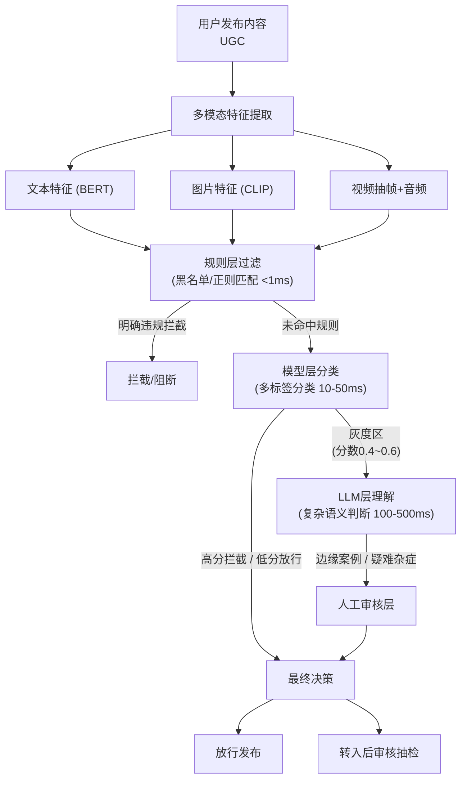

# 如何设计一个AI内容审核系统？实时检测文本、图片、视频中的有害内容。

【场景分析】
AI内容审核系统需求：实时检测有害内容（暴力/色情/仇恨/自我伤害）、多模态审核（文本+图片+视频）、误杀控制。

【多级审核架构】
1. 规则层（<1ms）：黑名单/正则匹配，零误判但低召回，用于明确拦截。
2. 模型层（10-50ms）：BERT/CLIP多标签分类，通过阈值拦截，灰度区转人工。
3. LLM层（100-500ms）：利用上下文理解意图（如隐喻、谐音），解决复杂语义歧义。
4. 人工层：处理边缘案例、用户申诉及质量抽检，保障最终准确性。

【关键设计决策】
- 审核时机：预审核（发布前拦截）vs 后审核（发布后抽检）。
- 性能权衡：实时性要求<100ms，需平衡延迟与准确率。
- 风险控制：误杀影响体验，漏放涉及合规，需根据业务调整阈值。

【持续优化】
- 样本分析：通过FP/FN样本反向优化规则与模型。
- 对抗防御：防御规则试探，快速迭代更新。
- A/B测试：对比不同审核策略效果。

## 技术原理

内容审核系统采用**漏斗式分级过滤**，核心思想是"便宜快的在前、贵精的在最后"，让绝大多数内容在低成本层就被处理掉，只有疑难杂症才进入高成本层：

- **规则层（<1ms）**：基于正则和黑名单的关键词匹配。例如"加微信 xxx"直接命中黑名单拦截。成本极低（纯内存哈希查找），延迟 <1ms，零误判但召回率低——只能拦明确已知的有害模式，对变种、谐音、隐喻无能为力。这一层能拦掉 60-70% 的明显违规，是第一道闸门。
- **模型层（10-50ms）**：用 BERT（文本）/CLIP（图文）做多标签分类（暴力、色情、仇恨、自伤等）。比规则灵活，能识别变种和谐音，但有阈值权衡——阈值高则漏放多（合规风险），阈值低则误杀多（体验损失）。灰度区（分数在 0.4~0.6 之间）不直接判，转入下一层。
- **LLM 层（100-500ms）**：利用上下文理解能力处理模型层无法判定的复杂语义——隐喻（"今晚吃席"指代赌博）、谐音（"违禁词谐音"）、跨句依赖。贵但精准，只对灰度区调用，控制成本。
- **人工层**：处理边缘案例、用户申诉、质量抽检。人的判断最准但最贵，只占总量 <1%。

## 代码示例

多级审核流水线的最小骨架：

```python
import re
from typing import Tuple

# 黑名单（实际从配置中心加载）
BLACKLIST = {"色情网址", "加微信赚钱", "代开发票"}
# 规则正则
RULE_PATTERNS = [
    re.compile(r'(微信|vx|v信)\s*[：:]?\s*\w{6,}', re.I),   # 导流微信号
    re.compile(r'1[3-9]\d{9}'),                              # 手机号
]

def rule_check(text: str) -> Tuple[str, float]:
    """规则层：<1ms，明确违规直接拦截"""
    for kw in BLACKLIST:
        if kw in text:
            return ("block", 1.0)
    for pat in RULE_PATTERNS:
        if pat.search(text):
            return ("block", 1.0)
    return ("pass", 0.0)

def model_check(text: str) -> Tuple[str, float]:
    """模型层：BERT 多标签分类，返回 (决策, 风险分)"""
    score = bert_classifier(text)["harmful"]   # 0~1
    if score > 0.8:
        return ("block", score)
    if score < 0.4:
        return ("pass", score)
    return ("review", score)   # 灰度区转下层

def llm_check(text: str) -> Tuple[str, float]:
    """LLM 层：理解复杂语义（隐喻/谐音），贵但精准"""
    prompt = (
        "判断以下内容是否含有害意图（暴力/色情/仇恨/赌博/诈骗），"
        "只输出 JSON：{\"harmful\": bool, \"reason\": str}\n"
        f"内容：{text}"
    )
    result = llm.chat(prompt, response_format="json")
    return ("block" if result["harmful"] else "pass", 0.9)

def audit_pipeline(text: str, modality: str = "text") -> dict:
    """多级漏斗：规则 -> 模型 -> LLM，逐级精度升、成本升"""
    # 1. 规则层（最便宜）
    decision, score = rule_check(text)
    if decision == "block":
        return {"decision": "block", "layer": "rule", "score": score}
    # 2. 模型层（BERT/CLIP，按模态选）
    decision, score = model_check(text) if modality == "text" else clip_check(text)
    if decision in ("block", "pass"):
        return {"decision": decision, "layer": "model", "score": score}
    # 3. LLM 层（最贵，只对灰度区调用）
    decision, score = llm_check(text)
    if decision == "block":
        return {"decision": "block", "layer": "llm", "score": score}
    # 4. 仍不确定 -> 人工
    return {"decision": "manual_review", "layer": "human", "score": score}
```

## 注意事项

- **预审核 vs 后审核要分场景**：预审核（发布前拦截）保安全但增加用户感知延迟，适合高风险内容（UGC 发布）；后审核（发布后抽检）保体验但可能漏放，适合低风险或熟人场景。两者常组合使用——预审核兜底明显违规，后审核抽检变种。
- **误杀和漏放的权衡**：误杀伤体验（用户发正常内容被拦），漏放涉合规（违规内容流出）。金融、医疗等强监管领域宁可误杀，社交娱乐宁可漏放。阈值要按业务可调，并支持用户申诉回滚。
- **多模态协同**：文本用 BERT、图片用 CLIP、视频抽关键帧 + 音频转文本再分类。警惕"图文不一致"绕过——图片有害但配文无害，或反之，需做跨模态联合判断。
- **持续优化防变种**：分析 FP（误杀）和 FN（漏放）样本，反向优化规则和模型。攻击者会持续试探规则边界，需快速迭代更新黑名单和模型，A/B 测试验证新策略效果。

## 流程图




## 记忆要点

- 多级架构：规则层（<1ms黑名单）→ 模型层（BERT分类）→ LLM层（意图理解）→ 人工。
- 审核时机：预审核（发布前拦截）保安全，后审核（抽检）保体验。
- 性能权衡：实时性要求<100ms，需平衡误杀（体验）与漏放（合规）。
- 多模态：文本用BERT，图片用CLIP，视频抽帧+音频转文本。
- 持续优化：分析FP/FN样本，A/B测试策略，防御对抗试探。


## 结构化回答

**30 秒电梯演讲：** 基于漏斗模型的多层分级过滤架构。——打个比方，像机场安检：先过安检门（规则快速扫），再开包检查（模型细看），遇到可疑物品叫来专家（LLM/人工）定性。

**展开框架：**
1. **多级架构** — 规则层（<1ms黑名单）→ 模型层（BERT分类）→ LLM层（意图理解）→ 人工。
2. **审核时机** — 预审核（发布前拦截）保安全，后审核（抽检）保体验。
3. **性能权衡** — 实时性要求<100ms，需平衡误杀（体验）与漏放（合规）。

**收尾：** 以上三点都能配合实战聊。我可以展开任一要点，比如「如何平衡审核准确率和实时性」这类追问您感兴趣吗？

## 视频脚本

> 预计时长：3 分钟 | 由浅入深

| 时间 | 画面/字幕 | 口播台词 | 讲解要点 |
|------|----------|----------|----------|
| 0:00 | 标题卡 | "设计一个AI内容审核系统，30 秒讲清楚。" | 开场钩子 |
| 0:36 | 概念定义动画 | "一句话：基于漏斗模型的多层分级过滤架构。" | 核心定义 |
| 1:12 | 多级架构图解 | "规则层（<1ms黑名单）→ 模型层（BERT分类）→ LLM层（意图理解）→ 人工。" | 多级架构 |
| 1:48 | 审核时机图解 | "预审核（发布前拦截）保安全，后审核（抽检）保体验。" | 审核时机 |
| 2:24 | 总结卡 | "记好这几条，面试不慌。下期见。" | 收尾 |
