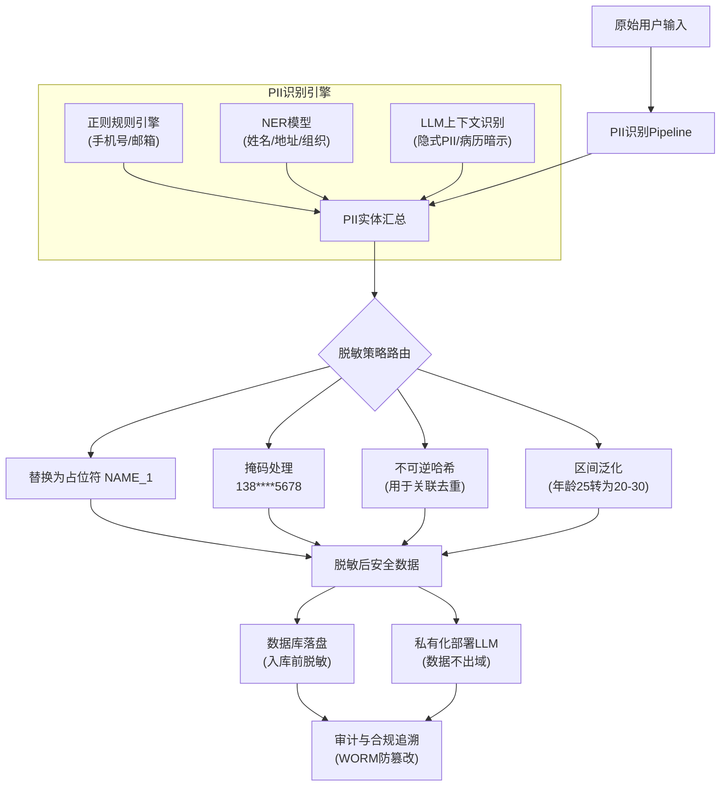

# 如何设计AI系统的PII脱敏与数据安全方案？满足GDPR等隐私法规要求。

【场景分析】
AI系统处理大量用户数据，PII（个人身份信息）保护和数据安全是合规底线（GDPR/CCPA/个人信息保护法）。

【PII脱敏Pipeline】
1. PII识别：
   - 规则匹配：正则（手机号、邮箱、身份证、银行卡）
   - NER模型：识别姓名、地址、组织名、病历号
   - LLM辅助：上下文中的隐式PII（「我住在朝阳区XX小区」）
2. 脱敏策略：
   - 替换：真实值 → 占位符（[PHONE] [NAME] [ID]）
   - 掩码：部分隐藏（138****5678）
   - 哈希：不可逆哈希（用于去重和关联）
   - 泛化：精确值 → 区间（年龄25 → 20-30）
3. 脱敏时机：
   - 入库前脱敏：数据库只存脱敏数据（最安全）
   - 查询时脱敏：查询结果动态脱敏（灵活但风险高）
   - LLM调用前脱敏：发给LLM前替换PII（防泄露）

【LLM数据安全策略】
- 数据不出域：使用私有化部署模型，不调用外部API
- API安全：如必须使用外部API，先脱敏再发送
- 供应商DPA：签署数据处理协议，明确数据不得用于训练
- 零留存：供应商API设置zero_data_retention

【权限与访问控制】
- RBAC：基于角色控制数据访问权限
- 数据分级：公开/内部/机密/绝密，不同级别不同控制
- 审计日志：所有数据访问记录可追溯
- 数据主权：数据存储在指定地域，不跨境传输

【合规设计】
- 用户知情同意：明确告知数据用途
- 数据删除权：用户可请求删除所有个人数据
- 数据可携带权：用户可导出个人数据
- 隐私影响评估（PIA）：新功能上线前评估隐私风险

## 技术原理

PII 脱敏的核心难题是"识别要全、替换要不可逆、时机要早"。三个环节各有原理：

- **三层识别的互补性**：正则规则快但只能匹配固定格式（手机号、邮箱、身份证）；NER 模型能识别开放实体（姓名、地址、组织）但依赖训练数据；LLM 能理解上下文中的隐式 PII（"我住朝阳区 XX 小区"是地址，"上周三去了医院"暗示病历）。三者叠加才能覆盖长尾——单靠任何一层都会漏。这也是为什么生产系统用"规则粗筛 + NER 精排 + LLM 兜底"的级联。
- **脱敏策略的可逆性光谱**：替换（真值→占位符）和哈希是不可逆的，安全性最高但丧失原始值；掩码（138****5678）保留部分信息便于人工核对；泛化（年龄 25→20-30）保留统计价值用于分析。选择策略要看下游用途——需要关联分析的用哈希，需要人工核对的用掩码，纯存档的用替换。
- **脱敏时机的安全-灵活权衡**：入库前脱敏最安全（数据库只有脱敏数据，即使泄露也无害），但丧失原始数据用途；查询时动态脱敏最灵活但风险高（原始数据仍在库，动态脱敏一旦逻辑出错就泄露）；LLM 调用前脱敏是防泄露的关键一关。生产推荐"入库前 + LLM 调用前"双保险。

## 注意事项

1. **脱敏别影响 LLM 理解**：过度脱敏（把"张三"换成 [NAME]）会丢失语义，LLM 无法区分多个 [NAME] 指代谁。可用一致性占位符（[NAME_1]、[NAME_2]）保留指代关系。
2. **外部 API 要零留存**：调用外部 LLM API 时，供应商必须签署 DPA 并开启 zero_data_retention，否则数据会被用于训练造成泄露。
3. **数据删除权要级联**：GDPR 要求用户可请求删除所有个人数据，需支持按用户 ID 物理删除（含向量索引条目），不能只删文本不删向量。
4. **数据分级配 RBAC**：公开/内部/机密/绝密不同级别不同访问控制，审计日志记录所有访问便于追溯。

## 对比表

| 脱敏策略 | 可逆性 | 保留信息 | 适用场景 | 示例 |
|:---|:---|:---|:---|:---|
| **替换** | 不可逆 | 无 | 纯存档、日志 | 张三 → [NAME] |
| **掩码** | 部分 | 部分便于核对 | 人工核对、展示 | 138****5678 |
| **哈希** | 不可逆 | 关联键 | 去重、跨库关联 | 张三 → a3f2... |
| **泛化** | 不可逆 | 统计价值 | 数据分析、统计 | 25岁 → 20-30岁 |
| **令牌化** | 可逆（需密钥） | 加密映射 | 需还原原始值 | 张三 → TOK_8x2 |

| 脱敏时机 | 安全性 | 灵活性 | 风险 |
|:---|:---|:---|:---|
| **入库前** | 最高（库内无原始数据） | 低（丧失原始用途） | 低 |
| **查询时** | 中（动态脱敏逻辑易出错） | 高 | 高 |
| **LLM 调用前** | 高（防 LLM 泄露） | 中 | 低 |

## 流程图

## 核心知识点图

## 记忆要点

- 脱敏Pipeline：规则（正则）+ NER（模型）+ LLM（隐式PII），替换为占位符。
- 脱敏时机：入库前脱敏最安全，调用LLM前脱敏防泄露。
- 数据安全：私有化部署不出域，外部API需零留存（Zero Retention）。
- 权限控制：RBAC角色访问，数据分级（公开/机密），审计日志追溯。
- 合规设计：用户知情同意，支持数据删除/携带权，隐私影响评估（PIA）。

## 结构化回答

**30 秒电梯演讲：** 全链路识别、替换与控制敏感信息，确保数据合规。——打个比方，像给文档涂改液，或把真名换成代号，数据可用但不可逆。

**展开框架：**
1. **脱敏Pipeli** — 脱敏Pipeline：规则（正则）+ NER（模型）+ LLM（隐式PII），替换为占位符。
2. **脱敏时机** — 入库前脱敏最安全，调用LLM前脱敏防泄露。
3. **数据安全** — 私有化部署不出域，外部API需零留存（Zero Retention）。

**收尾：** 以上三点都能配合实战聊。我可以展开任一要点，比如「脱敏后的数据对LLM理解能力有多大影响」这类追问您感兴趣吗？

## 视频脚本

> 预计时长：2 分钟 | 由浅入深

| 时间 | 画面/字幕 | 口播台词 | 讲解要点 |
|------|----------|----------|----------|
| 0:00 | 标题卡 | "设计AI系统的PII脱敏与数据安全方案，30 秒讲清楚。" | 开场钩子 |
| 0:30 | 概念定义动画 | "一句话：全链路识别、替换与控制敏感信息，确保数据合规。" | 核心定义 |
| 1:00 | 脱敏Pipeline图解 | "规则（正则）+ NER（模型）+ LLM（隐式PII），替换为占位符。" | 脱敏Pipeline |
| 1:30 | 总结卡 | "记好这几条，面试不慌。下期见。" | 收尾 |
