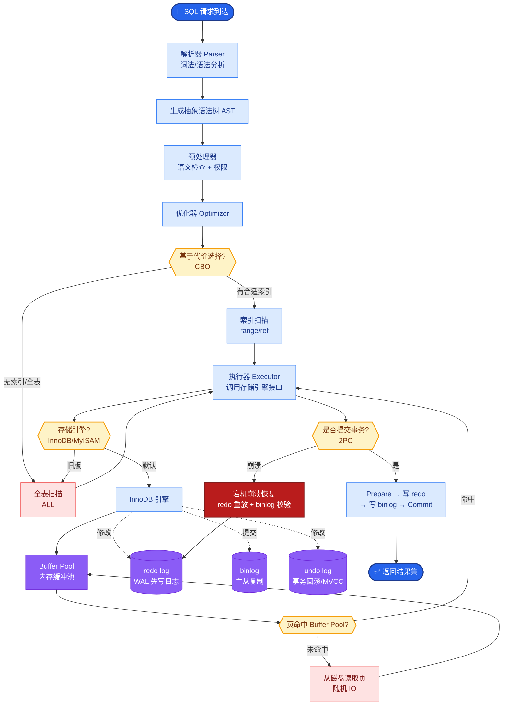

# 如何设计一个AI搜索引擎（类似Perplexity）？直接给出答案而非链接列表，支持引用溯源。

【场景分析】
AI搜索引擎（如Perplexity）= 传统搜索 + LLM理解 + RAG + 引用溯源。核心价值：直接给出答案而非链接列表，解决信息过载。

【系统架构】
1. **Query理解层**：
   - **意图识别**：分类为导航型（去哪）、信息型（是什么）、交易型（买什么）。
   - **Query改写与分解**：
     - 利用LLM将复杂Query拆解为多个Sub-Query（例如：“比较iPhone 15和华为Mate 60” -> 拆解为：“iPhone 15 参数”、“Mate 60 参数”、“两者对比评测”）。
     - 利用HyDE（Hypothetical Document Embeddings）生成假设性答案文档，以此进行向量检索，提高语义召回率。

2. **多源检索层**：
   - **Web搜索**：调用Bing/Google/SerpAPI获取Top-K结果。
   - **垂直检索**：调用知识库、学术、GitHub、Reddit等特定API。
   - **混合检索**：BM25（关键词） + Dense Vector（语义），平衡精准度与泛化性。

3. **内容提取与处理层**：
   - **网页清洗**：Readability/Trafilatura去除广告、导航栏、CSS。
   - **切分**：按语义切分文本块，保持上下文完整性。
   - **去重与冲突检测**：MinHash LSH去重；LLM检测多源信息冲突（如不同来源数据不一致）。

4. **答案生成层（RAG Pipeline）**：
   - **上下文构建**：将Query + Top-K检索到的Snippet拼装成Prompt。
   - **引用生成**：要求LLM在生成句子时标注引用ID [1][2]，利用COT思维链确保事实有据可依。
   - **结构化输出**：Summary（摘要） + Details（正文） + References（来源链接） + Follow-up Questions（推荐追问）。

5. **后处理校验**：
   - **事实一致性**：使用NLI（Natural Language Inference）模型校验生成的答案与Reference是否存在矛盾。
   - **无答案处理**：若检索结果置信度低，直接回答“未找到相关信息”，避免幻觉。

【实战案例】
- **踩坑经验**：在实际工程中，直接拼接Snippet会导致LLM产生“幻觉引用”（即编造不存在的来源）。解决方法是在Prompt中加入指令：“如果文中未提到，请勿引用”，并对生成的引用ID进行反向验证，确保ID确实存在于上下文中。

【关键代码实现（引用生成Prompt）】
```python
# 构造Prompt示例
system_prompt = """
你是一个智能搜索引擎助手。请根据参考文档回答用户问题。
要求：
1. 回答必须基于提供的参考资料。
2. 在回答中的每个事实或观点后，必须使用[citation:X]标注来源，X为文档ID。
3. 如果参考资料中没有答案，请直接回答“未找到相关信息”，不要编造。
参考资料格式：[doc_id] 内容
"""

user_query = "Perplexity AI的特点是什么？"
context = "[1] Perplexity AI是一个基于大语言模型的搜索引擎... [2] 它具有引用溯源功能..."
```

【检索策略对比】
| 维度 | BM25 (关键词) | Dense Vector (语义) | Hybrid (混合检索) |
| :--- | :--- | :--- | :--- |
| **原理** | 基于词频统计，精确匹配 | 基于向量空间，语义相似度 | 综合倒数排名融合 (RRF) | 
| **优势** | 专有名词匹配强（如型号、人名） | 解决同义词、隐含语义（如“水果”->“苹果”） | 兼顾精准度与召回率，鲁棒性最好 |
| **劣势** | 无法理解语义，“手机”搜不到“移动终端” | 可能会引入语义相近但主题偏移的噪声 | 系统复杂度高，需要调节Alpha权重 |
| **适用场景** | 刚性关键词搜索 | 概念解释、模糊意图搜索 | 生产环境通用方案 |

【RAG 处理流程图】
```text
User Query
   │
   ▼
┌──────────────┐
│ Query Plan   │ (LLM: 意图识别 & 拆解)
│   Rewriter   │
└──────┬───────┘
       │ (Sub-Queries)
       ▼
┌──────────────┐
│ Hybrid Search│ (Web Search + Vector Search)
│ & Retriever  │
└──────┬───────┘
       │ (Snippets)
       ▼
┌──────────────┐
│ Rerank &     │ (Cross-Encoder / LLM Rerank)
│  Validate    │
└──────┬───────┘
       │ (Top-K Context)
       ▼
┌──────────────┐
│ Answer Gen   │ (LLM Generation + Citation)
└──────────────┘
```

## 边界情况与极端场景
1. **实时性事件（如突发新闻）**：如果是刚刚发生的事件，搜索引擎索引可能未更新，或向量库中无相关数据。系统应具备“时效性检测”能力，识别出需要实时信息的Query，并强制调用实时新闻API，而非依赖静态向量库。
2. **多模态查询**：当用户问“如何操作这个界面”并附带图片，或搜索特定图表时，纯文本检索会失效。架构需预留多模态（Image/Video）检索接口，将图片特征向量纳入检索范围。
3. **信息源冲突与时效过期**：检索到的Top-5结果可能存在截然相反的观点（如“咖啡有害”vs“咖啡有益”），或者部分信息已过时（如2023年的文章介绍2024年的政策）。需在Prompt中增加时间感知指令，并要求LLM列出多方观点而非强行给出单一结论。

## 面试追问
1. 在RAG检索中，如果Top-K的结果中没有正确答案，但LLM依然生成了看起来很合理但完全错误的回答（幻觉），除了Prompt约束，工程上有哪些“防呆”机制？
2. 对于超长尾的领域知识问题（如某个冷门机械零件的参数），通用Web搜索可能搜不到。如何设计一种机制，能够优雅地降级到垂直领域数据库或知识图谱查询？
3. 引用溯源中，如何处理“跨句子引用”的问题？即一个事实是由多个文档综合推导出来的，或者是一个长结论引用了多个分散的段落，如何保证引用的颗粒度准确且不遗漏？

## 易错点
1. **忽略网页解析的Robots协议**：在批量抓取网页内容进行索引时，容易忽视版权和爬虫规范，可能导致IP被封禁。必须严格遵守目标网站的Robots.txt，并设置合理的抓取频率和User-Agent。
2. **过度依赖SerpAPI等第三方服务**：第三方搜索API可能会有单日调用次数限制或突然的API变更。系统设计中必须考虑Multi-Provider策略（如同时接入Bing和Google），当一个Provider不可用时能自动切换。


## 核心流程图



## 记忆要点

- 架构：Query理解(拆解) → 混合检索(BM25+向量) → 答案生成(引用溯源)。
- 检索策略：HyDE生成假设文档检索，RRF融合多路结果。
- 引用生成：Prompt要求标注[citation:X]，反向验证ID存在性防幻觉。
- 边界处理：实时事件强制调用新闻API，无答案直接拒答。
- 核心价值：直接给答案而非链接，解决信息过载。


## 结构化回答

**30 秒电梯演讲：** 检索增强生成（RAG）+引用溯源，直接生成答案。——打个比方，像助理帮你读完资料并标注出处，直接给你结论。

**展开框架：**
1. **架构** — Query理解(拆解) → 混合检索(BM25+向量) → 答案生成(引用溯源)。
2. **检索策略** — HyDE生成假设文档检索，RRF融合多路结果。
3. **引用生成** — Prompt要求标注[citation:X]，反向验证ID存在性防幻觉。

**收尾：** 以上三点都能配合实战聊。我可以展开任一要点，比如「AI搜索引擎的时效性如何保证」这类追问您感兴趣吗？

## 视频脚本

> 预计时长：3 分钟 | 由浅入深

| 时间 | 画面/字幕 | 口播台词 | 讲解要点 |
|------|----------|----------|----------|
| 0:00 | 标题卡 | "设计一个AI搜索引擎（类似Perplexity），30 秒讲清楚。" | 开场钩子 |
| 0:36 | 概念定义动画 | "一句话：检索增强生成（RAG）+引用溯源，直接生成答案。" | 核心定义 |
| 1:12 | 架构图解 | "Query理解(拆解) → 混合检索(BM25+向量) → 答案生成(引用溯源)。" | 架构 |
| 1:48 | 检索策略图解 | "HyDE生成假设文档检索，RRF融合多路结果。" | 检索策略 |
| 2:24 | 总结卡 | "记好这几条，面试不慌。下期见。" | 收尾 |
