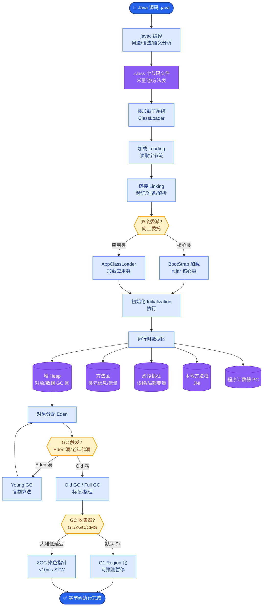

# 如何设计一个AI代码审查系统？自动检测PR中的Bug、安全漏洞和性能问题。

【场景分析】
AI代码审查系统：自动Review PR/MR，检测Bug、安全漏洞、性能问题、代码规范，减少人工Review工作量。

【审查Pipeline】
1. 差异分析层：
   - Git diff解析：提取变更文件、新增/删除/修改的代码行
   - AST解析：构建变更代码的抽象语法树
   - 依赖分析：变更可能影响的其他代码
2. 多维度检查层：
   - 静态分析工具集成：
     - SonarQube：代码质量/技术债务
     - Semgrep：安全漏洞模式匹配
     - CodeQL：数据流分析（SQL注入、XSS等）
   - LLM深度审查：
     - 逻辑Bug检测：分析代码逻辑是否有缺陷
     - 边界条件：空指针、数组越界、整数溢出
     - 并发安全：竞态条件、死锁风险
     - 性能问题：N+1查询、不必要的循环、内存泄漏
     - API误用：参数顺序、返回值处理、异常处理
3. 上下文增强层：
   - 跨文件分析：函数调用链追踪
   - 历史上下文：相关历史PR和讨论
   - 项目规范：团队约定的编码规范
4. 报告生成层：
   - 分级报告：Critical/Warning/Suggestion/Info
   - 修复建议：针对每个问题给出修复代码
   - PR评论：自动在代码行上添加Review评论

```text
┌───────────┐    ┌───────────┐    ┌───────────┐    ┌───────────┐
│   SCM     │───▶│   Diff    │───▶│  Static   │───▶│   Merge   │
│ (GitLab)  │    │  Parser   │    │  Analysis │    │  Report   │
└───────────┘    └─────┬─────┘    └───────────┘    └───────────┘
                       │
                       ▼
                ┌──────────────┐
                │  AST & Dep   │───┐
                └──────────────┘   │
                                   ▼
                           ┌───────────────┐
                           │ LLM Reviewer  │
                           │ (Deep Context)│
                           └───────┬───────┘
                                   │
                                   ▼
                           ┌───────────────┐
                           │ Noise Filter  │
                           └───────┬───────┘
                                   ▼
                           ┌───────────────┐
                           │ PR Comments   │
                           └───────────────┘
```

【LLM审查Prompt设计】
```
你是一位资深代码审查专家。请审查以下代码变更：
1. 检查逻辑Bug和边界条件
2. 检查安全漏洞（注入、越权、信息泄露）
3. 检查性能问题
4. 检查代码可维护性
5. 对每个问题给出严重级别和修复建议
```

【效果优化】
- Few-shot：历史优质Review作为示例
- 噪音过滤：过滤低价值告警（如风格偏好）
- 置信度控制：低置信度问题不报告，减少噪音
- 反馈学习：开发者Dismiss的告警 → 优化检测规则

【CI/CD集成】
- Pre-commit Hook：提交前快速检查
- PR自动Review：PR创建时自动触发
- 质量门禁：Critical问题阻断合并

### 实战案例
某金融项目在接入AI审查后，模型频繁误报关于“硬编码密钥”的Critical错误，实则是代码中的测试常量。通过引入**路径白名单机制**和**文件后缀过滤**（如排除`*_test.go`文件），并优化Prompt要求“仅关注生产环境代码”，误报率降低了70%。

### 关键代码示例 (Python: Diff 提取与 LLM 分析)
```python
import difflib

# 1. 提取关键变更片段
def get_relevant_diffs(old_code, new_code):
    diff = difflib.unified_diff(old_code.splitlines(), new_code.splitlines())
    # 仅提取新增或修改的行，过滤删除行以节省Token
    changed_lines = [line for line in diff if line.startswith('+') and not line.startswith('+++')]
    return "\n".join(changed_lines)

# 2. 构造审查 Prompt
def review_pr(diff_context, file_path):
    prompt = f"""
    文件路径: {file_path}
    变更内容:
    {diff_context}
    
    请分析上述代码是否存在逻辑错误或安全风险。
    输出JSON格式: {{"level": "Critical/Warning", "line": 10, "msg": "...", "fix": "..."}}
    """
    response = llm.generate(prompt)
    return parse_llm_response(response)
```

### 审查工具对比

| 维度 | 传统静态分析 (SAST) | LLM 智能审查 | 融合方案 (推荐) |
| :--- | :--- | :--- | :---
| **检出类型** | 模式匹配，已知漏洞 | 逻辑推理，未知风险 | 覆盖已知 + 未知风险 |
| **误报率** | 低 (规则明确) | 高 (易产生幻觉) | SAST过滤噪音 + LLM确认 |
| **解释性** | 规则引用强 | 自然语言解释好 | 结合规则代码和自然语言 |
| **执行成本** | 低 (本地运行) | 高 (API调用) | SAST前置筛选，减少LLM调用 |

### 常见考点
1. **Diff上下文构建**：如何只获取变更相关代码而非整个文件，避免Token浪费。
2. **长Diff处理**：当PR包含1000+行变更时，如何分块审查。
3. **降低误报**：如何利用代码库的Git历史和开发者反馈来校准LLM的输出。


## 核心流程图



## 记忆要点

- 流程：Diff解析 → 静态分析 → LLM深度审查 → 报告生成。
- 审查维度：静态工具查漏洞，LLM查逻辑Bug/边界条件/性能问题。
- 上下文：AST解析跨文件依赖，历史PR上下文增强。
- 效果优化：Few-shot注入历史Review，路径白名单过滤误报。
- 集成：Pre-commit快速查，PR自动Review，Critical阻断合并。


## 结构化回答

**30 秒电梯演讲：** 静态工具扫漏洞，LLM审逻辑，自动化Review流程。——打个比方，像带了多种扫描仪的资深专家，机器扫规则，人审逻辑。

**展开框架：**
1. **流程** — Diff解析 → 静态分析 → LLM深度审查 → 报告生成。
2. **审查维度** — 静态工具查漏洞，LLM查逻辑Bug/边界条件/性能问题。
3. **上下文** — AST解析跨文件依赖，历史PR上下文增强。

**收尾：** 以上三点都能配合实战聊。我可以展开任一要点，比如「如何减少LLM代码审查的误报率」这类追问您感兴趣吗？

## 视频脚本

> 预计时长：3 分钟 | 由浅入深

| 时间 | 画面/字幕 | 口播台词 | 讲解要点 |
|------|----------|----------|----------|
| 0:00 | 标题卡 | "设计一个AI代码审查系统，30 秒讲清楚。" | 开场钩子 |
| 0:36 | 概念定义动画 | "一句话：静态工具扫漏洞，LLM审逻辑，自动化Review流程。" | 核心定义 |
| 1:12 | 流程图解 | "Diff解析 → 静态分析 → LLM深度审查 → 报告生成。" | 流程 |
| 1:48 | 审查维度图解 | "静态工具查漏洞，LLM查逻辑Bug/边界条件/性能问题。" | 审查维度 |
| 2:24 | 总结卡 | "记好这几条，面试不慌。下期见。" | 收尾 |
