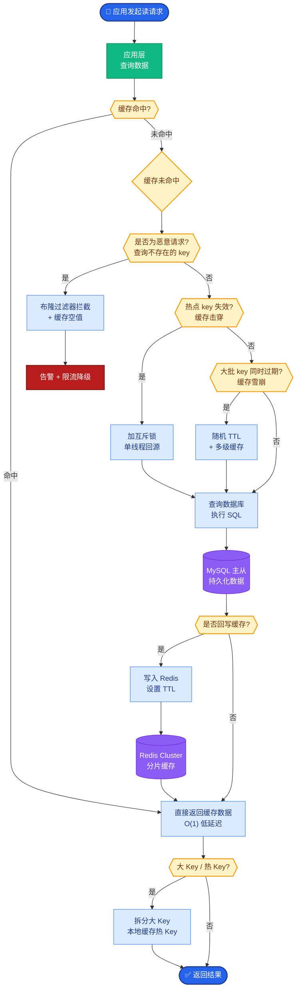

# 如何设计一个AI金融风控系统？实时交易反欺诈、信用评分、反洗钱。

【场景分析】
AI金融风控系统：实时交易反欺诈、信用评分、反洗钱（AML）。核心要求：低延迟（<100ms决策）、高准确率、可解释。

【系统架构】
1. 实时特征层：
   - 用户画像：历史交易频率、金额、地点、设备
   - 实时特征：最近5分钟/1小时/24小时的交易统计
   - 设备指纹：设备ID、IP、地理位置、行为生物特征
   - 图特征：社交网络关系图（团伙欺诈检测）
   - 特征存储：Feast/Tecton实时特征服务
2. 风控模型层：
   - 规则引擎：硬规则拦截（单笔>50万、异地+凌晨）
   - ML模型：XGBoost/LightGBM（结构化特征分类）
   - 深度学习：GNN（图神经网络检测团伙）
   - LLM辅助：分析交易备注文本（可疑描述检测）
   - 模型融合：多模型结果加权融合
3. 决策层：
   - 通过：低风险交易直接放行
   - 验证：中风险 → 短信/App验证
   - 拦截：高风险 → 拒绝交易 + 冻结账户
   - 人工审核：灰度案例 → 风控分析师
4. 反馈闭环：
   - 事后确认：交易是否确实为欺诈（延迟标签）
   - 模型更新：定期用新标签重新训练
   - 规则更新：发现新型欺诈模式 → 快速添加规则

```text
┌───────────┐    ┌─────────────┐    ┌─────────────┐    ┌───────────┐
│  User     │───▶│  Real-time  │───▶│  Fraud Risk │───▶│  Decision │
│  Action   │    │  Features   │    │  Model      │    │  Engine   │
└───────────┘    └─────────────┘    └─────────────┘    └─────┬─────┘
                                                        │
                    ┌───────────────────────────────────┼───────┐
                    │                                   │       │
                    ▼                                   ▼       ▼
             ┌─────────────┐                     ┌──────────┐ ┌──────────┐
             │   Rules     │                     │  Pass    │ │  Block   │
             │   Engine    │                     │          │ │          │
             └─────────────┘                     └──────────┘ └──────────┘
                    ▼
             ┌─────────────┐
             │  LLM/GenAI  │◀── Case Explainability
             │ (Text/Note)│
             └─────────────┘
```

【LLM在风控中的应用】
- 交易行为分析：用LLM分析用户的消费行为模式，发现异常
- 可解释性：将模型决策转化为自然语言解释（「此交易被拦截因为：异地+大额+新设备」）
- 智能问答：风控分析师通过自然语言查询案件详情
- 反洗钱：分析资金流向文本描述，识别可疑模式

【核心指标】
| 指标 | 目标 | 说明 |
| 欺诈检出率 | >95% | 识别出的欺诈交易比例 |
| 误拦率 | <0.1% | 正常交易被错误拦截的比例 |
| 决策延迟 | <50ms | 单笔交易风控决策时间 |
| 模型KS值 | >0.4 | 模型区分能力强弱 |

【## 常见考点】
1. **特征实时性保证**：如何保证实时特征（如“最近5分钟交易额”）的准确性和低延迟更新（Flink/Spark Streaming）。
2. **冷启动处理**：新用户或新设备缺乏历史数据时，如何利用规则或通用画像进行风控。
3. **模型在线推理优化**：XGBoost/LightGB

【实战深化】
- **实战案例**：在双11大促期间，因流量突增导致实时特征计算窗口出现数据倾斜，部分高频用户特征延迟高达500ms。通过引入Flink的「预聚合」策略和本地缓存，将P99延迟稳定控制在20ms以内，避免了风控漏网。

- **代码示例**（Python：规则与模型评分融合）：
```python
def decide_transaction(user_features):
    score = xgboost_model.predict(user_features)
    # 硬规则：黑名单直接拦截，不看模型分数
    if user_features['device_id'] in blacklist:
        return 'BLOCK', 'Blacklisted Device'
    # 模型与规则融合：高分用户可以豁免部分规则
    if score < 0.3 and user_features['amount'] < 10000:
        return 'PASS', f'Low Risk Score: {score}'
    return 'REVIEW', f'High Risk Score: {score}'
```

- **技术选型对比**（实时计算引擎）：
| 引擎 | 延迟 | 吞吐量 | 状态管理 | 适用场景 |
| :--- | :--- | :--- | :--- | :--- |
| **Spark Streaming** | 秒级 (高) | 高 | 基于微批，有 Checkpoint | 离线风控，T+1报表 |
| **Flink** | 毫秒级 (低) | 极高 | 原生支持 StateBackend | 实时反欺诈，复杂CEP |
| **Kafka Streams** | 毫秒级 | 中 | 轻量级，依赖 Kafka | 简单流式ETL，日志清洗 |


## 核心流程图



## 记忆要点

- 核心要求：低延迟(<50ms)、高准确率、可解释；实时特征计算是关键(Flink/预聚合)。
- 架构四层：实时特征(画像/图特征)、模型层(规则+XGBoost+GNN)、决策层(放行/验证/拦截)、反馈闭环。
- 模型融合：规则引擎兜底黑名单，ML模型评分，GNN检测团伙，LLM辅助解释。
- 关键指标：欺诈检出率>95%，误拦率<0.1%，KS值>0.4；冷启动用通用画像或强规则。


## 结构化回答

**30 秒电梯演讲：** 实时特征计算，多模型融合决策，毫秒级响应拦截。——打个比方，像银行门口的安检门，快速扫描所有人，异常则报警。

**展开框架：**
1. **核心要求** — 低延迟(<50ms)、高准确率、可解释；实时特征计算是关键(Flink/预聚合)。
2. **架构四层** — 实时特征(画像/图特征)、模型层(规则+XGBoost+GNN)、决策层(放行/验证/拦截)、反馈闭环。
3. **模型融合** — 规则引擎兜底黑名单，ML模型评分，GNN检测团伙，LLM辅助解释。

**收尾：** 以上三点都能配合实战聊。我可以展开任一要点，比如「如何平衡欺诈检出率和误拦率」这类追问您感兴趣吗？

## 视频脚本

> 预计时长：3 分钟 | 由浅入深

| 时间 | 画面/字幕 | 口播台词 | 讲解要点 |
|------|----------|----------|----------|
| 0:00 | 标题卡 | "设计一个AI金融风控系统，30 秒讲清楚。" | 开场钩子 |
| 0:36 | 概念定义动画 | "一句话：实时特征计算，多模型融合决策，毫秒级响应拦截。" | 核心定义 |
| 1:12 | 核心要求图解 | "低延迟(<50ms)、高准确率、可解释；实时特征计算是关键(Flink/预聚合)。" | 核心要求 |
| 1:48 | 架构四层图解 | "实时特征(画像/图特征)、模型层(规则+XGBoost+GNN)、决策层(放行/验证/拦截)、反馈闭环。" | 架构四层 |
| 2:24 | 总结卡 | "记好这几条，面试不慌。下期见。" | 收尾 |
