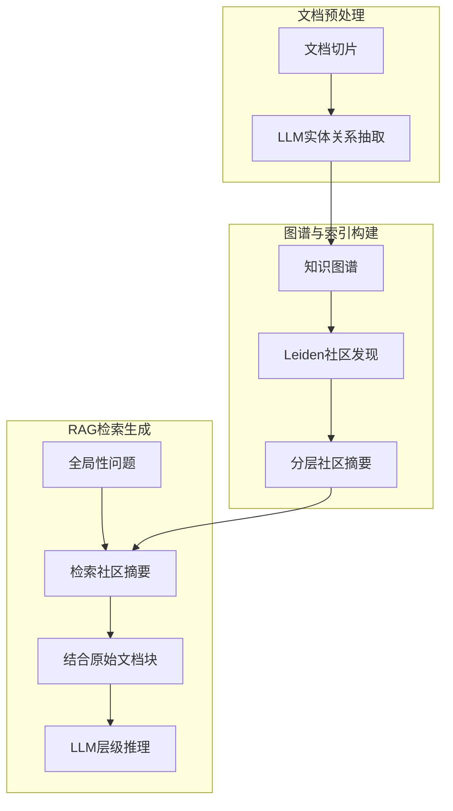

# GraphRAG 相比传统向量 RAG，在构建“全局索引”时使用了什么核心技术？它在解决“分散信息汇总”类问题时为何表现更好？

GraphRAG 的核心在于从文档中抽取实体和关系，构建知识图谱，并使用社区发现算法（如 Leiden 算法）对图谱节点进行分层聚类，生成“社区摘要”作为全局索引。在面对需要汇总全库信息的问题（如“数据集的主要主题有哪些？”）时，传统向量 RAG 仅能检索局部相关的 Top-K 文档块，难以跨文档进行归纳；而 GraphRAG 先在社区层级进行检索和预汇总，将分散在不同文档中的相关信息在图谱结构中连接起来，再由 LLM 生成最终答案。这种层级化的索引结构使得模型能够利用图谱的结构化语义，从宏观到微观逐步推理，显著提高了对全局性问题的回答质量。

【边界情况】
1. **图谱构建成本与噪声**：从非结构化文本抽取实体关系时，LLM 容易产生幻觉（虚构不存在的节点或边），导致图谱充满噪声。需设置严格的置信度阈值，并引入实体消歧（Entity Resolution）机制，将“苹果”和“Apple Inc.”合并。
2. **高频动态更新**：如果文档库频繁更新（如新闻流），全量重建图谱的开销巨大。需设计增量更新机制，仅对变更部分进行局部图谱重构，或者设置 TTL 定期重建。
3. **超大社区坍缩**：如果社区发现算法参数设置不当，可能导致所有节点聚合成一个超大社区，失去“分层归纳”的意义。需动态调整 Leiden 算法的 Resolution 参数，控制社区粒度。

## 面试追问
1. **索引构建时效**：GraphRAG 需要离线索引构建，对于实时性要求高的场景（如当日新闻问答），如何设计混合架构以平衡“全局理解”与“实时索引”？
2. **实体抽取泛化**：在抽取实体关系时，如何保证 Schema 的完整性？即如何确保 LLM 抽取出的是符合业务定义的节点类型，而不是随意生成的标签？（提示：使用 Guided Extraction 或 Few-shot Prompting with Schema）。
3. **多跳推理衰减**：在图谱上进行多跳检索时，如何避免信息的“传递衰减”或误差累积？如果中间某一步的关系抽取错误，如何回溯或修正？

## 易错点
1. **过度依赖摘要**：认为“社区摘要”可以完全替代原始文档。实际上，摘要会丢失细节。在生成最终答案时，不仅要检索社区摘要，还应将摘要指向的原始具体文档块作为上下文一同喂给 LLM，以支撑细节问答。
2. **与 Vector RAG 对立**：认为 GraphRAG 可以完全取代 Vector RAG。实际上两者是互补的，通常在 GraphRAG 的实体检索阶段，依然可以使用向量检索来快速定位相关的起始节点。

## 技术原理

GraphRAG（微软 2024 年提出）解决传统向量 RAG 的一个根本短板：**向量 RAG 只能检索局部相关的 Top-K 文档块，无法回答"全库级别的归纳性问题"**（如"这个数据集的主要主题有哪些"）。它的核心是先用知识图谱把分散的文档结构化，再用社区发现做层级汇总。

- **图谱构建**：用 LLM 从每个文档块抽取实体和关系（三元组 `<实体, 关系, 实体>`），合并成全局知识图谱。比如从"苹果公司发布 iPhone"和"库克是苹果 CEO"抽出实体 `苹果公司`、`iPhone`、`库克` 和关系 `发布`、`CEO_OF`。这一步把非结构化文本变成了结构化的关联网络。
- **社区发现（Leiden 算法）**：在图谱上运行 Leiden 算法（比 Louvain 更稳定的社区发现算法），把紧密关联的节点聚成"社区"。每个社区代表一个主题聚类——比如"苹果产品线"社区的节点包括 iPhone、iPad、Mac 等。Leiden 通过优化模块度（modularity）让社区内连接密、社区间连接疏。
- **社区摘要**：用 LLM 给每个社区生成一段摘要（如"本社区讨论苹果公司的硬件产品线，包括 iPhone、iPad、Mac 的发布历史和销量"）。这些摘要构成了**全局索引**——回答宏观问题时，先检索相关社区摘要，就能在社区层级得到跨文档的预汇总，打破文档切片的物理边界。
- **层级推理**：回答"数据集主要主题"这类全局问题时，先把所有社区摘要喂给 LLM 做归纳；回答具体问题时，先定位相关社区，再下钻到社区内的原始文档块。实现了"宏观到微观"的层级化检索。

## 代码示例

GraphRAG 的核心流程骨架（基于微软 graphrag 思路简化）：

```python
import networkx as nx
from community.leiden import leiden  # 假设有 Leiden 实现

def build_knowledge_graph(documents: list, llm) -> nx.Graph:
    """用 LLM 从文档抽取实体关系，构建知识图谱"""
    g = nx.Graph()
    for doc in documents:
        prompt = (
            "从以下文本抽取实体和关系，输出 JSON 数组：\n"
            "[{\"subject\": str, \"relation\": str, \"object\": str}]\n"
            f"文本：{doc}"
        )
        triples = llm.chat(prompt, response_format="json")
        for t in triples:
            g.add_node(t["subject"], type="entity")
            g.add_node(t["object"], type="entity")
            g.add_edge(t["subject"], t["object"], relation=t["relation"])
    # 实体消歧：合并"苹果"和"Apple Inc."
    g = entity_resolution(g)
    return g

def build_community_summaries(g: nx.Graph, llm) -> list:
    """Leiden 社区发现 + 每个社区生成摘要"""
    # 1. Leiden 社区发现
    communities = leiden(g, resolution=1.0)   # resolution 控制社区粒度
    # 2. 每个社区用 LLM 生成摘要
    summaries = []
    for i, comm in enumerate(communities):
        nodes = [n for n in g.nodes if g.nodes[n].get("community") == i]
        edges = [(u, v, d["relation"]) for u, v, d in g.edges(nodes, data=True)]
        prompt = (
            "以下是一个实体关系子图，请生成一段摘要描述这个社区的主题：\n"
            f"节点：{nodes}\n边：{edges}"
        )
        summary = llm.chat(prompt)
        summaries.append({"id": i, "summary": summary, "nodes": nodes})
    return summaries

def graphrag_query(query: str, summaries: list, vector_store, llm) -> str:
    """层级检索：先社区摘要预汇总，再下钻原始文档"""
    # 1. 全局层：用社区摘要做粗筛
    comm_scores = vector_store.search(embed(query), corpus=summaries)
    top_comms = comm_scores[:3]
    # 2. 下钻：在相关社区的原始文档块里精排
    candidate_docs = []
    for c in top_comms:
        candidate_docs.extend(get_docs_by_community(c["id"]))
    refined = vector_store.search(embed(query), corpus=candidate_docs)
    # 3. LLM 结合社区摘要（宏观）+ 原始文档（细节）生成答案
    context = format_context(top_comms, refined)
    return llm.chat(f"基于以下信息回答：\n{context}\n问题：{query}")
```

## 注意事项

- **图谱构建有噪声**：LLM 抽取实体关系会产生幻觉（虚构不存在的节点或边）。必须设置信度阈值 + 实体消歧（把"苹果""Apple Inc.""苹果公司"合并），否则噪声边会误导社区发现。
- **动态更新成本高**：文档库频繁更新（新闻流）时全量重建图谱开销巨大。需设计增量更新——只对变更文档局部重构图谱，或设 TTL 定期重建。
- **超大社区坍缩**：Leiden 的 Resolution 参数设不当会导致所有节点聚成一个超大社区，失去分层归纳意义。需动态调整 Resolution 控制社区粒度，超大社区要二次分裂。
- **摘要不能完全替代原始文档**：摘要会丢失细节。生成答案时既要检索社区摘要（宏观），也要把摘要指向的原始文档块作为上下文（微观细节），两者结合。
- **与向量 RAG 互补非替代**：GraphRAG 擅长全局归纳，向量 RAG 擅长局部精确匹配。生产中常在 GraphRAG 的实体检索阶段仍用向量检索定位起始节点，两者混合使用。

## 流程图



## 记忆要点

- 核心技术：抽取实体关系构建图谱，使用Leiden算法进行社区发现，生成社区摘要作为全局索引。
- 解决痛点：传统RAG仅检索局部Top-K块，难以跨文档归纳；GraphRAG利用图谱结构连接分散信息。
- 层级推理：先在社区层级预汇总，再结合原始文档生成答案，从宏观到微观逐步推理。
- 边界处理：需控制图谱噪声(实体消歧)，超大社区需调整Resolution参数，避免摘要丢失细节。


## 结构化回答

**30 秒电梯演讲：** 利用图谱社区聚类构建层级索引，实现跨文档信息的宏观关联与汇总。——打个比方，传统 RAG 像是只看零散的拼图碎片回答画面内容；GraphRAG 则是先把碎片拼成若干个局部图块（社区），再通过图块组合看懂整幅画的全貌。

**展开框架：**
1. **核心技术** — 抽取实体关系构建图谱，使用Leiden算法进行社区发现，生成社区摘要作为全局索引。
2. **解决痛点** — 传统RAG仅检索局部Top-K块，难以跨文档归纳；GraphRAG利用图谱结构连接分散信息。
3. **层级推理** — 先在社区层级预汇总，再结合原始文档生成答案，从宏观到微观逐步推理。

**收尾：** 以上三点都能配合实战聊。您想深入聊哪一块？

## 视频脚本

> 预计时长：2 分钟 | 由浅入深

| 时间 | 画面/字幕 | 口播台词 | 讲解要点 |
|------|----------|----------|----------|
| 0:00 | 标题卡 | "GraphRAG 相比传统向量 RAG，在构建“全局索引”时使用了什么核心技术，30 秒讲清楚。" | 开场钩子 |
| 0:30 | 概念定义动画 | "一句话：利用图谱社区聚类构建层级索引，实现跨文档信息的宏观关联与汇总。" | 核心定义 |
| 1:00 | 核心技术图解 | "抽取实体关系构建图谱，使用Leiden算法进行社区发现，生成社区摘要作为全局索引。" | 核心技术 |
| 1:30 | 总结卡 | "记好这几条，面试不慌。下期见。" | 收尾 |
