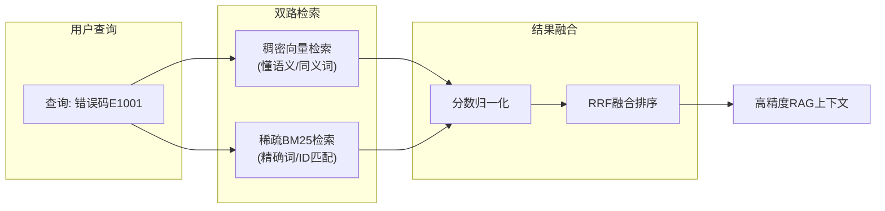
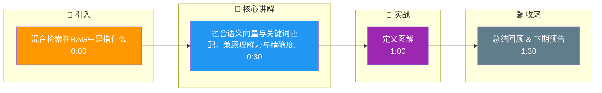

# 混合检索在RAG中是指什么？为什么单纯的稠密检索在高精度场景下往往不够用？

混合检索是指结合稠密检索和稀疏检索的技术。稠密检索（如向量Embedding）擅长捕捉语义相似性，能处理同义词改写，但对专有名词、精确ID匹配往往失效，且存在“语义漂移”问题。稀疏检索（如BM25）基于关键词匹配，对精确实体和长尾词敏感，但无法理解语义。混合检索通过融合两者的分数，取长补短，既保证了语义理解能力，又确保了关键词匹配的精确性。在实际高精度RAG场景中，仅靠向量检索容易漏掉关键的唯一标识符（如错误代码、型号），加入稀疏检索能有效弥补这一短板，提高召回率。

**实战案例**：在某金融合规RAG项目中，仅用向量检索经常将“风险等级R3”误检为“R2”，因为两者向量空间极近，导致严重的合规风险；引入BM25加权后，精准匹配了“等级R3”关键词，完全解决了误检问题。

**代码示例 (Python)**：
```python
from typing import List
import numpy as np

def hybrid_score(dense_score: float, sparse_score: float, alpha: float = 0.5) -> float:
    # 使用RRF(Reciprocal Rank Fusion)或加权求和进行融合
    # 简单加权归一化示例
    return alpha * dense_score + (1 - alpha) * sparse_score
```

**对比表格**：

| 维度 | 稠密检索 | 稀疏检索 (BM25) | 混合检索 |
| :--- | :--- | :--- | :--- |
| **核心能力** | 语义理解、同义词召回 | 关键词精确匹配、专有名词 | 兼顾语义与精确匹配 |
| **优势场景** | 概念解释、意图模糊查询 | ID查询、长尾词、人名/型号 | 复杂查询、高精度要求 |
| **主要缺陷** | 语义漂移、无法处理生僻词 | 无法理解同义改写、词汇鸿沟 | 计算成本较高、需调参 |
| **存储开销** | 高 (需存储向量) | 低 (倒排索引) | 高 (需同时维护两套索引) |
| **典型技术** | OpenAI Embeddings, BGE | Elasticsearch, Lucene | Dense+Sparse, RRF Fusion |

## 技术原理

混合检索的本质是**承认单一检索模型无法同时满足语义泛化和精确匹配**，因此用两路互补的检索器分别擅长一件事，再融合结果：

- **稠密检索（向量）的原理**：把 query 和文档编码成高维稠密向量，用余弦相似度匹配。优势是"懂语义"——query 写"如何提高系统性能"能召回讲"优化吞吐量"的文档（语义相近但用词不同）。短板是"认不准 ID"——query 写"错误码 E1001"可能误召回"E1002"的文档（两者向量空间极近，因为都是错误码语境）。
- **稀疏检索（BM25）的原理**：基于词频的倒排索引匹配（TF-IDF 的改进版）。优势是"认准关键词"——query 写"E1001"能精确匹配含"E1001"的文档。短板是"不懂语义"——query 写"提高性能"无法召回讲"优化吞吐量"的文档（用词完全不同）。
- **互补性的根源**：向量捕获语义关系（同义、近义），BM25 捕获精确词项匹配。两者失败的 case 几乎不重叠——向量栽在精确 ID 上时 BM25 能救，BM25 栽在同义改写上时向量能救。融合后召回率显著高于任一单独使用。
- **分数融合的关键**：两路分数的量级不同（向量相似度 0~1，BM25 可能 0~30），直接加权求和会让量级大的一方主导。必须先归一化，或用 RRF（Reciprocal Rank Fusion）——只看排名不看绝对分数，$\text{RRF}(d) = \sum_i \frac{1}{k + \text{rank}_i(d)}$，天然免疫量级差异。

## 代码示例

基于 RRF 融合的混合检索实现：

```python
from rank_bm25 import BM25Okapi
import numpy as np

class HybridRetriever:
    def __init__(self, documents, embed_fn):
        self.docs = documents
        self.embed_fn = embed_fn
        # 1. 稀疏索引（BM25）
        self.bm25 = BM25Okapi([d.split() for d in documents])
        # 2. 稠密索引（向量）
        self.doc_embs = np.array([embed_fn(d) for d in documents])

    def dense_search(self, query, top_k=20):
        """稠密检索：向量余弦相似度"""
        q_emb = self.embed_fn(query)
        scores = self.doc_embs @ q_emb / (
            np.linalg.norm(self.doc_embs, axis=1) * np.linalg.norm(q_emb) + 1e-8
        )
        ranked = np.argsort(-scores)[:top_k]
        return [(i, scores[i]) for i in ranked]

    def sparse_search(self, query, top_k=20):
        """稀疏检索：BM25"""
        scores = self.bm25.get_scores(query.split())
        ranked = np.argsort(-scores)[:top_k]
        return [(i, scores[i]) for i in ranked]

    def hybrid_search(self, query, top_k=10, k_rrf=60):
        """RRF 融合：只看排名，免疫量级差异"""
        dense = self.dense_search(query, top_k=50)
        sparse = self.sparse_search(query, top_k=50)
        # RRF: score(d) = sum( 1 / (k + rank_i(d)) )
        rrf_scores = {}
        for rank, (idx, _) in enumerate(dense):
            rrf_scores[idx] = rrf_scores.get(idx, 0) + 1 / (k_rrf + rank + 1)
        for rank, (idx, _) in enumerate(sparse):
            rrf_scores[idx] = rrf_scores.get(idx, 0) + 1 / (k_rrf + rank + 1)
        # 按 RRF 分数排序
        ranked = sorted(rrf_scores.items(), key=lambda x: -x[1])[:top_k]
        return [(self.docs[i], score) for i, score in ranked]

# 实战：金融合规场景，避免"风险等级R3"误召回为"R2"
retriever = HybridRetriever(compliance_docs, embed_fn)
results = retriever.hybrid_search("风险等级R3的产品有哪些")
# BM25 精确匹配 "R3" 关键词，向量补充语义相关文档，两者融合后 R3 文档排名靠前
```

## 注意事项

- **分数必须归一化或用 RRF**：直接把向量分数（0~1）和 BM25 分数（0~30）加权求和，BM25 会主导结果。RRF 是最稳的融合方式，不用调参。
- **权重 alpha 要按场景调**：精确实体多的场景（错误码、型号、人名）偏 BM25（alpha 调低）；概念查询多的场景偏向量（alpha 调高）。线上 A/B 测试确定最优值。
- **存储成本翻倍**：混合检索需同时维护向量索引和倒排索引，存储和构建成本约为单路的两倍。但对高精度场景（金融、医疗）这个成本值得。
- **并非所有场景都需要混合**：简单 FAQ、闲聊这类对精确匹配要求不高的场景，纯向量检索已够用，上混合检索是过度工程。

## 流程图



## 记忆要点

- 定义：混合检索结合稠密检索(向量)和稀疏检索(BM25)，取长补短提升召回率。
- 为何不够：稠密检索对专有名词、ID匹配失效且存在语义漂移；稀疏检索无法理解同义改写。
- 互补性：向量保语义理解，BM25保精确匹配；高精度场景下两者缺一不可。
- 融合方式：分数需归一化或使用RRF算法，避免因量级差异导致某一方失效。

## 结构化回答

**30 秒电梯演讲：** 融合语义向量与关键词匹配，兼顾理解力与精确度。——打个比方，像警察破案，既通过画像（语义）锁定嫌疑人，又通过指纹（关键词）精准定罪，避免抓错人。

**展开框架：**
1. **定义** — 混合检索结合稠密检索(向量)和稀疏检索(BM25)，取长补短提升召回率。
2. **为何不够** — 稠密检索对专有名词、ID匹配失效且存在语义漂移；稀疏检索无法理解同义改写。
3. **互补性** — 向量保语义理解，BM25保精确匹配；高精度场景下两者缺一不可。

**收尾：** 以上三点都能配合实战聊。您想深入聊哪一块？

## 视频脚本

> 预计时长：2 分钟 | 由浅入深

| 时间 | 画面/字幕 | 口播台词 | 讲解要点 |
|------|----------|----------|----------|
| 0:00 | 标题卡 | "混合检索在RAG中是指什么，30 秒讲清楚。" | 开场钩子 |
| 0:30 | 概念定义动画 | "一句话：融合语义向量与关键词匹配，兼顾理解力与精确度。" | 核心定义 |
| 1:00 | 定义图解 | "混合检索结合稠密检索(向量)和稀疏检索(BM25)，取长补短提升召回率。" | 定义 |
| 1:30 | 总结卡 | "记好这几条，面试不慌。下期见。" | 收尾 |

### 视频流程图




