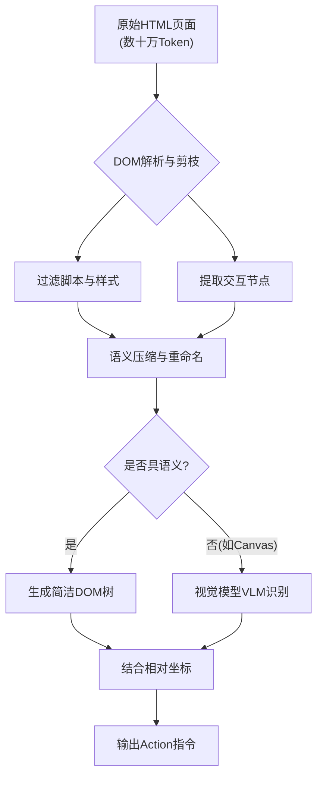

# 在浏览器自动化Agent中，DOM树的语义理解难点是什么？有哪些常见的工程优化手段？

难点在于HTML DOM树结构复杂、冗余标签多、动态加载元素多，直接将原始HTML喂给LLM会瞬间撑爆上下文窗口且干扰模型判断。工程优化手段包括：1) DOM剪枝与清洗：移除脚本、样式、不可见元素，仅保留交互式标签；2) 语义压缩：将深层嵌套的div结构扁平化，或用描述性ID替换无意义的长ID；3) 视觉化辅助：不直接传HTML，而是截图并用OCR或图标识别模型结合坐标位置给LLM，让模型像人类一样“看”屏幕操作；4) 树结构检索：只提取与当前操作目标相关的子树路径，降低上下文长度。

【实战案例】：在做电商平台自动下单Agent时，发现原生的“购物车”按钮被包裹在5层div且class名是hash值，LLM无法理解；通过将aria-label和文本内容提取映射为简短的语义标签（如`<button_icon="cart">`），指令执行成功率从40%提升至95%。

【代码示例 (Python/伪代码)】：
```python
def simplify_dom(element):
    if not is_interactive(element):
        return None  # 剪枝非交互节点
    
    # 压缩属性，保留核心语义
    attrs = {
        "tag": element.tag_name,
        "text": element.text[:20],  # 截断长文本
        "id": element.get_aria_label() or element.id[:10]
    }
    return attrs
```

【对比表格】：

| 优化手段 | 适用场景 | 优点 | 缺点 |
| :--- | :--- | :--- | :--- |
| **DOM剪枝与清洗** | 页面结构冗余严重 | 显著减少Token消耗 | 可能误删隐藏的关键交互元素 |
| **语义压缩** | 深层嵌套、Hash类名 | 提高LLM可读性 | 需要编写复杂的解析规则 |
| **视觉化辅助 (V2A)** | 图标多、布局复杂的SPA | 类似人类视觉直觉，抗干扰大 | 额外引入OCR/视觉模型，延迟高 |
| **树结构检索** | 超长页面、特定目标操作 | 上下文极度压缩，针对性强 | 需要预先定位目标根节点，逻辑复杂 |

【边界情况】
1. **动态 Shadow DOM / Web Components**：现代框架常使用 Shadow DOM 封装组件，传统的 DOM 遍历（如 `querySelector`）往往无法穿透其边界，导致获取不到内部交互元素。需考虑 specialized context 或启用 Shadow DOM穿透选项（性能开销大）。
2. **iframe 嵌套**：很多支付或登录模块在 iframe 中，受跨域策略限制，主环境的 Agent 无法直接读取 iframe 内的 DOM。需设计“上下文切换”逻辑，让 Agent 识别 iframe 并“进入”其内部上下文执行操作。
3. **Canvas 绘图内容**：对于完全基于 Canvas 绘制的游戏或图表页面，DOM 树几乎没有语义信息，HTML 解析完全失效。必须强制切换为“视觉理解模式”，依赖纯视觉模型定位点击坐标。
4. **相似元素区分**：列表中存在多个结构完全一致的按钮（如“删除”），仅靠文本无法区分操作对象（如删除第3行 vs 第5行）。必须结合“DOM树层级索引”（nth-child）或“视觉相对位置”（在标题下方）来精确定位。

## 面试追问
1. **状态同步**：Agent 点击按钮后，页面可能局部刷新或通过 AJAX 异步加载数据，DOM 结构发生变化但 URL 未变。你的系统如何感知“页面已更新”并决定何时进行下一次 DOM 快照提取？（提示：MutationObserver 或轮询检测）。
2. **稳定性维护**：网站改版会导致 class 名或结构变化，使得基于规则或 XPath 的 Agent 失效。如何设计一套具有“鲁棒性”的定位策略，减少因前端微调导致的任务失败？（提示：结合语义属性多锚点定位）。
3. **多模态权衡**：视觉模型（VLM）比文本模型更贵且慢。在什么策略下你会决定从“DOM文本模式”降级或升级到“视觉模式”？

## 易错点
1. **坐标漂移**：在视口尺寸变化（如移动端 vs PC端，或窗口缩放）时，基于截图的视觉坐标映射会发生偏移。必须使用相对坐标（如 bounding box 的百分比）或在点击前重新校准元素位置。
2. **忽略显隐状态**：直接操作 DOM 元素而不检查其 `visibility` 或 `disabled` 属性，导致点击不可见元素报错。需在生成 Action 前增加前置断言检查。

## 技术原理

浏览器自动化 Agent 的核心难点是**把人类一眼就能看懂的网页，转换成 LLM 能消费的低 token、高语义的表示**。原始 HTML 平均一个复杂 SPA 有 10-50 万 token，塞不进上下文也充满噪声，必须做工程化压缩：

- **DOM 剪枝的本质——交互元素优先**：网页里 80% 的 DOM 节点是非交互的（`<div>`、`<span>` 纯布局、`<script>`、`<style>`）。剪枝的目标是只保留"用户能点的、能输入的、能看的"——即 `button/input/a/select/[role]` 这些交互节点。剪枝后 token 量从几十万降到几千，且保留的信息都是 Action 可执行的。
- **语义压缩的关键——给无意义结构命名**：现代前端用 hash 类名（`class="css-1abc2d"`）和深嵌套（5 层 div 包一个按钮），LLM 读不懂。压缩做法：扁平化嵌套 + 用 `aria-label`/`text`/`icon` 替换 hash 名，生成 `<button data-id="cart" label="购物车">` 这种自描述标签。关键属性（href、placeholder、aria-*）必须保留，LLM 靠这些推断元素功能。
- **视觉辅助（V2A）为什么有效**：有些 UI（Canvas 图表、图标按钮、复杂瀑布流）DOM 完全无语义，必须靠 VLM（视觉语言模型）看截图。视觉模式抗干扰强（不受 class 变化影响），但延迟高（VLM 推理慢）成本高（贵 5-10 倍）。工程上通常是"DOM 文本模式优先，失败降级到视觉模式"。
- **动态状态同步的难点**：SPA 点击后局部刷新，URL 不变但 DOM 变了。Agent 必须感知"页面已更新"才能做下一步——用 `MutationObserver` 监听 DOM 变化或轮询检测关键元素消失/出现，否则会在过期 DOM 上点击导致报错。

## 代码示例

```python
# 1. DOM 剪枝 + 语义压缩（生成 LLM 可读的简化树）
from bs4 import BeautifulSoup

INTERACTIVE_TAGS = {"a", "button", "input", "select", "textarea"}
INTERACTIVE_ATTRS = ("aria-label", "placeholder", "href", "role", "type")

def simplify_dom(html: str, max_text_len: int = 20) -> str:
    """原始 HTML → 简化的语义化树（token 降低 95%+）"""
    soup = BeautifulSoup(html, "html.parser")
    # 剪枝：移除非交互节点
    for tag in soup(["script", "style", "svg", "path", "meta", "link"]):
        tag.decompose()

    output = []
    counter = 0
    for el in soup.find_all(INTERACTIVE_TAGS):
        counter += 1
        # 语义压缩：用 aria-label/text 替代 hash 类名
        label = (el.get("aria-label") or el.get_text().strip()[:max_text_len]
                 or el.get("placeholder") or el.get("href", "")[:30])
        attrs = {k: el[k] for k in INTERACTIVE_ATTRS if el.get(k)}
        # 生成自描述标签：<button id="b3" label="购物车">
        output.append(f'<{el.name} id="b{counter}" label="{label}" {attrs}>')
    return "\n".join(output)

# 2. 视觉降级：DOM 模式失败时切换到截图 + VLM
def agent_act_with_fallback(target: str, dom_mode_fn, visual_mode_fn):
    try:
        return dom_mode_fn(target)   # 先尝试快便宜的 DOM 文本模式
    except ElementNotFound:
        # DOM 模式找不到（可能是 Canvas/图标），降级到视觉模式
        screenshot = take_screenshot()
        coords = vlm_locate(screenshot, target)   # VLM 返回点击坐标
        return click_at(coords)

# 3. 动态状态同步：MutationObserver 等待页面更新
def wait_for_dom_stable(driver, timeout=5):
    """点击后等待 DOM 稳定，避免在刷新中的页面上操作"""
    driver.execute_script("""
        window.__dom_stable = false;
        let timer = null;
        const observer = new MutationObserver(() => {
            clearTimeout(timer);
            timer = setTimeout(() => { window.__dom_stable = true; }, 800);
        });
        observer.observe(document.body, {childList: true, subtree: true});
    """)
    import time
    deadline = time.time() + timeout
    while time.time() < deadline:
        if driver.execute_script("return window.__dom_stable"):
            return True
        time.sleep(0.1)
    return False  # 超时
```

## 对比选型

| 维度 | DOM 剪枝+语义压缩 | 视觉辅助（V2A） | 树结构检索 | 原始 HTML |
| :--- | :--- | :--- | :--- | :--- |
| **Token 消耗** | 极低（降 95%+） | 中（截图+坐标） | 极低（只取子树） | 极高（撑爆上下文） |
| **延迟** | 低（毫秒级解析） | 高（VLM 推理 1-3s） | 低 | 低 |
| **抗前端改版** | 中（依赖语义属性） | 高（看像素，不依赖结构） | 低（依赖 XPath） | 低 |
| **复杂 SPA/Canvas** | 差（无语义） | 好（视觉直读） | 差 | 差 |
| **适用场景** | 常规表单/列表页 | 图标按钮/Canvas/图表 | 长页面定向操作 | 不推荐 |
| **工程推荐** | 主力方案 | 降级兜底 | 补充 | 禁用 |

## 常见坑

- **hash 类名不是稳定的锚点**：前端构建工具（webpack/vite）每次构建生成的 hash 类名会变，基于 `class="css-1abc"` 的定位会在下次发版后全部失效。必须用 `aria-label`、文本内容、`data-*` 这类语义属性做锚点。
- **Shadow DOM 穿透默认关闭**：`querySelector` 无法穿透 Shadow DOM 边界，Web Components 组件内部的按钮拿不到。需要用 `querySelectorAll` 配合 `shadowRoot` 递归，或用 Playwright 的 `>>` 穿透语法（性能开销大）。
- **iframe 跨域读不到 DOM**：支付/登录模块常在跨域 iframe 里，主环境的 JS 读不到。必须让 Agent 识别 iframe 并切换上下文（`driver.switch_to.frame()`），处理完再切回。
- **坐标漂移**：视口缩放或移动端适配会让基于截图的视觉坐标偏移。必须用相对坐标（bounding box 百分比）或在每次点击前重新截图校准。
- **忽略 visibility/disabled 状态**：直接对 DOM 操作而不检查 `display:none`/`disabled`，会点到不可见或禁用的元素。生成 Action 前必须加前置断言。

## 流程图



## 记忆要点

- 核心难点：DOM树结构冗余、动态加载多、标签无语义，直接传HTML撑爆上下文。
- 优化手段：DOM剪枝(移除脚本/样式)、语义压缩(扁平化/重命名ID)、视觉化辅助(截图+OCR)、树检索。
- 视觉辅助：类似人类直觉，抗干扰强，适合复杂SPA；但成本高、延迟大。
- 边界情况：需处理Shadow DOM穿透、iframe跨域切换、Canvas纯视觉模式及动态状态同步。


## 结构化回答

**30 秒电梯演讲：** 剔除冗余噪点，将HTML结构压缩为LLM可理解的语义或视觉映射。——打个比方，就像给一本乱码丛生的电子书加目录：先撕掉全是广告的废页（剪枝），再把晦涩的章节号改成易懂的小标题（语义压缩），或者直接对着插图看目录（视觉辅助），而不是死记每…

**展开框架：**
1. **核心难点** — DOM树结构冗余、动态加载多、标签无语义，直接传HTML撑爆上下文。
2. **优化手段** — DOM剪枝(移除脚本/样式)、语义压缩(扁平化/重命名ID)、视觉化辅助(截图+OCR)、树检索。
3. **视觉辅助** — 类似人类直觉，抗干扰强，适合复杂SPA；但成本高、延迟大。

**收尾：** 以上三点都能配合实战聊。您想深入聊哪一块？

## 视频脚本

> 预计时长：2 分钟 | 由浅入深

| 时间 | 画面/字幕 | 口播台词 | 讲解要点 |
|------|----------|----------|----------|
| 0:00 | 标题卡 | "在浏览器自动化Agent中，DOM树的语义理解难点是什么，30 秒讲清楚。" | 开场钩子 |
| 0:30 | 概念定义动画 | "一句话：剔除冗余噪点，将HTML结构压缩为LLM可理解的语义或视觉映射。" | 核心定义 |
| 1:00 | 核心难点图解 | "DOM树结构冗余、动态加载多、标签无语义，直接传HTML撑爆上下文。" | 核心难点 |
| 1:30 | 总结卡 | "记好这几条，面试不慌。下期见。" | 收尾 |
