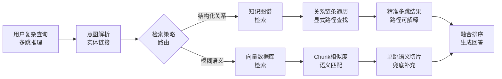

# 知识图谱增强RAG相比于传统向量RAG，在处理多跳推理问题时有什么优势？

传统向量RAG基于语义相似度检索片段，对于跨文档、需要逻辑关联的多跳问题（如“A的老板是谁，老板的生日是几号”），往往因为检索结果局限于单个Chunk而无法回答。知识图谱RAG将数据结构化为实体和关系，可以显式地进行路径查找和子图检索。优势在于：1) 精确推理：能沿关系链条一步步推导，避免向量检索的语义模糊；2) 可解释性：返回的推理路径清晰可见；3) 反事实能力：能处理“如果不是A而是B会怎样”等需要结构化逻辑的查询。这使得RAG系统在处理复杂企业知识库时更加可靠。

**实战案例**：在医疗诊断RAG中，用户问“服用阿司匹林的患者禁忌什么药？”，向量检索只能召回阿司匹林说明书的切片，答案不全；知识图谱通过“阿司匹林->含有成分->华法林->相互作用->禁忌药”的路径，精准定位到了具体的冲突药物名称。

**代码示例 (Cypher - Neo4j)**：
```cypher
// 查找A的老板的生日 (多跳推理)
MATCH path = (p:Person {name: 'A'})-[:MANAGES*1..2]->(boss:Person)
RETURN boss.name, boss.birthday
```

**对比表格**：

| 维度 | 传统向量RAG | 知识图谱增强RAG (GraphRAG) |
| :--- | :--- | :--- |
| **数据结构** | 非结构化文本切片 | 结构化实体与关系 |
| **检索机制** | 语义相似度计算 | 路径查找、子图遍历 |
| **多跳推理** | 弱 (依赖片段重合度) | 强 (显式关系链条推导) |
| **可解释性** | 低 (黑盒相似度) | 高 (可视化推理路径) |
| **更新成本** | 低 (向量化更新) | 高 (需维护图谱一致性) |
| **适用问题** | 概念解释、摘要总结 | 复杂关联、因果推理、溯源查询 |

## 边界情况
- **空节点与孤立实体**：当查询涉及的实体存在于知识库中但无任何关联边（孤立节点），或者实体不存在（OOD）时，图检索会失败，需回退到向量检索作为兜底策略。
- **多义性与歧义路径**：同名实体（如“苹果”指水果或公司）会产生大量噪声路径，若不进行实体消歧，推理路径会爆炸或指向错误结论。
- **图规模与深度限制**：在超大规模图谱（千万级节点）上进行超过3跳的查询可能导致指数级性能下降，需严格限制推理深度或引入剪枝策略。

## 面试追问
1. **混合架构**：既然知识图谱构建成本高，如何设计一种机制，在向量检索和图检索之间动态切换，以平衡成本和效果？
2. **图谱构建**：从非结构化文本构建知识图谱时，实体抽取和关系对齐准确率往往不足90%，这种误差在多跳推理中如何被放大？如何缓解？
3. **处理模糊查询**：如果用户提问非常模糊（如“那个生病的人”），图检索无法精准锚定起点，系统该如何处理这种非结构化意图？

## 易错点
- **忽视图更新的滞后性**：很多人认为图检索比向量准，却忽略了图谱数据更新的高成本。如果图谱数据不是实时的，可能检索到过期的关系（如“已离职员工”），导致严重的错误信息。
- **过度依赖显式关系**：并非所有知识都能被显式建模为关系，隐性知识（如常识、潜台词）在图谱中难以表达，这部分依然是向量检索的强项，不能完全用图谱替代。

## 技术原理

知识图谱增强 RAG（GraphRAG）在多跳推理上胜过向量 RAG，根源在于数据结构决定了检索能力：

- **向量 RAG 的多跳失效**：向量检索找的是"和 query 语义相似的 chunk"。多跳问题（A→B→C）的中间节点 B 往往和最终 query 不相似（如"老板的生日"和"老板的姓名"语义距离远），会被向量检索漏掉。即使召回多个 chunk，它们之间的逻辑关联也是隐式的，模型得靠推理猜，容易断片。
- **图谱的显式路径查找**：知识图谱用节点存实体、边存关系，多跳推理就是沿边遍历（Cypher 的 `MATCH (a)-[:MANAGES*1..2]->(b)`）。每跳都精确——A 的老板是 B（边 1），B 的生日是 X（边 2），路径完整可见。这把"概率匹配"变成"精确查找"，准确率和可解释性都大幅提升。
- **反事实推理的结构优势**：向量 RAG 无法回答"如果 A 不是经理而是工程师会怎样"，因为这种假设在训练数据里不存在。图谱可以通过修改边属性（把 MANAGER 改成 ENGINEER）重新遍历，天然支持反事实查询。
- **混合架构的兜底逻辑**：图谱构建成本高（需 NER + 关系抽取）且对隐性知识（常识、潜台词）表达弱，所以生产系统常用"图谱为主 + 向量兜底"——图谱回答结构化推理，向量回答模糊语义，两者互补。

## 注意事项

1. **孤立节点要回退向量**：查询的实体存在但无关联边（孤立节点）或不存在（OOD）时，图检索会失败，需回退向量检索兜底。
2. **同名实体要消歧**："苹果"指水果还是公司会产生噪声路径，不消歧会导致推理爆炸或错误结论，需结合上下文做实体链接。
3. **超深查询要剪枝**：千万级图谱上超过 3 跳的查询会指数级性能下降，需限制推理深度（max_hops=2~3）或用双向 BFS 剪枝。
4. **图谱更新滞后要警惕**：图谱数据更新成本高，若非实时可能检索到过期关系（如已离职员工），导致严重错误信息。

## 对比表

| 维度 | 向量 RAG | GraphRAG | 混合架构 |
|:---|:---|:---|:---|
| **数据结构** | 文本切片 | 实体+关系图 | 向量+图谱 |
| **检索机制** | 语义相似度 | 路径遍历 | 向量召回+图推理 |
| **多跳推理** | 弱（断片） | 强（显式链条） | 强 |
| **可解释性** | 低（黑盒） | 高（路径可视） | 中高 |
| **构建成本** | 低（向量化） | 高（NER+关系抽取） | 中高 |
| **更新成本** | 低 | 高（维护一致性） | 中 |
| **适用问题** | 概念解释、摘要 | 因果推理、溯源 | 综合场景 |
| **边界处理** | 语义漂移 | 孤立节点/OOD | 互补兜底 |

## 流程图



## 记忆要点

- 向量RAG查语义，图谱RAG查关系，多跳推理图谱优势明显。
- 图谱优势：精确推理沿链条，可解释路径清晰，反事实逻辑强。
- 边界情况：孤立节点需回退向量，同名实体需消歧，超深查询需剪枝。
- 核心口诀：向量模糊图谱准，多跳推理看路径，混合架构兜底稳。


## 结构化回答

**30 秒电梯演讲：** 用显式关系路径替代模糊语义检索，解决跨文档逻辑推理难题。——打个比方，向量RAG像翻阅散乱的便签找信息，多跳时容易断片；知识图谱RAG像看地图导航，能顺着路标一步步找到终点。

**展开框架：**
1. **向量RAG查语义** — 向量RAG查语义，图谱RAG查关系，多跳推理图谱优势明显。
2. **图谱优势** — 精确推理沿链条，可解释路径清晰，反事实逻辑强。
3. **边界情况** — 孤立节点需回退向量，同名实体需消歧，超深查询需剪枝。

**收尾：** 以上三点都能配合实战聊。您想深入聊哪一块？

## 视频脚本

> 预计时长：2 分钟 | 由浅入深

| 时间 | 画面/字幕 | 口播台词 | 讲解要点 |
|------|----------|----------|----------|
| 0:00 | 标题卡 | "知识图谱增强RAG相比于传统向量RAG，在处理多跳推理问题时有什么优势，30 秒讲清楚。" | 开场钩子 |
| 0:30 | 概念定义动画 | "一句话：用显式关系路径替代模糊语义检索，解决跨文档逻辑推理难题。" | 核心定义 |
| 1:00 | 要点图解 | "向量RAG查语义，图谱RAG查关系，多跳推理图谱优势明显。" | 要点 |
| 1:30 | 总结卡 | "记好这几条，面试不慌。下期见。" | 收尾 |
