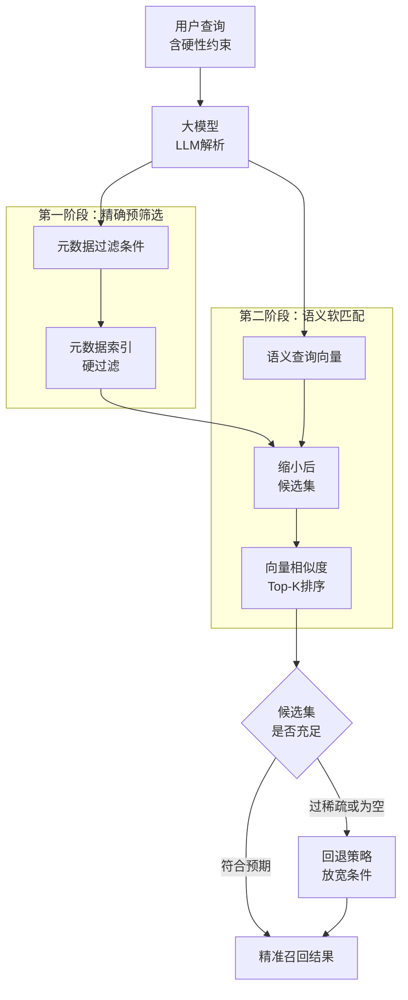
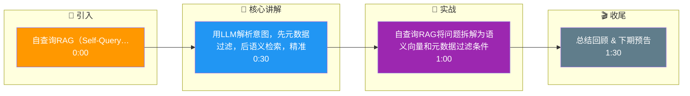

# 自查询RAG（Self-Querying RAG）是如何实现元数据过滤的？它比单纯的语义检索强在哪里？

自查询RAG利用LLM将自然语言拆解为语义查询向量和元数据过滤条件（如年份、类别）。检索时先通过元数据进行硬过滤以缩小候选集，再在候选集内计算向量相似度。其核心优势在于能精准处理“硬性约束”（如时间、数值），避免纯语义检索召回语义相关但条件不符的结果（如用旧文档回答新问题），显著提升了RAG的准确性和合规性。

## 边界情况
- **元数据冲突**：当查询中包含互相矛盾的过滤条件（如“2023年但早于2022年”）或超出范围的数值时，LLM需要能够识别并报错，而不是传递给数据库导致空结果或全表扫描。
- **稀疏过滤后的候选集**：如果元数据过滤过于严格，导致候选集为空或极少（如<5条），向量检索的排序意义不大，需设计“回退策略”放宽条件。
- **复杂逻辑组合**：面对包含 AND/OR/NOT 的嵌套逻辑查询（如“包含A或B，但不包含C”），简单的键值对过滤往往无法支持，需生成结构化查询语言（如SQL或MongoDB查询语句）。

## 面试追问
1. **LLM解析稳定性**：如果LLM将“去年的文档”错误解析为`year=2025`（当前年）而非`year=2024`，会导致致命的召回失败，如何在检索后验证元数据解析的正确性？
2. **多模态元数据**：除了文本元数据，如何处理基于图像、音频内容的过滤条件（如“找包含红色图表的文档”）？
3. **性能权衡**：对于高频查询，是否可以将LLM的“解析结果”进行缓存？如何设计Cache Key来命中相似的查询意图？

## 易错点
- **混淆元数据过滤与重排序**：元数据过滤是预筛选，是二元判断；重排序是基于相关性的打分。很多初学者试图用Re-ranker来实现“必须符合年份”的需求，这效率极低且不够严格。
- **忽略Schema的局限性**：如果文档的元数据定义不全（例如缺少“地区”字段），自查询RAG会完全失效，因为它无法基于不存在的字段进行过滤，这往往比纯向量检索表现更差（因为向量可能隐含了这些语义）。

## 技术原理

自查询 RAG 解决的是**向量检索无法表达精确逻辑约束**的问题。向量相似度是"软匹配"（语义相近就高分），但现实查询常含"硬约束"（必须 2023 年、必须是 R3 等级、必须是某地区），这些硬约束无法靠向量相似度保证。

- **查询拆解**：用 LLM 把自然语言 query 拆成两部分——
  - **语义查询向量**：`"找关于金融风控的文档"` → 向量化用于语义匹配。
  - **元数据过滤条件**：`"发布年份=2023 且 地区=上海"` → 结构化条件用于硬过滤。
  比如 `"2023年发布的金融风控方案"` 拆成 `semantic="金融风控方案"`、`filter={"year": 2023}`。
- **两阶段检索**：
  1. **先元数据硬过滤**：在向量库里用 `filter={"year": 2023}` 缩小候选集（这一步是精确匹配，走 metadata 索引，极快）。
  2. **再向量相似度排序**：在缩小后的候选集内做向量相似度计算，找出语义最相关的 Top-K。
- **为什么比纯语义检索强**：纯向量检索可能召回"2022 年的金融风控方案"（语义相关但年份不符），导致用旧政策回答新问题，合规风险。自查询先用硬过滤把不符年份的剔除，保证结果严格满足约束。

## 代码示例

基于 LLM 查询拆解 + 两阶段检索：

```python
from pydantic import BaseModel

class ParsedQuery(BaseModel):
    """LLM 输出的结构化拆解结果"""
    semantic_query: str          # 语义部分，用于向量化
    filter: dict                 # 元数据过滤条件
    fallback_strategy: str = "relax"  # 候选集为空时的回退策略

QUERY_PARSE_PROMPT = """\
把用户查询拆解为语义查询和元数据过滤条件。
可用元数据字段：year(年份), region(地区), category(类别), risk_level(风险等级)。
输出 JSON，格式：
{{"semantic_query": "...", "filter": {{"字段": "值"}}, "fallback_strategy": "relax|strict"}}

示例：
输入：2023年发布的上海地区金融风控方案
输出：{{"semantic_query": "金融风控方案", "filter": {{"year": 2023, "region": "上海"}}, "fallback_strategy": "relax"}}

用户输入：{query}
"""

def parse_query(query: str, llm) -> ParsedQuery:
    """用 LLM 拆解查询"""
    result = llm.chat(
        QUERY_PARSE_PROMPT.format(query=query),
        response_format=ParsedQuery,
    )
    # 校验过滤条件合法性（防止 LLM 幻觉出不存在的字段）
    valid_fields = {"year", "region", "category", "risk_level"}
    result.filter = {k: v for k, v in result.filter.items() if k in valid_fields}
    return result

def self_query_search(query: str, vector_store, llm, top_k=5) -> list:
    """自查询 RAG：先元数据过滤，再向量检索"""
    parsed = parse_query(query, llm)
    # 1. 元数据硬过滤缩小候选集
    candidates = vector_store.filter(metadata_filter=parsed.filter)
    # 2. 候选集为空时的回退策略
    if len(candidates) < top_k:
        if parsed.fallback_strategy == "relax":
            # 放宽：去掉最严格的条件（如保留 year 放弃 region）
            relaxed = {k: v for k, v in parsed.filter.items() if k == "year"}
            candidates = vector_store.filter(metadata_filter=relaxed)
        else:  # strict: 直接返回空
            return []
    # 3. 在候选集内做向量相似度排序
    q_emb = embed(parsed.semantic_query)
    return vector_store.search_in(candidates, q_emb, top_k=top_k)

# 实战：避免用旧政策回答新问题
results = self_query_search(
    "2024年最新的小微企业贷款政策", vector_store, llm
)
# filter={"year": 2024} 先把 2023 及更早的政策剔除，再用向量找"小微企业贷款"语义最相关的
```

## 注意事项

- **元数据过滤 ≠ 重排序**：元数据过滤是二元预筛选（符合/不符合，硬判断），重排序是基于相关性的打分（软排序）。想实现"必须符合年份"必须用过滤，用 Re-ranker 加权既不严格也低效。
- **LLM 解析要校验和兜底**：LLM 可能幻觉出不存在的字段、错误的年份（"去年"解析成当前年）。解析后必须校验字段合法性，对相对时间（"去年""上季度"）要结合当前日期换算。
- **候选集过稀要回退**：过滤太严格导致候选集为空或 <5 条时，向量排序失去意义。需设计回退策略——逐级放宽过滤条件（如放弃地区保留年份），或直接降级为纯向量检索。
- **元数据 Schema 要完备**：如果文档入库时没抽取"地区"字段，自查询就无法按地区过滤，效果反而不如纯向量（向量可能隐含地区语义）。文档入库时的元数据抽取质量直接决定自查询的上限。
- **复杂逻辑要生成查询语言**：AND/OR/NOT 嵌套逻辑（"包含 A 或 B 但不含 C"）简单的键值过滤不支持，需让 LLM 生成 SQL/MongoDB 查询语句，并严格防注入。

## 流程图



## 记忆要点

- 自查询RAG将问题拆解为语义向量和元数据过滤条件两部分。
- 先元数据硬过滤缩小范围，再向量相似度排序，精准处理硬性约束。
- 优势：避免语义相关但条件不符的误召回，提升准确性和合规性。
- 易错点：元数据过滤是二元预筛选，区别于基于打分的重排序。

## 结构化回答

**30 秒电梯演讲：** 用LLM解析意图，先元数据过滤，后语义检索，精准匹配硬性约束。——打个比方，像图书馆找书，先告诉管理员要“2023年出版的”（元数据过滤），管理员锁定期架，你再从中搜索“金融”相关的书（语义检索），避免在旧书堆里瞎找。

**展开框架：**
1. **自查询RAG将问** — 自查询RAG将问题拆解为语义向量和元数据过滤条件两部分。
2. **先元数据硬过滤缩** — 先元数据硬过滤缩小范围，再向量相似度排序，精准处理硬性约束。
3. **优势** — 避免语义相关但条件不符的误召回，提升准确性和合规性。

**收尾：** 以上三点都能配合实战聊。您想深入聊哪一块？

## 视频脚本

> 预计时长：2 分钟 | 由浅入深

| 时间 | 画面/字幕 | 口播台词 | 讲解要点 |
|------|----------|----------|----------|
| 0:00 | 标题卡 | "自查询RAG（Self-Querying RAG）是如何实现元数据过滤的，30 秒讲清楚。" | 开场钩子 |
| 0:30 | 概念定义动画 | "一句话：用LLM解析意图，先元数据过滤，后语义检索，精准匹配硬性约束。" | 核心定义 |
| 1:00 | 要点图解 | "自查询RAG将问题拆解为语义向量和元数据过滤条件两部分。" | 要点 |
| 1:30 | 总结卡 | "记好这几条，面试不慌。下期见。" | 收尾 |

### 视频流程图




