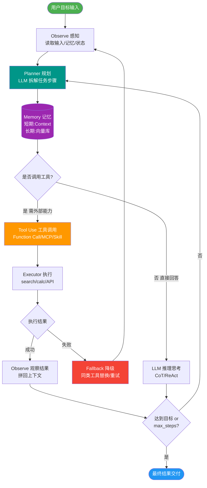

# 【后端开发二面】Agent如何理解代码仓库？基于AST建立项目索引

> 来源：后端开发二面（贼难）小红书面经 — 原题：Agent如何理解整个代码仓库？如何构建代码知识库？为什么基于AST建立项目索引？如何做到按需加载？

## 一、费曼类比

```
代码知识库 = 图书馆索引系统:

全量加载(笨办法):
  Agent读所有文件 → 10万行代码 → Context爆炸 → 模型崩溃

AST索引(聪明办法):
┌─────────────────────────────────────────────────────┐
│  Step 1: AST解析 (建索引)                             │
│  源码 → AST → 提取结构信息 → 知识文件(Markdown)       │
│                                                     │
│  Step 2: 任务触发 (查索引)                            │
│  "修改登录组件" → 搜索知识库 → 找到Login组件位置       │
│                                                     │
│  Step 3: 按需加载 (读相关章节)                        │
│  只加载Login.tsx + 相关API + 相关类型定义             │
│  → Context只占~2000 Token (vs 全量~100000 Token)     │
└─────────────────────────────────────────────────────┘
```

## 二、第一性原理分析

**核心问题：代码仓库太大，Context放不下**

```
一个中型前端项目:
  - 500个TypeScript文件
  - 平均200行/文件
  - 总计~100,000行
  - Token估算: ~1,000,000 Token
  
大模型Context Window:
  - GPT-4: 128K Token (只能放~12%的代码)
  - Claude: 200K Token (只能放~20%的代码)
  
→ 必须按需加载，不能全量塞入!
```

## 三、详细答案

### 3.1 AST解析流程

```
┌──────────────────────────────────────────────────────────┐
│  源代码: src/components/Login.tsx                        │
│                                                          │
│  import { Form, Input, Button } from 'antd';             │
│  import { login } from '@/api/auth';                     │
│                                                          │
│  export const Login: React.FC = () => {                  │
│    const [phone, setPhone] = useState('');               │
│    const handleSubmit = async () => {                    │
│      await login({ phone });                             │
│    };                                                    │
│    return <Form>...</Form>;                              │
│  };                                                      │
└──────────────────────────────────────────────────────────┘
                         │
                    AST Parser
                    (TS Compiler API)
                         ↓
┌──────────────────────────────────────────────────────────┐
│  AST节点提取:                                            │
│                                                          │
│  • ImportDeclaration:                                    │
│    - antd: Form, Input, Button                           │
│    - @/api/auth: login                                   │
│                                                          │
│  • ExportDeclaration:                                    │
│    - Login (React.FC)                                    │
│                                                          │
│  • VariableDeclaration:                                  │
│    - phone: string (useState)                            │
│                                                          │
│  • FunctionDeclaration:                                  │
│    - handleSubmit: () => Promise<void>                   │
│    - 调用: login({ phone })                               │
│                                                          │
│  • JSX结构: Form > FormItem > Input                      │
└──────────────────────────────────────────────────────────┘
                         │
                    转换为知识文件
                         ↓
┌──────────────────────────────────────────────────────────┐
│  知识文件: knowledge/components/Login.md                 │
│                                                          │
│  ## Login 组件                                           │
│  - 路径: src/components/Login.tsx                        │
│  - 类型: React.FC                                        │
│  - 依赖: antd(Form/Input/Button), @/api/auth(login)      │
│  - 状态: phone(string)                                   │
│  - 方法: handleSubmit → 调用 login API                   │
│  - JSX: Form → Input → Button                            │
│  - 被引用: src/pages/Auth.tsx                            │
└──────────────────────────────────────────────────────────┘
```

### 3.2 知识库结构

```
knowledge/
├── components/           # 组件知识
│   ├── Login.md          # 组件签名+依赖+状态
│   ├── Header.md
│   └── ProductCard.md
├── utils/                # 工具函数知识
│   ├── format.md         # 函数签名+参数+返回值
│   └── request.md
├── api/                  # 接口知识
│   ├── auth.md           # API端点+请求/响应类型
│   └── product.md
├── types/                # 类型定义
│   └── global.md         # TS类型定义汇总
└── project.md            # 项目全局知识
    ├── 目录结构
    ├── 技术栈
    └── 依赖关系图
```

### 3.3 AST工具选型

| 工具 | 语言 | 速度 | 准确性 | 适用场景 |
|------|------|------|--------|---------|
| **TypeScript Compiler API** | TS/JS | 中 | 最高 | TS项目首选 |
| **Babel Parser** | JS/TS | 快 | 高 | 广泛兼容 |
| **SWC** | JS/TS/Rust | 最快 | 高 | 大规模项目 |
| **tree-sitter** | 多语言 | 快 | 中 | 跨语言项目 |

```typescript
// TypeScript Compiler API 示例
import * as ts from 'typescript';

function analyzeFile(filePath: string) {
    const sourceFile = ts.createProgram([filePath], {})
        .getSourceFile(filePath);
    
    // 提取imports
    const imports = [];
    const functions = [];
    const components = [];
    
    function visit(node: ts.Node) {
        if (ts.isImportDeclaration(node)) {
            imports.push({
                source: node.moduleSpecifier.text,
                names: node.importClause?.namedImports
            });
        }
        if (ts.isFunctionDeclaration(node)) {
            functions.push({
                name: node.name?.text,
                params: node.parameters,
                returnType: node.type
            });
        }
        ts.forEachChild(node, visit);
    }
    
    visit(sourceFile);
    return { imports, functions, components };
}
```

### 3.4 按需加载（Context Retrieval）

```python
class ContextRetriever:
    """根据当前Task检索相关代码上下文"""
    
    def retrieve(self, task: Task, knowledge_base):
        context = []
        
        # 1. 从Task描述提取关键词
        keywords = extract_keywords(task.description)
        # 例: "修改登录页面的手机号验证" → ["Login", "phone", "验证"]
        
        # 2. 在知识库中搜索相关知识文件
        relevant = knowledge_base.search(keywords)
        # 找到: Login.md, auth.md, format.md
        
        # 3. 加载知识文件
        for doc in relevant:
            context.append(doc.content)
        
        # 4. 按依赖关系扩展（Import的模块）
        for doc in relevant:
            deps = doc.get('dependencies', [])
            dep_docs = knowledge_base.get_by_path(deps)
            context.extend(d.content for d in dep_docs[:3])  # 限制深度
        
        # 5. 读取实际源码（Source of Truth验证）
        for file_path in task.affected_files:
            source = read_file(file_path)
            context.append(source)
        
        # 6. 控制Context大小
        return truncate_context(context, max_tokens=4000)
```

### 3.5 Git Diff增量更新

```python
class KnowledgeUpdater:
    """基于Git Diff的增量更新"""
    
    def update(self, git_diff):
        changed_files = parse_git_diff(git_diff)
        
        for file in changed_files:
            if file.is_new:
                # 新文件: 全量AST解析
                self.build_knowledge(file.path)
            elif file.is_modified:
                # 修改文件: 重新解析，更新知识文件
                self.rebuild_knowledge(file.path)
            elif file.is_deleted:
                # 删除文件: 移除知识文件
                self.remove_knowledge(file.path)
        
        # 更新引用关系（其他文件引用了变更文件）
        self.update_references(changed_files)
    
    # 为什么不全量扫描？
    # 1. 大仓库全量解析需要数分钟 → 增量只需数秒
    # 2. Git Diff精确知道哪些变了 → 只更新必要的部分
    # 3. 全量扫描会覆盖手工修改的知识文件 → 增量只更新变更的
```

### 3.6 Source of Truth原则

```
源码 vs 知识库:

  知识库 = 缓存（可能过期）
  源码 = 真相（永远准确）

  Code Agent工作流:
    1. 读知识库 → 快速了解组件结构
    2. 读实际源码 → 确认细节（知识库可能过期）
    3. 修改源码 → 实际变更
    4. Git Diff → 触发知识库增量更新

  如果知识库与源码不一致:
    → 以源码为准
    → 触发知识库重建
    → 记录不一致警告
```

## 四、知识文件粒度

| 粒度 | 示例 | 优点 | 缺点 |
|------|------|------|------|
| 太粗 | 整个模块一个文件 | 文件少 | 加载时Token太多 |
| 太细 | 每个函数一个文件 | 精确加载 | 文件太多，检索慢 |
| **适中** | 每个组件/模块一个文件 | 平衡检索效率和加载精度 | 需要合理拆分 |

## 五、苏格拉底式面试提问

1. **"你说知识库是缓存，如果知识库和真实代码不一致，Agent用了过期知识写出了错误代码怎么办？"** — 引出Code Agent写入前必须读源码验证、CI校验、知识库一致性检查
2. **"AST解析每次全量重建不是很慢吗？大仓库怎么办？"** — 引出Git Diff增量更新、缓存策略、后台异步重建
3. **"TS Compiler API、Babel、SWC三个你选哪个？为什么？"** — TS Compiler准确性最高(类型推断)，SWC速度最快(Rust)，Babel生态最成熟
4. **"知识文件如何转换为LLM可理解的格式？直接用AST JSON行吗？"** — AST JSON太冗长，转换为Markdown/自然语言描述更节省Token
5. **"如果项目用的是Vue不是React，AST解析策略需要怎么调整？"** — 引出多框架支持、template解析、Composition API识别

## 六、面试加分点

1. **强调Source of Truth原则** — 源码是真相，知识库是缓存
2. **量化Context节省** — 全量100K Token → 按需4K Token，节省96%
3. **知道增量更新策略** — Git Diff驱动，不全量重建
4. **理解AST工具选型** — TS Compiler准确性、SWC速度、各有所长
5. **提到知识文件粒度权衡** — 不粗不细，按组件/模块拆分
6. **强调按需加载算法** — 关键词提取→知识库搜索→依赖扩展→源码验证

## 核心流程图



## 结构化回答

**30 秒电梯演讲：** 通过AST(抽象语法树)解析整个代码仓库，提取组件/函数/接口的结构信息，构建大模型可理解的知识库。让Agent按需加载上下文，而不是把整个仓库塞进Prompt。

**展开框架：**
1. **AST解析提取** — 组件结构、函数签名、类型定义、import依赖、调用关系
2. **按需加载** — Agent只加载当前任务相关的上下文，不全量加载
3. **Git Diff增量更新** — 只解析变更的文件，不用全量重建

**收尾：** 您想深入聊：AST解析用了哪些工具？TypeScript Compiler API vs Babel vs SWC？

## 视频脚本

> 预计时长：5 分钟 | 由浅入深

| 时间 | 画面/字幕 | 口播台词 | 讲解要点 |
|------|----------|----------|----------|
| 0:00 | 标题卡：Agent如何理解代码仓库？基于AST建立项目索… | "AST知识库就像图书馆的索引系统——你不需要读完所有书才能找到需要的信息。AST提取每本书…" | 开场钩子 |
| 0:20 | 核心概念图 | "通过AST(抽象语法树)解析整个代码仓库，提取组件/函数/接口的结构信息，构建大模型可理解的知识库。让Agent按需加载…" | 核心定义 |
| 0:50 | AST解析提取示意图 | "AST解析提取——组件结构、函数签名、类型定义、import依赖、调用关系" | 要点拆解1 |
| 1:30 | 按需加载示意图 | "按需加载——Agent只加载当前任务相关的上下文，不全量加载" | 要点拆解2 |
| 2:20 | 对比/实战案例图 | "对比一下常见误区和工程实践，看真实场景里怎么取舍。" | 实战与对比 |
| 3:10 | 总结卡 | "记住核心要点。下期我们追问：AST解析用了哪些工具？TypeScript Compile？" | 收尾与钩子 |

### 视频流程图


