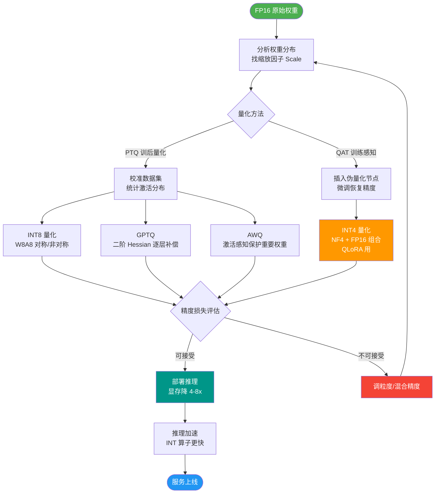
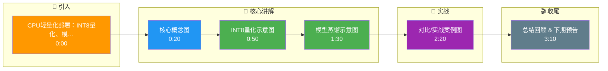

# 【拼多多 AI大模型开发】CPU轻量化部署：INT8量化、模型蒸馏、剪枝、batch合并

> 来源：拼多多AI大模型开发面经（小红书）— 拼多多极度看重CPU吞吐

## 一、费曼类比

```
模型轻量化四大招 = 搬家四步法:

┌───────────────────────────────────────────────────────┐
│ 原始模型(FP32, 1GB)                                    │
│                                                       │
│ Step 1: 量化 (压缩打包)                                 │
│   FP32(4字节) → INT8(1字节) → 体积250MB (1/4)         │
│   类比: 把厚棉衣抽真空压缩                               │
│                                                       │
│ Step 2: 蒸馏 (大换小)                                  │
│   12层BERT → 6层TinyBERT → 体积60MB (1/16)           │
│   类比: 大卡车换小货车，功能一样                         │
│                                                       │
│ Step 3: 剪枝 (扔冗余)                                  │
│   去掉权重|w|<0.01的参数 → 体积30MB (1/32)           │
│   类比: 扔掉搬家时不需要的旧物                           │
│                                                       │
│ Step 4: batch合并 (拼车)                               │
│   10个请求合并为1个batch → CPU利用率提升5-10x         │
│   类比: 拼车一次运多家的货                              │
│                                                       │
│ 最终: 30MB模型在CPU上跑 → 延迟20ms → 成本~0.001元/次  │
└───────────────────────────────────────────────────────┘
```

## 二、第一性原理分析

**为什么GPU贵但CPU便宜？**

```
GPU: 10000+核心, 适合大规模并行 → 贵(几万元/卡)
CPU: 几十核心, 适合串行逻辑 → 便宜(已有的服务器)

推理瓶颈分析:
  内存带宽: FP32模型大 → 搬运慢 → 量化减少搬运量
  计算量: 模型层数多 → 计算慢 → 蒸馏减少层数
  参数量: 大量冗余参数 → 计算浪费 → 剪枝去除冗余
  硬件利用率: 单请求推理CPU空闲 → batch合并提高利用率
```

## 三、详细答案

### 3.1 INT8量化

```
量化原理: 将FP32浮点权重映射到INT8整数

┌──────────────────────────────────────────────────┐
│ FP32: [0.123, -0.456, 0.789, -0.012, ...]       │
│        32 bit/值                                  │
│                                                  │
│ 量化公式: q = round(r / scale) + zero_point      │
│ 反量化:   r = (q - zero_point) × scale           │
│                                                  │
│ INT8: [31, -115, 200, -3, ...]                   │
│        8 bit/值                                   │
│                                                  │
│ scale = (max_val - min_val) / 255                │
│ 原始范围[-0.5, 0.8] → scale=0.0051               │
└──────────────────────────────────────────────────┘

量化方式对比:
┌──────────────┬────────────┬────────────┬──────────┐
│ 方式         │ 精度损失    │ 推理加速    │ 实现难度  │
├──────────────┼────────────┼────────────┼──────────┤
│ 对称量化     │ 较大        │ 最快        │ 简单      │
│ 非对称量化   │ 较小        │ 快          │ 中等      │
│ 感知量化(QAT)│ 最小(<1%)   │ 快          │ 复杂      │
│ 动态量化     │ 中等        │ 中          │ 最简单    │
└──────────────┴────────────┴────────────┴──────────┘
```

```python
# PyTorch动态量化示例
import torch.quantization as quant

# 动态量化（最简单，仅权重量化）
model_int8 = quant.quantize_dynamic(
    model, {torch.nn.Linear}, dtype=torch.qint8
)
# 体积: 440MB → 110MB (1/4)
# 推理: ~2x加速
```

### 3.2 模型蒸馏

```
蒸馏原理: Teacher(大模型) → Student(小模型)

┌─────────────────────────────────────────────────┐
│ Teacher Model (BERT-Base, 12层, 110M参数)        │
│                    │                            │
│     训练数据 → 生成软标签(soft labels)             │
│     (概率分布，包含类间关系信息)                    │
│                    │                            │
│                    ↓ 蒸馏                        │
│ Student Model (TinyBERT, 6层, 15M参数)           │
│ (学习Teacher的输出分布 + 原始任务)                 │
│                                                 │
│ 结果: 参数减少86%, 保留90%+性能                    │
└─────────────────────────────────────────────────┘

蒸馏损失函数:
  L = α × L_hard(student, true_label)    # 硬标签(真实标签)
    + (1-α) × L_soft(student, teacher)    # 软标签(教师输出)
    + β × L_hidden(student, teacher)      # 中间层对齐
```

### 3.3 剪枝

```
剪枝原理: 去掉对输出贡献小的参数

┌──────────────────────────────────────────────────┐
│ 非结构化剪枝:                                       │
│   去掉单个权重(|w|<threshold)                       │
│   结果: 稀疏矩阵(大量0)                              │
│   问题: 通用硬件难以加速稀疏计算                       │
│                                                  │
│ 结构化剪枝 (推荐):                                  │
│   去掉整个神经元/通道/层                              │
│   结果: 直接变小(稠密矩阵)                            │
│   优势: 通用CPU/GPU可直接加速                         │
│                                                  │
│ 剪枝流程:                                           │
│   1. 训练模型                                       │
│   2. 评估参数重要性(权重绝对值/梯度/激活值)             │
│   3. 剪掉不重要的                                    │
│   4. 微调恢复精度                                    │
│   5. 迭代2-4                                        │
└──────────────────────────────────────────────────┘
```

### 3.4 Batch合并

```python
# 请求合并：将短时间内的多个请求组成batch
class BatchInference:
    def __init__(self, max_batch=32, max_wait_ms=50):
        self.max_batch = max_batch
        self.max_wait_ms = max_wait_ms
        self.buffer = []
    
    async def infer(self, query):
        self.buffer.append(query)
        if len(self.buffer) >= self.max_batch:
            return await self._batch_predict()
        await asyncio.sleep(self.max_wait_ms / 1000)
        return await self._batch_predict()
    
    async def _batch_predict(self):
        batch = self.buffer[:self.max_batch]
        self.buffer = self.buffer[self.max_batch:]
        # 一次推理32个请求 vs 32次单请求
        results = model.predict(batch)  # CPU利用率从10%→80%
        return results
```

### 3.5 综合优化效果

| 优化手段 | 体积变化 | 延迟变化 | 精度变化 | 成本变化 |
|---------|---------|---------|---------|---------|
| 原始模型 | 1.0x | 1.0x | 100% | 1.0x |
| +INT8量化 | 0.25x | 0.5x | 99.5% | 0.25x |
| +蒸馏 | 0.06x | 0.2x | 97% | 0.06x |
| +剪枝 | 0.03x | 0.15x | 96% | 0.03x |
| +batch合并 | - | 0.1x | 96% | 0.01x |

## 四、实际例子

```
拼多多客服意图识别部署方案:
  模型: BERT-Tiny (4层, 4.4M参数)
  量化: INT8 动态量化
  推理: ONNX Runtime (CPU)
  batch: 32个请求合并
  
  结果:
    - 延迟: 15ms/query (含batch合并等待)
    - QPS: 2000+/CPU核
    - 成本: ~0.0001元/次
    - 精度: F1=0.92 (原始BERT F1=0.95)
    - 硬件: 普通X86服务器，无需GPU
```

## 五、扩展知识

- **ONNX Runtime**: 微软开源跨平台推理引擎，支持INT8量化+图优化
- **OpenVINO**: Intel开源推理引擎，针对Intel CPU极致优化
- **TensorRT**: NVIDIA推理引擎，GPU端优化
- **GGUF/llama.cpp**: 大模型CPU量化推理（INT4/INT8）

## 六、苏格拉底式面试提问

1. **"INT8量化精度损失1%，在客服场景这1%意味着什么？"** — 可能影响数百万次咨询的分类结果，需要评估业务影响
2. **"蒸馏和微调有什么区别？"** — 蒸馏是从大模型学（迁移知识），微调是在小模型上继续训练（适应任务）
3. **"结构化剪枝和非结构化剪枝，为什么推荐结构化？"** — 通用硬件可以加速稠密矩阵，稀疏矩阵需要特殊硬件
4. **"batch合并会增加延迟（等满batch），怎么权衡？"** — 设置max_wait_ms上限（如50ms），保证延迟可控
5. **"如果用INT4量化呢？精度损失能接受吗？"** — INT4精度损失3-8%，GPTQ/AWQ算法可缓解，适合极端降本场景

## 七、面试加分点

1. **量化每一步的效果** — 4x体积→16x→32x，展示系统性思维
2. **提到ONNX Runtime/OpenVINO** — 实际部署的推理框架
3. **强调CPU吞吐** — 拼多多核心关注点，不是模型精度
4. **batch合并的延迟权衡** — max_batch + max_wait_ms双控
5. **量化+蒸馏+剪枝可叠加使用** — 展示组合优化的理解

## 核心流程图



## 结构化回答

**30 秒电梯演讲：** CPU轻量化部署四大技术：INT8量化（精度换速度）、模型蒸馏（大模型教小模型）、剪枝（去掉冗余参数）、batch合并（批量推理）。拼多多极度看重CPU吞吐。

**展开框架：**
1. **INT8量化** — FP32→INT8，体积缩4倍，推理快2-3倍，精度损失<1%
2. **模型蒸馏** — Teacher大模型→Student小模型，保留90%能力体积减10倍
3. **剪枝** — 去掉权重接近0的参数（结构化剪枝+非结构化剪枝）

**收尾：** 您想深入聊：INT8量化精度损失如何评估？

## 视频脚本

> 预计时长：5 分钟 | 由浅入深

| 时间 | 画面/字幕 | 口播台词 | 讲解要点 |
|------|----------|----------|----------|
| 0:00 | 标题卡：CPU轻量化部署：INT8量化、模型蒸馏、剪枝… | "模型轻量化就像搬家——量化是把每件东西压缩打包(32bit→8bit)，蒸馏是请搬家公司把…" | 开场钩子 |
| 0:20 | 核心概念图 | "CPU轻量化部署四大技术：INT8量化（精度换速度）、模型蒸馏（大模型教小模型）、剪枝（去掉冗余参数）、batch合并（…" | 核心定义 |
| 0:50 | INT8量化示意图 | "INT8量化——FP32→INT8，体积缩4倍，推理快2-3倍，精度损失<1%" | 要点拆解1 |
| 1:30 | 模型蒸馏示意图 | "模型蒸馏——Teacher大模型→Student小模型，保留90%能力体积减10倍" | 要点拆解2 |
| 2:20 | 对比/实战案例图 | "对比一下常见误区和工程实践，看真实场景里怎么取舍。" | 实战与对比 |
| 3:10 | 总结卡 | "记住核心要点。下期我们追问：INT8量化精度损失如何评估？" | 收尾与钩子 |

### 视频流程图




