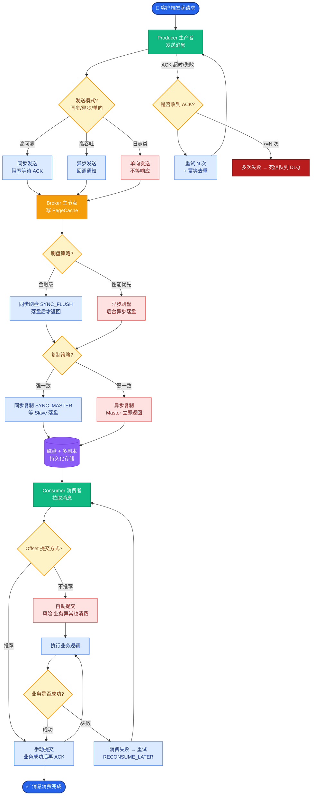
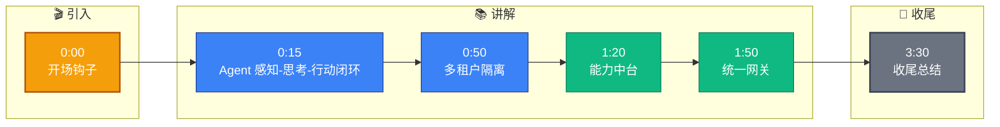

# 【生物医药 AI】企业级 AI Agent 平台整体架构怎么设计？

> JD 依据："负责 AI Agent 系统架构设计、开发与优化；负责企业级 AI Agent 产品的架构设计、研发落地。"

## 一、为什么要平台化

```
单场景建设（重复造轮子）：
  文献检索系统：自己接 LLM + 自己建库 + 自己运维
  用药咨询系统：自己接 LLM + 自己建库 + 自己运维
  → 数据孤岛、重复投入、运维爆炸

平台化（能力复用）：
  统一平台 → 新场景只编排已有能力，快速上线
```

## 二、五层架构

```
┌─────────────────────────────────────────┐
│  接入层    API 网关 / Web / SDK / 审批台  │
├─────────────────────────────────────────┤
│  编排层    Agent 引擎 / Workflow 引擎     │
├─────────────────────────────────────────┤
│  能力层    RAG / 工具市场 / 模型路由 / Prompt │
├─────────────────────────────────────────┤
│  数据层    知识库 / 向量库 / 元数据 / 业务库 │
├─────────────────────────────────────────┤
│  基础设施  GPU 池 / 监控 / 日志 / 队列      │
└─────────────────────────────────────────┘
              横切：多租户 / 安全 / 计量 / 审计
```

### 1. 接入层（网关）
- 统一入口：API/Web/SDK/审批台。
- 鉴权（API Key/OAuth）、限流、计量、流式、审计。
- 模型路由（见005）的承载点。

### 2. 编排层
- **Agent 引擎**：规划+工具+校验闭环（见001）。
- **Workflow 引擎**：DAG+状态机+人工审批（见004）。
- 场景 = 编排能力的组合，新场景快速搭建。

### 3. 能力层（中台）
- **RAG 服务**：检索+重排+引用回溯（见002）。
- **工具市场**：工具/MCP server 注册、发现、调用（见003/028）。
- **模型路由**：多模型多供应商路由+fallback（见005）。
- **Prompt 管理**：版本化、A/B、模板复用。
- 这些能力对上层场景共享复用。

### 4. 数据层
- 知识库（文档治理，见008）、向量库（见006）、业务库（PG/MySQL）。
- 元数据治理、版本、权限。

### 5. 基础设施层
- GPU 池与推理服务（vLLM）、队列（Kafka/RabbitMQ）、监控（Prometheus）、日志（ELK）。

## 三、横切关注点（贯穿所有层）

- **多租户**：数据隔离 + 配额 + 计量。
- **安全合规**：脱敏 + 审计 + 权限（见034）。
- **可观测**：trace/metrics/log（见033）。
- **成本**：计量 + 预算 + 降级（见010）。

## 四、多租户隔离

```
租户A ─┐
租户B ─┤→ 共享平台，tenant_id 贯穿各层强制隔离
租户C ─┘

隔离强度：
  逻辑隔离（共享集群+tenant_id）→ 成本低，多数场景够
  物理隔离（独立库/独立集群）→ 安全高，敏感数据
```
- 医药场景：患者数据可物理隔离，通用知识库逻辑隔离。

## 五、新场景如何快速上线（平台价值）

```
新需求"药物相互作用查询"：
  ① 接入工具市场已有 drug_interaction 工具
  ② 接入 RAG（药品说明书库）
  ③ 用编排层拖拽 Agent（意图→调工具→检索→生成→校验）
  ④ 网关暴露 API
  → 两周上线（不用从零建）
```

## 六、演进路径（避免过度设计）

```
阶段1：单场景验证（先做文献检索，跑通价值）
阶段2：抽共性（把 RAG/工具沉淀成服务）
阶段3：多场景复用（平台化）
阶段4：开放（让业务方自助编排）
```
不要一上来就建大平台，先单场景验证再抽中台。

## 七、底层本质

企业级 AI 平台本质是**"把 AI 能力分层解耦、公共下沉、上层复用"**。五层架构各司其职，能力中台沉淀复用，新场景快速组装，多租户统一治理。

**这是'AI 项目'到'AI 平台'的跨越** —— 单个 AI 应用谁都能做，但能让企业多个场景低成本复用的平台，才是资深架构师的价值。

## 常见考点

1. **平台和单场景如何权衡？**——先单场景跑通价值，再抽共性沉淀，避免一开始过度抽象（YAGNI）；平台要服务于"让新场景更快上线"这个目标。
2. **能力中台怎么做版本兼容？**——服务 API 版本化、灰度发布、向下游保证契约稳定；破坏性变更走 v2 并行。
3. **怎么度量平台价值？**——新场景上线周期缩短、公共能力复用率、单位场景成本下降、租户数和调用量增长。


## 核心流程图



## 结构化回答

**30 秒电梯演讲：** 聊到企业级 AI Agent 平台整体架构怎么设计，我的理解是——企业级 AI Agent 平台架构是'分层解耦 + 能力沉淀'——接入层（网关）、编排层（Agent/Workflow）、能力层（RAG/工具/模型）、数据层（知识库/向量库）、基础设施层（GPU/监控），让 AI 能力像中台一样被复用。打个比方，像大型医院体系——前台挂号（网关）、专科分诊（编排）、各科室能力（RAG/工具/模型）、病案室药房（数据层）、水电后勤（基础设施）。每层各司其职，新开科室复用底层能力，不用从零建。

**展开框架：**
1. **五层架构** — 接入层 / 编排层 / 能力层 / 数据层 / 基础设施层
2. **多租户隔离** — 数据/模型/配额按租户隔离，逻辑隔离为主
3. **能力中台** — RAG、工具市场、模型路由、Workflow 引擎沉淀为共享服务

**收尾：** 这块我在项目里也踩过坑——想深入的话，可以接着聊：多租户怎么隔离？您更想看哪个方向？

## 视频脚本

> 预计时长：4 分钟 | 由浅入深

| 时间 | 画面/字幕 | 口播台词 | 讲解要点 |
|------|----------|----------|----------|
| 0:00 | 标题卡 | "企业级 AI Agent 平台整体架构怎么设计——这道题面试官到底想考什么？我用 30 秒给你讲透。" | 开场钩子 |
| 0:15 | Agent 感知-思考-行动闭环图 | 先说核心：企业级 AI Agent 平台架构是'分层解耦 + 能力沉淀'——接入层（网关）、编排层（Agent/Workflow）、能力层（RAG/工具/模型）、数据层（知识库/向量库）。 | 核心定义 |
| 0:50 | 概念结构示意图 | 数据/模型/配额按租户隔离，逻辑隔离为主。 | 多租户隔离 |
| 1:20 | 流程图 | RAG、工具市场、模型路由、Workflow 引擎沉淀为共享服务。 | 能力中台 |
| 1:50 | API 网关架构图 | 鉴权限流计量 + 模型路由 + 流式 + 审计的统一入口。 | 统一网关 |
| 3:30 | 总结卡 | 一句话记忆：五层架构：接入/编排/能力/数据/基础设施。 下期可以接着聊：多租户怎么隔离。 | 收尾总结 |

### 视频流程图



