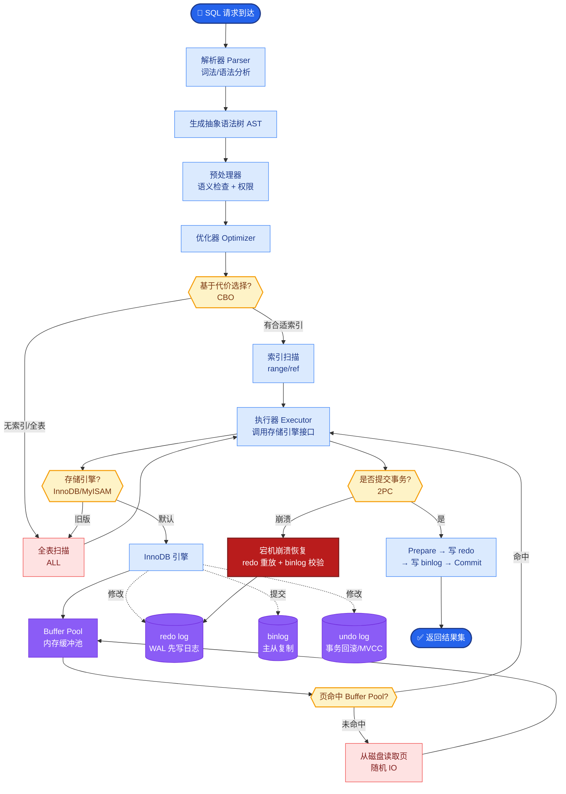

# 【生物医药 AI】医药垂直 AI 数据治理架构怎么设计（合规/隐私/溯源）？

> JD 依据："金融/医药垂直 AI 经验优先；生物医药 AI 全栈；企业级安全合规。"

## 一、医药 AI 的合规特殊性

```
普通行业 AI：数据治理是"加分项"
医药 AI：数据治理是"准入门槛"（不做就违法/不能上市）

法规约束：
  - 个人信息保护法（中国）/ HIPAA（美国）/ GDPR（欧盟）
  - GMP（药品生产质量管理）/ GCP（临床试验质量管理）
  - 医疗器械软件法规（AI 辅助诊断属医疗器械）
```

## 二、数据治理五层架构

```
┌──────────────────────────────────────────┐
│  使用层    AI 训练/推理（脱敏数据+可追溯） │
├──────────────────────────────────────────┤
│  管控层    权限 / 审批 / 审计 / 计量       │
├──────────────────────────────────────────┤
│  处理层    脱敏 / 去标识 / 差分隐私        │
├──────────────────────────────────────────┤
│  建模层    元数据 / 血缘 / 敏感分级        │
├──────────────────────────────────────────┤
│  采集层    授权同意 / 来源登记 / 受控接入  │
└──────────────────────────────────────────┘
```

## 三、隐私脱敏（处理层）

| 方法 | 说明 | 适用 |
|------|------|------|
| 去标识化 | 删除/替换直接标识（姓名/身份证/病历号） | 基础，必做 |
| k-匿名/l-多样性 | 同质组抗再识别 | 数据集发布 |
| 差分隐私 | 加噪保证统计级隐私 | 训练/统计 |
| 合成数据 | 生成保分布的假数据 | 模型开发/测试 |
| 联邦学习 | 数据不出域，只传梯度 | 多机构协作 |

**脱敏 vs 可用性权衡**：过度脱敏损害 AI 效果（如病历细节对诊断重要），需在合规和效果间平衡（受控环境+弱脱敏 vs 开放环境+强脱敏）。

## 四、权限分级（管控层）

```
数据敏感级：
  公开 / 内部 / 机密 / 绝密（患者PHI）

角色权限（RBAC）：
  研究员 → 匿名化研究数据
  医生 → 本院患者数据（需诊疗关系）
  AI 服务 → 最小必要数据（脱敏后）

原则：最小授权 + 需知原则 + 审批 + 审计
```
- 在数据层和 AI 层强制（元数据权限标签 + 检索预过滤）。

## 五、全链路审计与溯源

```
数据血缘：数据从哪来 → 经哪些处理 → 被谁用 → 用于哪个模型/决策
AI 决策留痕：每次决策记录
  {输入数据版本, 模型版本, prompt, 工具调用, 检索引用, 人工确认, 时间, 操作者}
```
- 出问题可追溯到具体数据和模型版本（合规+责任界定）。
- 审计日志不可篡改（必要时上链/WORM 存储）。

## 六、AI 决策可解释（医药刚需）

```
用药建议 → 必须给出：
  - 依据（来自哪份指南/文献，证据等级）
  - 推理过程（症状→判断→建议）
  - 置信度 + 不确定提示
  - 免责声明（辅助决策，最终由医生定）
```
- 医药 AI 多为"辅助决策"而非"自主决策"，关键点必须人工确认。

## 七、合规落地的工程要点

- **数据受控环境**：敏感数据在隔离环境处理（不出域），AI 调用走受控通道。
- **模型/数据版本管理**：每次模型上线有对应数据版本，可回溯。
- **患者授权管理**：数据使用授权范围、期限、撤回机制。
- **合规审查流程**：AI 产品上线前过合规/伦理审查。
- **数据出境管控**：跨境数据传输的合规限制。

## 八、底层本质

医药数据治理本质是**"让数据在 AI 全链路中合规、安全、可追溯、决策可信"**。隐私脱敏保安全，权限分级保可控，全链路审计保可追溯，可解释保可信。

**医药 AI 的技术再先进，过不了合规这一关就不能落地** —— 数据治理是医药 AI 的生命线，也是区别于普通 AI 的核心壁垒。

## 常见考点

1. **怎么平衡脱敏和 AI 效果？**——按场景分级：受控研究环境弱脱敏+强审计，开放/第三方强脱敏；用合成数据做开发，真实数据仅生产受控用。
2. **AI 辅助诊断算医疗器械吗？**——多数国家把"用于诊断/治疗决策的软件"列为医疗器械，需注册审批；纯科普/文书类不算。合规要先界定产品属性。
3. **联邦学习怎么用？**——多医院协作训练不出域：各院本地训练传梯度，中心聚合，保护患者数据不离开本院。


## 核心流程图



## 结构化回答

**30 秒电梯演讲：** 聊到医药垂直 AI 数据治理架构怎么设计（合规/隐私/溯源），我的理解是——医药 AI 数据治理是'让数据在被 AI 用之前就合规、脱敏、可溯源、受控'——隐私脱敏、权限分级、全链路审计、决策可追溯，这是医药 AI 能落地的合规底线。打个比方，像 GMP 药品生产质量管理——原料（数据）进厂要检验（脱敏/校验），生产（训练/推理）全程记录（审计），每批产品（AI 决策）可追溯到哪批原料（数据来源），出问题能召回。医药数据也要'GMP'。

**展开框架：**
1. **合规框架** — 个人信息保护法 / HIPAA / GDPR / GMP / GCP
2. **隐私脱敏** — 去标识化、差分隐私、合成数据
3. **权限分级** — 数据敏感级 + 角色权限 + 最小授权

**收尾：** 这块我在项目里也踩过坑——想深入的话，可以接着聊：脱敏有哪些方法？您更想看哪个方向？

## 视频脚本

> 预计时长：4 分钟 | 由浅入深

| 时间 | 画面/字幕 | 口播台词 | 讲解要点 |
|------|----------|----------|----------|
| 0:00 | 标题卡 | "医药垂直 AI 数据治理架构怎么设计（合规/隐私/溯源）——这道题面试官到底想考什么？我用 30 秒给你讲透。" | 开场钩子 |
| 0:15 | 安全防御架构图 | 先说核心：医药 AI 数据治理是'让数据在被 AI 用之前就合规、脱敏、可溯源、受控'——隐私脱敏、权限分级、全链路审计、决策可追溯，这是医药 AI 能落地的合规底线。 | 核心定义 |
| 0:50 | 合规审计流程图 | 去标识化、差分隐私、合成数据。 | 隐私脱敏 |
| 1:20 | 概念结构示意图 | 数据敏感级 + 角色权限 + 最小授权。 | 权限分级 |
| 1:50 | 流程图 | 数据从哪来、被谁用、AI 怎么决策、可追溯。 | 全链路审计 |
| 3:30 | 总结卡 | 一句话记忆：合规底线：隐私法/GMP/GCP。 下期可以接着聊：脱敏有哪些方法。 | 收尾总结 |

