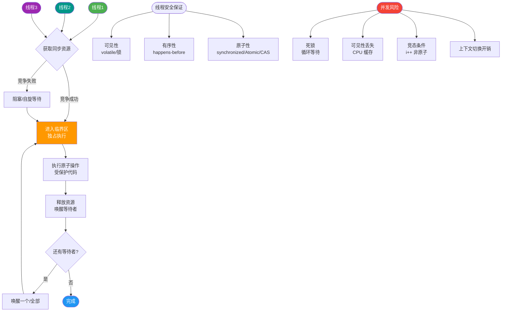
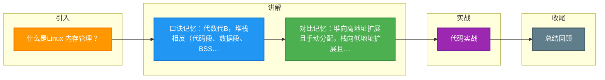

# 什么是Linux 内存管理？

**Linux 内存管理（进程虚拟内存分布）**

Linux 进程的虚拟内存空间主要分为以下几个段：

1. **代码段**：存储程序的二进制机器指令，只读，防止程序被修改。
2. **数据段**：存储已初始化的全局变量和静态变量。
3. **BSS 段**：存储未初始化的全局和静态变量，程序运行前清零，不占用文件空间。
4. **堆段**：用于动态内存分配（如 `malloc`/`new`），从低地址向高地址增长。
5. **文件映射段**：包括动态链接库、共享内存等，通过 `mmap` 映射。
6. **栈段**：存储局部变量、函数参数和返回地址，从高地址向低地址增长。

**内存地址空间分布架构图 (32位为例)**：
```
0xFFFFFFFF
    │
    ├──────────────────────────────────────┤
    │          内核空间 (1GB)              │  ◄── 用户态不可访问
    ├──────────────────────────────────────┤
    │          栈    ▲                     │  ◄── 向低地址增长
    │               │                      │
    │               │ (空闲区域)            │
    │               ▼                      │
    ├──────────────────────────────────────┤
    │          文件映射区                  │
    ├──────────────────────────────────────┤
    │              堵  ▲                   │  ◄── 向高地址增长
       │               │                      │
    │               │                      │
    ├──────────────────────────────────────┤
    │          BSS 段                     │
    ├──────────────────────────────────────┤
    │          数据段                     │
    ├──────────────────────────────────────┤
    │          代码段                     │
    ├──────────────────────────────────────┤
0x00000000
```

**补充关键细节**：
- **内核空间与用户空间**：Linux 通常将 4GB 虚拟地址空间（32位系统）划分为 1GB 内核空间和 3GB 用户空间。用户进程只能访问用户空间，需要通过系统调用切换到内核态来访问内核空间。
- **MMU 映射**：CPU 中的内存管理单元（MMU）负责将虚拟地址翻译为物理地址，操作系统维护页表来实现这种映射。
- **内存碎片**：堆和栈的向中间增长方式有效利用了中间的空闲区域，但如果分配释放频繁，会产生内存碎片（分为内部碎片和外部碎片）。

**实战案例**：在排查一次 C++ 服务 Core Dump 时，发现是由于多线程环境下栈空间分配的局部变量过大，导致栈溢出（Stack Overflow）覆盖了相邻的内存映射区域。**解决**：通过 `ulimit -s` 临时调大栈大小或优化代码减少大对象的栈上分配（改为堆分配）。

**代码示例**：
```c
// Linux下使用 pmap 查看进程内存分布实战
// 1. 找到进程ID
pid=$(ps -ef | grep "my_app" | grep -v grep | awk '{print $2}')
// 2. 查看详细内存映射（包括堆、栈、共享库地址）
pmap -x $pid
// 3. 查看特定内存段的权限（如栈不可执行）
cat /proc/$pid/maps | grep stack
```

**## 常见考点**
1. **堆和栈的区别**：除了存储内容和增长方向，它们的分配方式（自动/手动）、访问效率、线程共享性有何不同？
2. **内存泄漏**：堆内存的泄漏如何发生？如何检测？
3. **栈溢出**：什么会导致 StackOverflowError（如无限递归）？如何调整栈大小？


## 核心流程图



## 记忆要点

- 口诀记忆：代数代B，堆栈相反（代码段、数据段、BSS、堆和栈）
- 对比记忆：堆向高地址扩展且手动分配，栈向低地址扩展且自动分配
- 核心划分：32位系统中1GB内核态与3GB用户态隔离
- 排查命令：因为pmap能看内存映射，所以常用于排查内存泄漏

## 结构化回答

**30 秒电梯演讲：** 把房子划分为卧室（代码）、储藏室（数据）、客厅（堆）、阳台（栈）。

**展开框架：**
1. **代码段只读** — 代码段只读，数据段存全局变量。
2. **堆用于动态分配** — 堆用于动态分配，由程序员控制（向上增长）。
3. **栈用于函数调用** — 栈用于函数调用，自动分配释放（向下增长）。

**收尾：** 这块我踩过一些坑，您想深入聊哪一段——原理细节、实战案例还是常见踩坑？

## 视频脚本

> 预计时长：2 分钟 | 由浅入深

| 时间 | 画面/字幕 | 口播台词 | 讲解要点 |
|------|----------|----------|----------|
| 0:00 | 标题卡：什么是Linux 内存管理 | 今天这道题：什么是Linux 内存管理。30 秒先给你讲清楚。 | 开场钩子 |
| 0:20 | 核心概念动画/示意图 | 把房子划分为卧室（代码）、储藏室（数据）、客厅（堆）、阳台（栈）。 | 核心概念 |
| 0:40 | 代码段只读示意图 | 代码段只读，数据段存全局变量。 | 代码段只读 |
| 1:10 | 总结卡 + 下期预告 | 记住今天这几个关键词，面试一定用得上。下期见。 | 收尾 |

### 视频流程图



