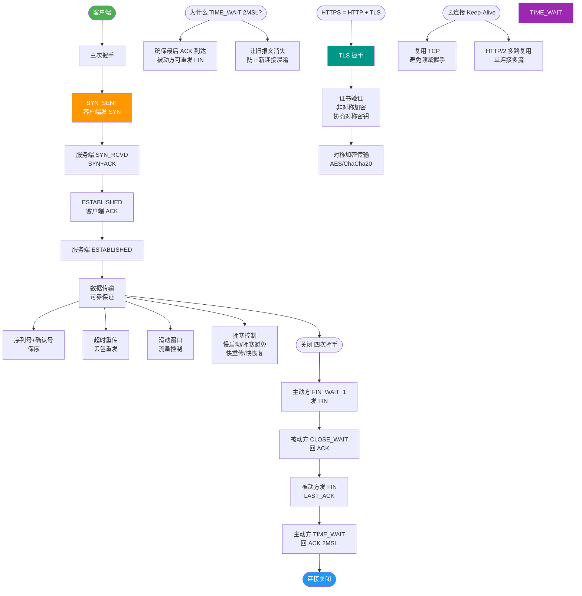

# 什么是四次挥手？

**四次挥手**

TCP 连接是全双工的，这意味着数据可以在两个方向上同时传输。断开连接时，为了确保双方都停止发送数据且数据都被接收完毕，需要四次挥手来分别关闭两个方向的连接。

**流程步骤**：

1. **第一次挥手 (FIN)**：客户端发送 `FIN` 报文，用来关闭客户端到服务器的数据传送。客户端进入 `FIN_WAIT_1` 状态。
2. **第二次挥手 (ACK)**：服务器收到 `FIN` 后，发送 `ACK` 给客户端，确认序号为收到序号+1。服务器进入 `CLOSE_WAIT` 状态。此时客户端收到确认后进入 `FIN_WAIT_2` 状态，等待服务器关闭连接。
   *注：此时是半关闭状态，即客户端无法发送数据，但服务器仍可发送数据给客户端。*
3. **第三次挥手 (FIN)**：服务器完成数据发送后，发送 `FIN` 报文给客户端，用来关闭服务器到客户端的数据传送。服务器进入 `LAST_ACK` 状态。
4. **第四次挥手 (ACK)**：客户端收到 `FIN` 后，发送 `ACK` 给服务器，确认序号为收到序号+1。客户端进入 `TIME_WAIT` 状态，等待 2MSL（最大报文生存时间）后彻底关闭。服务器收到 `ACK` 后关闭连接。

**状态转换流程图**：
```
    客户端                                服务器
      │                                     │
      │  (应用层调用 close())                 │
      ├───────── FIN, Seq=x ────────────────>│  CLOSE_WAIT
      │  FIN_WAIT_1                          │  (此时服务端可能还有数据要发)
      │                                     │
      │<──────── ACK, Ack=x+1 ───────────────┤
      │  FIN_WAIT_2                          │
      │        (半关闭)                       │
      │                                     │  (服务端发送完剩余数据)
      │                                     │  (应用层调用 close())
      │<──────── FIN, Seq=y ────────────────┤  LAST_ACK
      │                                     │
      │  ACK, Ack=y+1  ─────────────────────>│  CLOSED
      │  TIME_WAIT                           │
      │  (等待 2MSL)                         │
      │  CLOSED                              │
```

**补充关键细节**：
- **为什么是四次而非三次**：建立连接时（三次握手），服务端的 `SYN` 和 `ACK` 可以合并在一个包中发送（SYN+ACK）。但断开连接时，当服务端收到客户端的 `FIN`，内核协议栈会自动回复 `ACK`，但此时服务端可能还有未处理完的数据，所以需要等待应用层调用 `close()` 后，才能发送 `FIN`，因此 `ACK` 和 `FIN` 通常分开发送。
- **TIME_WAIT 状态的作用**：
  1. **确保最后一个 ACK 能到达**：如果服务端没收到 ACK，会重传 FIN，客户端在 2MSL 内可以重发 ACK。
  2. **避免旧连接干扰**：等待 2MSL 确保网络中所有旧的报文段都消失，避免影响新建立的连接。
- **2MSL 是多久**：MSL (Maximum Segment Lifetime) 是报文最大生存时间，通常建议为 2 分钟，Linux 默认通常为 60秒（`net.ipv4.tcp_fin_timeout` 可配置）。

**实战案例**：在压力测试中，作为客户端的高并发爬虫服务突然报错 "Too many open files"。经排查，是因为短时间内建立了大量短连接，服务端主动关闭，导致客户端处于 `TIME_WAIT` 状态的 socket 数量耗尽了系统的文件描述符限制。**优化**：开启 `net.ipv4.tcp_tw_reuse`（Linux 2.4+），允许将 TIME_WAIT socket 重新用于新的 TCP 连接。

**代码示例**：
```java
// Java 服务端常见误区：未正确处理输入输出流导致无法发送 FIN
// 错误示例
Socket socket = serverSocket.accept();
// 读取数据后直接关闭 socket，如果缓冲区还有数据未发送，可能导致 RST 而非 FIN
socket.close();

// 正确示例：确保数据发完再关闭
try (OutputStream out = socket.getOutputStream();
     InputStream in = socket.getInputStream()) {
    // 处理数据...
    out.flush(); // 确保数据发送
    socket.shutdownOutput(); // 半关闭，发送 FIN，但还能读
} // try-with-resources 自动调用 close()
```

**## 常见考点**
1. **为什么需要 TIME_WAIT**？如果过多会有什么危害（端口耗尽）？如何解决？
2. **CLOSE_WAIT 状态过多**：通常是什么原因导致的（通常是代码问题，如未关闭流或 Socket


## 核心流程图



## 记忆要点

- 因果逻辑：因为是全双工，所以各发各的FIN需四次挥手
- 关键状态：主动方最终必经TIME_WAIT且等待2MSL才真正关闭
- 设计目的：因为要保证最后ACK送达且防旧报文干扰，所以要等2MSL
- 握手对比：建连SYN和ACK可合并，但断开FIN和ACK通常分开发

## 结构化回答

**30 秒电梯演讲：** 挂电话：A说“我说完了”（1），B说“知道了”（2），B说“我也说完了”（3），A说“知道了”（4）。

**展开框架：**
1. **建立连接** — 建立连接是三次握手，断开连接是四次挥手。
2. **由于 TCP** — 由于 TCP 是全双工，每个方向必须单独关闭。
3. **ACK 和 FIN** — ACK 和 FIN 通常分开发送（除非同时关闭），造成多一次交互。

**收尾：** 这块我踩过一些坑，您想深入聊哪一段——原理细节、实战案例还是常见踩坑？

## 视频脚本

> 预计时长：2 分钟 | 由浅入深

| 时间 | 画面/字幕 | 口播台词 | 讲解要点 |
|------|----------|----------|----------|
| 0:00 | 标题卡：什么是四次挥手 | 今天这道题：什么是四次挥手。30 秒先给你讲清楚。 | 开场钩子 |
| 0:20 | 核心概念动画/示意图 | 挂电话：A说“我说完了”（1），B说“知道了”（2），B说“我也说完了”（3），A说“知道了”（4）。 | 核心概念 |
| 0:40 | 建立连接示意图 | 建立连接是三次握手，断开连接是四次挥手。 | 建立连接 |
| 1:10 | 总结卡 + 下期预告 | 记住今天这几个关键词，面试一定用得上。下期见。 | 收尾 |
