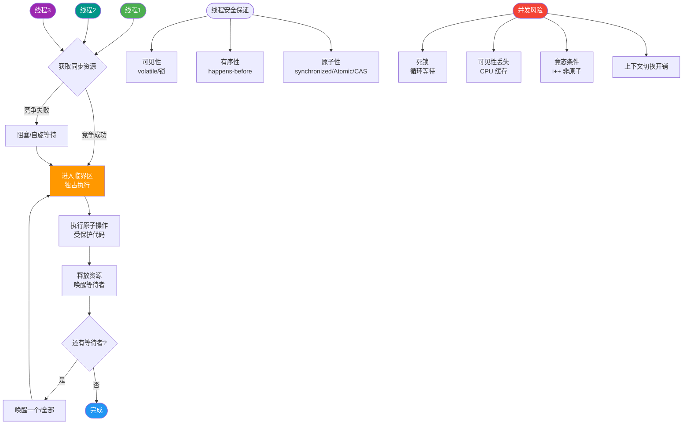

# 什么是常用的Linux命令？

**常用的 Linux 命令**

以下是开发中常用的 Linux 命令分类汇总：

**文件与目录操作**
- `ls`：列出当前目录下的文件和子目录。
- `cd`：切换当前工作目录。
- `pwd`：显示当前工作目录的绝对路径。
- `touch`：创建空文件或更新文件时间戳。
- `mkdir`：创建新目录。
- `rm`：删除文件或目录（`-rf` 强制递归删除）。
- `cp`：复制文件或目录。
- `mv`：移动文件或目录，或用于重命名。

**文件内容查看**
- `cat`：查看文件全部内容。
- `head`：查看文件开头部分（默认 10 行）。
- `tail`：查看文件结尾部分（常用 `-f` 实时追踪日志）。
- `vi`/`vim`：强大的文本编辑器。
- `grep`：在文件中搜索符合条件的字符串（支持正则）。

**查找与权限**
- `find`：在目录树中查找文件。
- `chmod`：修改文件或目录的权限。
- `chown`：修改文件或目录的所有者和所属组。

**系统与进程管理**
- `ps`：查看当前运行的进程状态。
- `kill`：发送信号终止进程（`-9` 强制终止）。
- `top`：实时监控系统资源使用情况和进程信息。
- `df`：查看磁盘分区的空间使用情况。

**网络与归档**
- `ifconfig` / `ip addr`：查看或配置网络接口信息。
- `tar`：打包或解压文件（如 `.tar`, `.tar.gz`）。

**补充关键细节**：
- **grep 组合用法**：
  - `grep -r "keyword" .`：递归查找当前目录下包含关键词的文件。
  - `ps -ef | grep java`：查找 java 进程。
  - `cat log.txt | grep "ERROR" | wc -l`：统计日志中 ERROR 的行数。
- **find 高级用法**：
  - `find / -name filename`：在全盘查找文件。
  - `find . -type f -size +100M`：查找当前目录下大于 100MB 的文件。
- **权限数字表示**：`chmod 755 file`，其中 7(4+2+1)代表所有者读写执行，5(4+1)代表组读执行，5代表其他人读执行。
- **网络排查**：`netstat -tuln` 查看监听端口；`curl` 或 `wget` 测试网络连通性。

**实战案例**：生产环境某接口响应突然变慢，通过 `top` 发现 CPU 使用率并不高，但 Load Average 很高。使用 `ps -mp <pid> -o THREAD,tid,time` 查看该进程的线程，发现大量线程处于 D 状态（不可中断睡眠）。进一步使用 `iostat -x 1` 发现磁盘 I/O 利用率 100%，最终定位是日志写入盘故障。**经验**：Load 高但 CPU 低，通常是 I/O 瓶颈。

**代码示例**：
```bash
# 网络调试与流量抓包实战
# 1. 查看特定端口占用（替代 netstat 推荐 ss）
ss -lntp | grep :8080

# 2. 实时抓取 HTTP 请求头（需要 root 权限）
sudo tcpdump -i eth0 -A -s 0 'tcp port 80 and (((ip[2:2] - ((ip[0]&0xf)<<2)) - ((tcp[12]&0xf0)>>2)) != 0)'

# 3. 快速查找最近修改的 Java 文件并打包
find . -name "*.java" -mtime -1 | xargs tar czf recent_code.tar.gz
```

**## 常见考点**
1. **awk 和 sed**：如何在日志分析场景下使用 `awk` 进行列提取或统计？
2. **软链接与硬链接**：`ln -s` (软链接) 和 `ln` (硬链接) 的区别是什么？删除源文件后各自的表现？
3. **top 命令**：如何按 CPU 或 内存 占用率排序？Load Average 代表什么意思？


## 核心流程图



## 记忆要点

- 日志排查：tail -f看实时，grep过滤关键词，wc -l做统计
- 资源监控：top看CPU负载，df看磁盘空间，iostat看I/O瓶颈
- 网络排查：ss -lntp看端口占用，tcpdump抓包分析网络流量
- 文件查找：find按名或大小区间查找，chmod 755修改读写执行权限

## 结构化回答

**30 秒电梯演讲：** 用遥控器（命令）精准控制电视（系统）的频道、音量和设置。

**展开框架：**
1. **文件操作** — 文件操作：ls, cd, cp, mv, rm。
2. **内容查看** — 内容查看：cat, grep, tail（日志常用）。
3. **权限** — 权限管理：chmod, chown。

**收尾：** 这块我踩过一些坑，您想深入聊哪一段——原理细节、实战案例还是常见踩坑？

## 视频脚本

> 预计时长：2 分钟 | 由浅入深

| 时间 | 画面/字幕 | 口播台词 | 讲解要点 |
|------|----------|----------|----------|
| 0:00 | 标题卡：什么是常用的Linux命令 | 今天这道题：什么是常用的Linux命令。30 秒先给你讲清楚。 | 开场钩子 |
| 0:20 | 核心概念动画/示意图 | 用遥控器（命令）精准控制电视（系统）的频道、音量和设置。 | 核心概念 |
| 0:40 | 文件操作示意图 | 文件操作：ls, cd, cp, mv, rm。 | 文件操作 |
| 1:10 | 总结卡 + 下期预告 | 记住今天这几个关键词，面试一定用得上。下期见。 | 收尾 |
