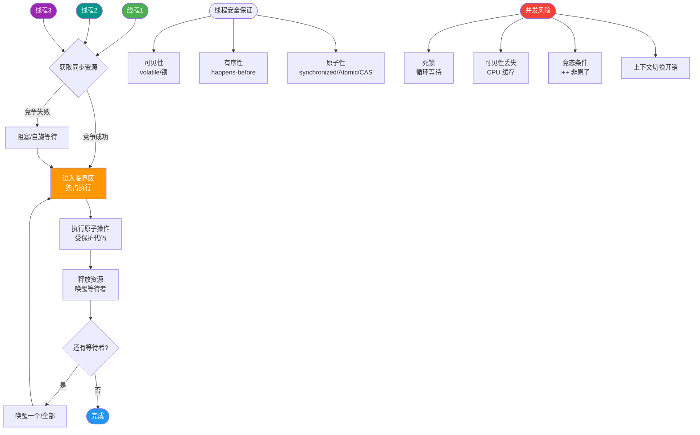
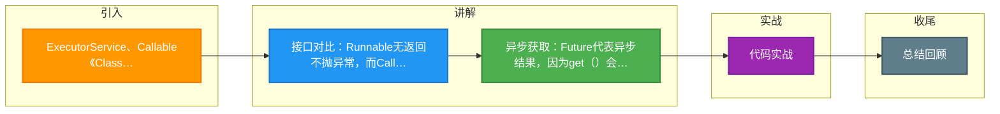

# ExecutorService、Callable<Class>、Future有返回值线程是什么？

在 Java 中，`Runnable` 接口的 `run()` 方法没有返回值。如果需要任务执行完成后获取返回结果，需要使用 `Callable` 接口配合 `Future` 接口，以及线程池 `ExecutorService`。

**核心组件：**

1. **Callable**
   - 类似于 `Runnable`，但 call 方法可以返回值并抛出异常。
   - `V call() throws Exception`;

2. **Future**
   - 代表异步计算的结果。提供了检查计算是否完成、等待计算完成以及获取计算结果的方法。
   - `get()`：阻塞获取结果（可设超时）。
   - `isDone()`：判断任务是否完成。
   - `cancel()`：取消任务（参数 mayInterruptIfRunning 决定是否中断执行中的线程）。

3. **ExecutorService**
   - 线程池接口，负责执行 `Callable` 任务并返回 `Future` 对象。

**执行流程图：**

```text
    Main Thread           ThreadPool                Worker Thread
       |                       |                        |
       |---submit(Callable)-->|                        |
       |                       |---create Work & Queue-->|
       |<---return Future-----|                        |
       |                       |                        |
       |                       |                        |--execute call()
       |                       |                        |
       |---future.get()-------|                        |
       |   (block/wait)       |                        |
       |                       |                        |--return Result
       |                       |<---set Result & Wake----|
       |<---return Result-----|                        |
```

**使用示例：**

```java
// 1. 创建线程池
ExecutorService pool = Executors.newFixedThreadPool(5);

// 2. 创建有返回值的任务
Callable<String> task = () -> {
    Thread.sleep(1000);
    return "Task Result";
};

// 3. 提交任务并获取 Future 对象
Future<String> future = pool.submit(task);

try {
    // 4. 阻塞获取结果
    String result = future.get(2, TimeUnit.SECONDS); // 设置超时防止无限等待
    System.out.println(result);
} catch (Exception e) {
    e.printStackTrace();
    // 可以判断是否超时或被取消
    if (future.isCancelled()) { ... }
} finally {
    pool.shutdown(); // 关闭线程池
}
```

### 实战案例
在批量查询第三方接口时，曾串行调用导致耗时 50 秒。改用 `ExecutorService.invokeAll` 并发执行 10 个请求，总耗时降为 5 秒。但在使用 `future.get()` 时务必设置超时，否则一旦下游服务宕机，主线程会被永久挂起。

### 代码示例 (CompletableFuture 编排)
```java
// 异步执行任务A
CompletableFuture<String> futureA = CompletableFuture.supplyAsync(() -> doTaskA());
// A完成后异步执行任务B，不依赖A结果
CompletableFuture<String> futureB = CompletableFuture.supplyAsync(() -> doTaskB());
// A和B都完成后合并结果
CompletableFuture<String> result = futureA.thenCombine(futureB, (a, b) -> a + "," + b);
```

### Future 家族对比
| 特性 | Future | CompletableFuture | FutureTask (RunnableFuture) |
| :--- | :--- | :--- | :--- |
| **获取方式** | `pool.submit()` | `supplyAsync()` / `runAsync()` | `new FutureTask<>(Callable)` |
| **阻塞获取** | 支持 (`get()`) | 支持 (`get()`, `join()`) | 支持 (`get()`) |
| **回调机制** | 无 | **丰富** (thenApply, thenAccept) | 无 (需自行封装) |
| **任务编排** | 难 (需手动等待) | **简单** (链式调用) | 难 (单任务) |
| **异常处理** | `get()` 抛出 ExecutionException | `exceptionally()` 处理 | `get()` 抛出 ExecutionException |
| **适用场景** | 简单的异步获取结果 | 复杂的异步流式处理 | 自己管理线程/任务时 |

## 常见考点
1. **Future 的局限性**：`get()` 阻塞主线程，多个串行 `get` 会降低效率。如何解决？（使用 `CompletableFuture` 进行回调编排或 `ExecutorService.invokeAll` 批量执行）。
2. **任务异常处理**：如果 `call()` 抛出异常，`get()` 会将其包装在 `ExecutionException` 中抛出，通过 `e.getCause()` 获取原始异常。


## 核心流程图



## 记忆要点

- 接口对比：Runnable无返回不抛异常，而Callable有返回且抛异常
- 异步获取：Future代表异步结果，因为get()会阻塞，所以务必设超时
- 核心流程：线程池submit提交Callable任务并返回Future对象
- 进阶方案：CompletableFuture支持回调编排，解决了Future的阻塞痛点

## 结构化回答

**30 秒电梯演讲：** 去干洗店洗衣服：填单子（Callable），拿小票，凭小票取衣服。

**展开框架：**
1. **Runnable 无返回值** — Runnable 无返回值，Callable 有返回值。
2. **Future** — Future 用于阻塞获取或异步检查任务结果。
3. **ExecutorServic** — 通过 ExecutorService.submit() 启动 Callable 任务。

**收尾：** 这块我踩过一些坑，您想深入聊哪一段——原理细节、实战案例还是常见踩坑？

## 视频脚本

> 预计时长：3 分钟 | 由浅入深

| 时间 | 画面/字幕 | 口播台词 | 讲解要点 |
|------|----------|----------|----------|
| 0:00 | 标题卡：ExecutorService、Callable<Class>、Future有返回值线程是什么 | 今天这道题：ExecutorService、Callable<Class>、Future有返回值线程是什么。30 秒先给你讲清楚。 | 开场钩子 |
| 0:20 | 核心概念动画/示意图 | 去干洗店洗衣服：填单子（Callable），拿小票，凭小票取衣服。 | 核心概念 |
| 0:40 | Runnable 无返回值示意图 | Runnable 无返回值，Callable 有返回值。 | Runnable 无返回值 |
| 1:10 | 总结卡 + 下期预告 | 记住今天这几个关键词，面试一定用得上。下期见。 | 收尾 |

### 视频流程图



