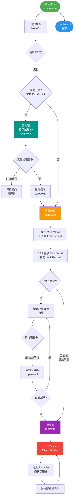

# 什么是偏向锁（Biased Locking）？

偏向锁是 Java 6 引入的一项锁优化技术，针对 `synchronized` 进行优化，属于锁升级的**第一阶段**。

**核心思想**

经过统计，在绝大多数情况下，锁不仅不存在多线程竞争，而且总是由**同一个线程多次获得**。偏向锁通过在对象头的 Mark Word 中记录获取锁的线程 ID，消除该线程获取锁的开销。

**工作流程**

1.  **加锁**：当第一个线程访问同步块时，JVM 会将对象头的 Mark Word 设置为偏向模式，并记录该线程 ID。
2.  **重入**：该线程再次进入同步块时，只需检查 Mark Word 中的线程 ID 是否为当前线程。如果是，则直接获取锁，**无需执行任何 CAS 操作或加锁步骤**，几乎零开销。
3.  **撤销与升级**：一旦有**第二个线程**尝试获取锁，偏向模式宣告结束。此时会触发偏向锁撤销（需要到达全局安全点 Safepoint），根据竞争情况升级为轻量级锁或重量级锁。

**撤销开销**

偏向锁的撤销需要暂停所有线程，如果在竞争激烈的场景下频繁撤销，性能反而会下降。因此，在 JDK 15 及之后版本中，偏向锁默认被禁用（JEP 374）。

**适用场景**

只有一个线程反复访问同步块的场景（无竞争）。

**实战案例**：
在运行 Spring 单元测试时，如果 `@Test` 方法调用了 `hashCode()` 方法后再进入同步块，会发现锁不再处于偏向状态，因为调用 `hashCode` 会导致 Mark Word 无法存储线程 ID，强制禁用了偏向锁。

**代码示例（JVM参数关闭偏向锁）**：
```bash
# JDK 15 之前，可通过参数关闭偏向锁以减少撤销开销
java -XX:-UseBiasedLocking MyApp
# 查看锁升级日志（仅限实验环境）
java -XX:+PrintSafepointStatistics -XX:PrintSafepointStatisticsCount=1 MyApp
```

**对比表格（Java 锁状态对比）**：

| 锁状态 | 存储内容 | 竞争策略 | 适用场景 |
| :--- | :--- | :--- | :--- |
| **无锁** | 对象Hash、分代年龄 | 无竞争 | - |
| **偏向锁** | 线程ID、Epoch、分代年龄 | 无竞争（同一线程重入） | 单线程访问同步块 |
| **轻量级锁** | 指向栈中 Lock Record 的指针 | CAS 自旋竞争 | 短时间锁竞争 |
| **重量级锁** | 指向堆中 Monitor 对象的指针 | OS 互斥量，阻塞线程 | 强烈、长时间竞争 |

**补充细节：**
- **Mark Word 结构**：在 64 位 JVM 中，未锁定状态下的 Mark Word 包含哈希码和分代年龄；偏向锁状态下，Mark Word 最后三位为 `101`，其中存储了偏向的线程 ID 和 Epoch（偏向时间戳）。
- **批量重偏向**：为了优化“对象被多个线程交替持有但不同时竞争”的场景，JVM 引入了批量重偏向机制。如果一个类的大量对象被撤销偏向锁，JVM 会重新标记偏向给新的线程。
- **HashCode 问题**：当一个对象计算过 `hashCode()`，它就无法进入偏向锁状态，因为 Mark Word 中没有空间存储 HashCode 了（Java 的 HashCode 通常缓存在 Mark Word 中）。

**锁升级流程图：**

```text
       对象创建
          │
          ▼
    ┌──────────────┐
    │  无锁        │ (Mark Word: HashCode + Age + 01)
    └──────┬───────┘
           │ Thread A 首次访问
           ▼
    ┌──────────────┐
    │  偏向锁      │ (Mark Word: ThreadId + Epoch + 01)
    └──────┬───────┘
           │ Thread A 重入: 检查 ThreadId
           │ (零开销，无 CAS)
           │
           │ Thread B 竞争
           ▼
    ┌──────────────┐  (达到 Safepoint，暂停线程，撤销偏向)
    │  轻量级锁    │ (Mark Word 指向栈中 Lock Record)
    └──────┬───────┘
           │ CAS 自旋尝试获取
           │
           │ 自旋失败 / 竞争激烈
           ▼
    ┌──────────────┐
    │  重量级锁    │ (Mark Word 指向堆中 Monitor 对象)
    └──────────────┘ (涉及 OS 互斥量，用户态/内核态切换)
```

## 常见考点
1. **偏向锁是否会被禁用？为什么？**：JDK 15 之后默认禁用。因为在现代应用（如微服务、容器化）中，线程池的使用非常普遍，线程经常被复用处理不同任务，偏向锁的撤销开销反而超过了其带来的收益，且增加了代码维护的复杂度。
2. **什么是锁粗化？**：JVM 编译器会检测到一连串连续的操作都对同一个对象加锁，会将加锁范围扩展（粗化）到整个操作序列的外部，减少加锁解锁的次数。
3. **什么是锁消除？**：JIT 编译器通过逃逸分析，如果发现某个对象只能被当前线程访问，根本不可能被其他线程引用，那么就会消除对该对象的 Synchronized 锁。


## 核心流程图



## 记忆要点

- 一句话定义：针对单线程重入优化的锁，在对象头 Mark Word 记录线程 ID
- 核心优势：同一线程再次进入仅需比对 ID，无需 CAS，实现近乎零开销
- 升级触发：一旦出现第二线程竞争，需达 Safepoint 撤销并升级为轻量级锁
- 注：对象计算过 hashCode 会占满 Mark Word，导致无法使用偏向锁

## 结构化回答

**30 秒电梯演讲：** 就像私人办公室，门牌上贴着你的名字（线程ID），你每次进出直接推门，不用每次都刷卡（CAS）。

**展开框架：**
1. **解决同** — 解决同一线程重入锁的性能问题。
2. **首次加锁后** — 首次加锁后在Mark Word记录线程ID。
3. **重入时仅需比对ID** — 重入时仅需比对ID，无额外开销。

**收尾：** 这块我踩过一些坑，您想深入聊哪一段——原理细节、实战案例还是常见踩坑？

## 视频脚本

> 预计时长：3 分钟 | 由浅入深

| 时间 | 画面/字幕 | 口播台词 | 讲解要点 |
|------|----------|----------|----------|
| 0:00 | 标题卡：什么是偏向锁（Biased Locking） | 今天这道题：什么是偏向锁（Biased Locking）。30 秒先给你讲清楚。 | 开场钩子 |
| 0:20 | 核心概念动画/示意图 | 就像私人办公室，门牌上贴着你的名字（线程ID），你每次进出直接推门，不用每次都刷卡（CAS）。 | 核心概念 |
| 0:40 | 解决同示意图 | 解决同一线程重入锁的性能问题。 | 解决同 |
| 1:10 | 总结卡 + 下期预告 | 记住今天这几个关键词，面试一定用得上。下期见。 | 收尾 |
