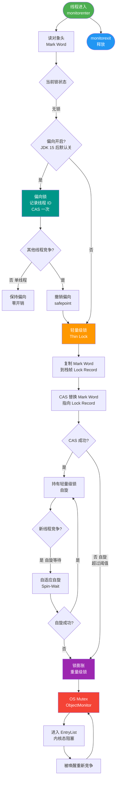

# 什么是重量级锁（Heavyweight Lock）？

重量级锁（Heavyweight Lock）是 `synchronized` 在锁竞争最激烈阶段所采用的锁机制，是锁升级的**最终阶段**。

### 实现原理

重量级锁依赖于操作系统的**互斥锁**。在 Java 中，它基于底层的 `ObjectMonitor`（C++ 实现）机制。

- **触发膨胀**：当竞争激烈导致轻量级锁自旋失败（或自旋次数超过阈值，默认 JDK 1.6 后是自适应自旋），锁会膨胀为重量级锁。此时 Mark Word 指向堆中的 ObjectMonitor 对象。
- **Monitor 结构**：ObjectMonitor 包含几个关键队列：
    - `_cxq` (EntryList)：竞争失败的线程先进入此队列（通常是一个单向链表或 LIFO 栈）。
    - `_WaitSet`：调用 `wait()` 方法的线程进入此队列等待被唤醒。
    - `_owner`：指向持有锁的线程。
- **阻塞与唤醒**：未获取到锁的线程会被操作系统挂起，进入内核态的阻塞状态。锁释放时，OS 会唤醒队列中的线程，这涉及昂贵的**用户态与内核态切换**。

### 架构图：ObjectMonitor 数据流

```
      Java Thread (竞争者)         ObjectMonitor (内核对象)
      -----------------         ------------------------
            |                          |
            | CAS Acquire Fail         |
            v                          |
      [ Running ]                   +-----------+
            |                        | _owner    | <--- (持有锁的线程)
            | (竞争失败)              +-----------+
            v                          |
      [ Blocked ]  ---> Enqueue ---> | _cxq      | (EntryList: 竞争队列)
            |                          | (队列头)   |
            | (系统挂起/Park)          +-----------+
            |                          |
      [ Waiting ] <--- NotifyAll --- | _WaitSet  | (调用了 wait() 的线程)
                                    +-----------+
```

### 特点

1.  **开销大**：线程的阻塞和唤醒需要操作系统的介入，涉及上下文切换，成本较高（微秒级），远高于用户态的 CAS 操作。
2.  **适合长临界区**：如果锁持有的时间很长，线程自旋（空转）会浪费 CPU，不如直接挂起等待唤醒划算。
3.  **竞争激烈时使用**：当多个线程频繁争抢同一把锁时，重量级锁能保证系统的稳定性，避免 CPU 飙升。

### 锁升级路径

锁升级是不可逆的：无锁 → 偏向锁 → 轻量级锁 → 重量级锁。

### 实战案例
在高并发秒杀场景中，如果错误地将简单的计数器操作（如 `count++`）包裹在 synchronized 中且并发量极高，JVM 会迅速跳过偏向锁和轻量级锁，直接膨胀为重量级锁，导致 CPU 频繁在用户态和内核态之间切换，系统吞吐量呈断崖式下跌。

### 代码示例 (Java - 关键 JVM 源码示意)
```cpp
// hotspot/share/runtime/objectMonitor.cpp
void ObjectMonitor::Enter(TRAPS) {
  // 尝试 CAS 抢锁 (轻量级尝试)
  if (TryLock (THREAD) == nullptr) {
    // 抢锁失败，通过互斥量进入内核态挂起
    // 这里涉及昂贵的系统调用 pthread_mutex_lock
    enter(THREAD); 
  }
}
```

### 常见考点

1.  **为什么锁升级不可逆？**
    - 主要是为了性能和实现的复杂度。一旦升级到重量级锁，说明竞争已经很激烈，即使后续竞争变小，降级带来的安全检查和指针修改的开销可能得不偿失，且实现起来非常复杂（JVM 中除特定 GC 场景外，一般不发生锁降级）。
2.  **ObjectMonitor 的 _cxq 和 _WaitSet 有什么区别？**
    - `_cxq` (EntryList) 存放的是竞争锁失败的线程，处于 Blocked 状态。
    - `_WaitSet` 存放的是调用了 `object.wait()` 的线程，处于 Waiting 状态，它们需要被 `notify` 后才能重新进入 `_cxq` 竞争锁。
3.  **JDK 1.6 对 synchronized 做了哪些优化？**
    - 偏向锁、轻量级锁、锁消除、锁粗化、自适应自旋。这些优化的目的都是为了避免直接膨胀到重量级锁。


## 核心流程图



## 记忆要点

- 底层依赖：基于 OS 互斥量与 ObjectMonitor 实现，涉及昂贵的内核态切换
- 触发时机：轻量级锁自旋失败或竞争激烈时，膨胀为重量级锁
- 核心结构：_owner 持锁，_cxq 存抢锁失败者，_WaitSet 存 wait 等待者
- 适用场景：高并发且临界区长的场景，此时阻塞挂起比空转自旋更划算

## 结构化回答


**30 秒电梯演讲：** 像抢厕所上厕所，人多时得排队睡大觉（阻塞），由管理员（OS）叫号，虽然慢但不会乱挤。

**展开框架：**
1. **基于操作系统Mu** — 基于操作系统Mutex实现。
2. **竞争失败线程阻塞** — 竞争失败线程阻塞，不消耗CPU。
3. **涉及用户态与内核态切换** — 涉及用户态与内核态切换，开销大。

**收尾：** 这是我实战中的理解，您想深入哪一段？


## 视频脚本

> 预计时长：3 分钟 | 由浅入深

| 时间 | 画面/字幕 | 口播台词 | 讲解要点 |
|------|----------|----------|----------|
| 0:00 | 标题卡：什么是重量级锁（Heavyweight Lock） | 今天这道题：什么是重量级锁（Heavyweight Lock）。30 秒先给你讲清楚。 | 开场钩子 |
| 0:20 | 核心概念动画/示意图 | 像抢厕所上厕所，人多时得排队睡大觉（阻塞），由管理员（OS）叫号，虽然慢但不会乱挤。 | 核心概念 |
| 0:40 | 操作系统Mutex示意图 | 基于操作系统Mutex实现。 | 操作系统Mutex |
| 1:10 | 总结卡 + 下期预告 | 记住今天这几个关键词，面试一定用得上。下期见。 | 收尾 |
