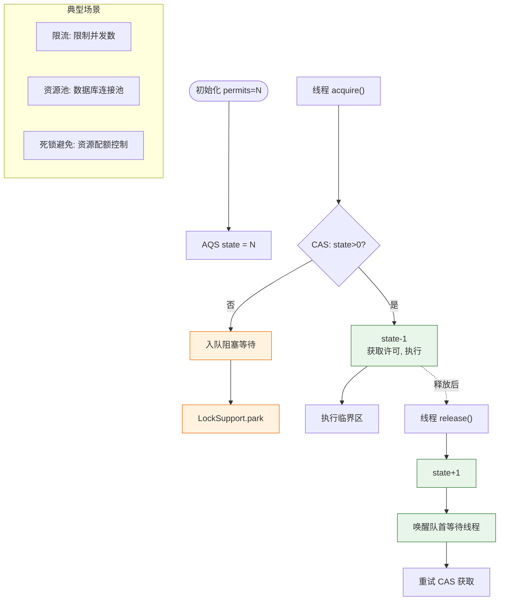

# 什么是信号量？

信号量（Semaphore）是用于控制多线程并发访问特定资源的同步机制，本质上是一个**非负的整数计数器**。

### 核心原理

信号量维护了一个许可集。线程在访问资源前，必须从信号量获取许可；访问完成后，必须将许可归还。

- **P 操作（wait/acquire）**：申请许可。如果计数器值 > 0，则计数器减 1，线程继续执行；如果计数器 = 0，线程阻塞等待，直到有许可可用。
- **V 操作（signal/release）**：释放许可。将计数器加 1，并唤醒等待的线程（如果有）。

### 数据结构示意图

```
     初始 State: permits = 2

     Thread A (acquire) ----> [ permits: 2 -> 1 ] ----> 允许访问
     Thread B (acquire) ----> [ permits: 1 -> 0 ] ----> 允许访问
     Thread C (acquire) ----> [ permits: 0 ]    ----> [ 阻塞队列 ]

     Thread A (release) --> [ permits: 0 -> 1 ] --> [ 唤醒 C ] --> C 获取许可进入
```

### 作用

1.  **控制并发数量**：限流。例如数据库连接池只允许 10 个连接，信号量初始值设为 10，超过 10 个线程将被阻塞等待。
2.  **线程同步**：生产者-消费者模型（虽然通常用 BlockingQueue，但信号量也可以实现）。

### 实战案例
在使用 Hystrix 或 Sentinel 进行资源隔离时，常用信号量来限制某个关键业务逻辑（如调用第三方 API）的最大并发数。例如设置 permits 为 20，当瞬时流量超过 20 时，多余的请求会被直接拒绝或进入等待队列，防止下游服务被压垮。

### 代码示例 (Java - 限流)
```java
// 允许 5 个线程同时执行
Semaphore semaphore = new Semaphore(5);

public void accessLimitedResource() throws InterruptedException {
    semaphore.acquire(); // 获取许可
    try {
        // 访问受保护的资源（如数据库连接）
        doSomethingDangerous();
    } finally {
        semaphore.release(); // 必须在 finally 中释放
    }
}
```

### 对比表格：Semaphore vs Mutex vs CountDownLatch

| 特性 | Semaphore (信号量) | Mutex (互斥锁) | CountDownLatch (倒计时器) |
| :--- | :--- | :--- | :--- |
| **核心计数** | 计数器可增可减 | 仅状态 0/1 | 仅减到 0 |
| **持有者** | 不区分线程 | 归属获取线程 | 不区分 |
| **重用性** | 可循环使用 | 可循环使用 | 不可逆，用完即废 |
| **用途** | 限流、资源池控制 | 互斥访问临界区 | 并发流程同步 |

### 常见考点

1.  **Semaphore 初始值为 1 时，和互斥锁有什么区别？**
    - 功能上类似，但语义不同。互斥锁强调“归属权”，通常由获取锁的线程释放；而信号量强调“计数”，任何人都可以 release，不需要是同一个线程获取的许可（这可能导致逻辑错误，但在机制上是允许的）。
2.  **Semaphore 的公平性选择（Fair vs Non-fair）？**
    - **公平模式**：线程按照请求的顺序（FIFO）获取许可，吞吐量较低但能避免线程饥饿。
    - **非公平模式**（默认）：允许插队，线程尝试获取许可时不检查排队情况，直接 CAS 抢占。通常吞吐量更高，因为减少了上下文切换和挂起操作。
3.  **`acquire(int permits)` 的应用场景？**
    - 用于处理批量资源的分配。例如数据库分库分表场景，一次查询可能需要同时获取 3 个分区的连接，此时可以一次性申请 3 个许可，避免部分成功导致的复杂回滚逻辑。

### Semaphore 信号量工作流程




## 记忆要点

- 四个必要条件：互斥、请求保持、不剥夺、循环等待（口诀：请勿剥夺循环）
- 排查工具：使用 jstack 命令或 JConsole 可直接检测出死锁循环
- 预防首选：保证加锁顺序一致性来破坏循环等待条件
- 恢复手段：使用 tryLock 设置超时时间来破坏请求与保持条件

## 结构化回答

**30 秒电梯演讲：** 像餐厅门口的等位牌，发了10个牌（信号量=10），有牌才能进，出来把牌还给门口，下一个人才能进。

**展开框架：**
1. **本质** — 本质是一个计数器，控制并发数。
2. **P操作（acquire）** — P操作（acquire）：计数减1，不够则阻塞。
3. **V操作（release）** — V操作（release）：计数加1，释放资源。

**收尾：** 这块我踩过一些坑，您想深入聊哪一段——原理细节、实战案例还是常见踩坑？

## 视频脚本

> 预计时长：3 分钟 | 由浅入深

| 时间 | 画面/字幕 | 口播台词 | 讲解要点 |
|------|----------|----------|----------|
| 0:00 | 标题卡：什么是信号量 | 今天这道题：什么是信号量。30 秒先给你讲清楚。 | 开场钩子 |
| 0:20 | 核心概念动画/示意图 | 像餐厅门口的等位牌，发了10个牌（信号量=10），有牌才能进，出来把牌还给门口，下一个人才能进。 | 核心概念 |
| 0:40 | 本质示意图 | 本质是一个计数器，控制并发数。 | 本质 |
| 1:10 | 总结卡 + 下期预告 | 记住今天这几个关键词，面试一定用得上。下期见。 | 收尾 |

---

## 延伸：Semaphore（信号量-控制同时访问的线程个数）是什么？

> 合并自 `conc-056`（相似度 70%）

### Semaphore（信号量）

#### 定义
`Semaphore` 用于控制同时访问特定资源的线程数量，它通过协调各个线程，以保证合理的使用公共资源。

#### 工作原理
*   **许可**：初始化时指定许可数量。
*   **获取**：线程调用 `acquire()` 获取许可，若无许可则阻塞，直到其他线程释放许可。
*   **释放**：线程调用 `release()` 归还许可。

#### 主要方法
*   `acquire()` / `acquire(int permits)`：获取许可，阻塞直到可用。
*   `release()` / `release(int permits)`：释放许可。
*   `tryAcquire()`：尝试获取，非阻塞，立即返回 true/false。
*   `availablePermits()`：获取当前可用的许可数。

#### 典型应用场景
**工厂机器使用示例**：
假设工厂有 5 台机器，8 个工人。一台机器只能一人使用。

```java
int N = 8; // 工人数
Semaphore semaphore = new Semaphore(5); // 5 台机器
// 工人线程运行代码
semaphore.acquire();
try {
    // 使用机器生产
} finally {
    semaphore.release(); // 必须释放
}

## 记忆要点

- 一句话定义：通过许可机制控制同时访问特定资源的线程数量
- 核心方法：acquire()阻塞获取许可，release()释放许可，tryAcquire()非阻塞尝试
- 记忆口诀：获取许可减一(不够等)，释放许可加一(唤醒等)
- 必做动作：release()必须在finally中执行，避免异常导致许可泄漏死锁

## 结构化回答


**30 秒电梯演讲：** 像景区限流，一次只放行固定数量的人。

**展开框架：**
1. **核心是许** — 核心是许可计数器acquire减，release加。
2. **用于限流和资源池** — 用于限流和资源池，允许多线程并发。
3. **计数为1时可** — 计数为1时可做互斥锁。

**收尾：** 这是我实战中的理解，您想深入哪一段？


## 视频脚本

> 预计时长：4 分钟 | 由浅入深

| 时间 | 画面/字幕 | 口播台词 | 讲解要点 |
|------|----------|----------|----------|
| 0:00 | 标题卡：Semaphore（信号量-控制同时访问的线程个数）是什么 | 今天这道题：Semaphore（信号量-控制同时访问的线程个数）是什么。30 秒先给你讲清楚。 | 开场钩子 |
| 0:20 | 核心概念动画/示意图 | 像景区限流，一次只放行固定数量的人。 | 核心概念 |
| 0:40 | 核心示意图 | 核心是许可计数器acquire减，release加。 | 核心 |
| 1:10 | 用于限流和资源池示意图 | 用于限流和资源池，允许多线程并发。 | 用于限流和资源池 |
| 1:40 | 总结卡 + 下期预告 | 记住今天这几个关键词，面试一定用得上。下期见。 | 收尾 |
