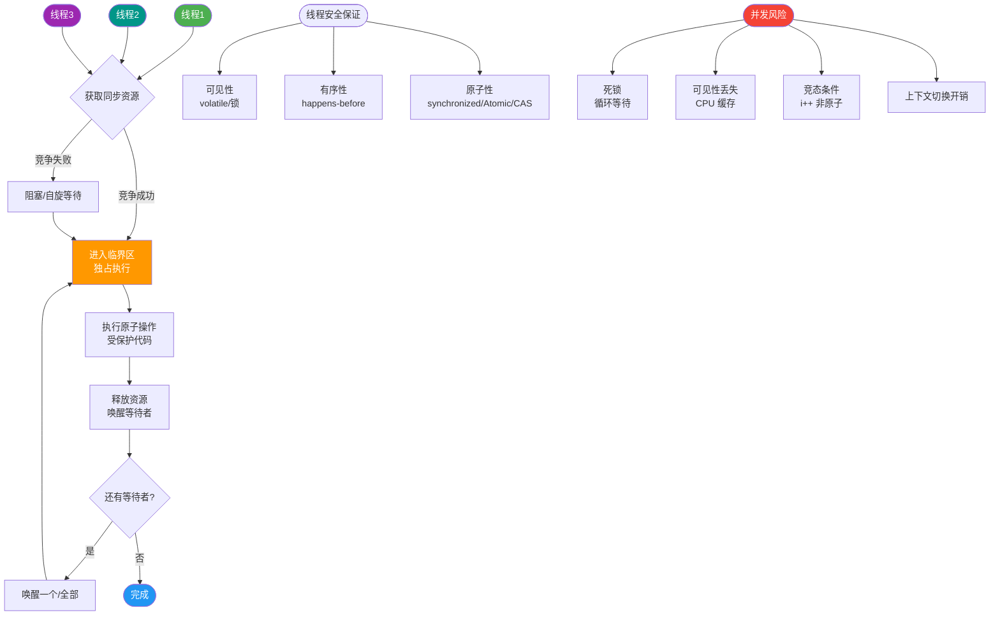

# 什么是新建状态（NEW）？

新建状态（NEW）是线程生命周期的初始状态。

**触发**：用 `new Thread()` 创建了线程对象，但还未调用 `start()`。

**特点**：
- 线程对象已分配内存、初始化字段，但尚未分配执行资源。
- 此时调用 `start()` 才进入 RUNNABLE 状态。
- 一个 Thread 对象只能 start 一次，重复 start 抛 IllegalThreadStateException。

**实战案例**：在使用线程池（如 `ThreadPoolExecutor`）时，如果核心线程满且队列满，线程池会尝试创建新线程。若此时线程数超过 `maximumPoolSize`，抛出 `RejectedExecutionException`；而在代码逻辑中如果不慎对已提交的 `Future` 任务重复执行，底层线程复用时若操作不当，可能会遇到 `IllegalThreadStateException`，甚至导致任务逻辑混乱。

**代码示例**：
```java
Thread thread = new Thread(() -> System.out.println("Running"));
System.out.println(thread.getState()); // 输出 NEW

thread.start(); 
// thread.start(); // 第二次调用会抛出 java.lang.IllegalThreadStateException
```

**完整线程生命周期（JDK 1.5+ 的 6 状态）：**
1.  **NEW**：已创建未启动。
2.  **RUNNABLE**：可运行（就绪 + 运行中，Java 不区分）。
3.  **BLOCKED**：等待 monitor 锁。
4.  **WAITING**：无限期等待（wait/join 无超时）。
5.  **TIMED_WAITING**：限期等待（sleep/wait(timeout)）。
6.  **TERMINATED**：执行完毕或异常退出。

```text
      start()               
   +----------+ sleep(n)   +----------------+
   |   NEW    |----------->|   RUNNABLE     |<----------+
   +----------+            +-------+--------+           |
           |                        |                    |
           |                        | lock/synchronized | yield()
           |                        v                    |
           |                 +------+--------+           |
           |                 |   BLOCKED     |           |
           |                 +---------------+           |
           |                        |                    |
           |             notify()/notifyAll()            |
           |                        |                    |
           |                        v                    |
           |                 +--------------+    wait()  |
           |                 |  WAITING    |<-----------+
           |                 +--------------+
           |                        |
           |                        | interrupt/timeout
           |                        v
           |                 +----------------+
           +---------------->|  TERMINATED   |
                             +----------------+
```

### 常见考点
1.  **run() 和 start() 的区别**：run() 是普通方法调用，主线程执行；start() 会启动新线程并调用 run()。
2.  **线程状态转换的具体触发条件**：如从 WAITING 到 RUNNABLE 需要什么操作（notify 或 interrupt）。
3.  **Java 线程状态与操作系统线程状态的对应**：Java 的 RUNNABLE 包含了 OS 的 Ready 和 Running，以及部分 Waiting（如 I/O 阻塞在 Java 中通常仍视为 RUNNABLE）。


## 核心流程图



## 记忆要点

- 定义：创建了线程对象但未调用 start()，此时仅分配内存无执行资源。
- 动作对比：start() 启动新线程，run() 仅普通方法调用（主线程执行）。
- 因为底层维护状态标志，所以一个 Thread 对象只能 start 一次，重复调用抛 IllegalThreadStateException。
- 生命周期记忆：新建 NEW 后，运行 RUNNABLE，遇锁 BLOCKED，无期 WAITING，限期 TIMED_WAITING，终老 TERMINATED。

## 结构化回答


**30 秒电梯演讲：** 员工（线程）已入职档案建立，但还没打卡上班。

**展开框架：**
1. **仅调用 new ** — Thread() 进入此状态
2. **尚未分配 CPU 资源** — 尚未分配 CPU 资源，不能运行
3. **必须且只能调用一** — 次 start() 启动

**收尾：** 这是我实战中的理解，您想深入哪一段？


## 视频脚本

> 预计时长：3 分钟 | 由浅入深

| 时间 | 画面/字幕 | 口播台词 | 讲解要点 |
|------|----------|----------|----------|
| 0:00 | 标题卡：什么是新建状态（NEW） | 今天这道题：什么是新建状态（NEW）。30 秒先给你讲清楚。 | 开场钩子 |
| 0:20 | 核心概念动画/示意图 | 员工（线程）已入职档案建立，但还没打卡上班。 | 核心概念 |
| 0:40 | 仅调用 new示意图 | 仅调用 new Thread() 进入此状态 | 仅调用 new |
| 1:10 | 总结卡 + 下期预告 | 记住今天这几个关键词，面试一定用得上。下期见。 | 收尾 |
