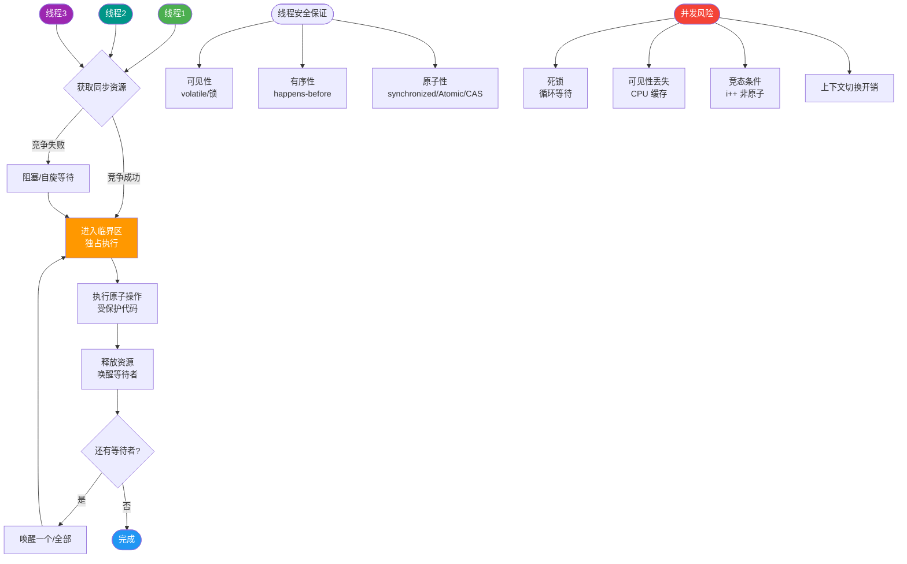
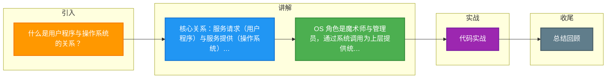

# 什么是用户程序与操作系统的关系？

用户程序与操作系统是**服务请求**与**服务提供**的关系。应用程序运行在操作系统之上，通过系统调用接口请求使用硬件资源。

**1. 操作系统的角色**
- **管理者**：统一管理 CPU、内存、I/O 等硬件资源，负责分配与回收，避免冲突。
- **服务者**：将复杂的硬件操作封装成系统调用，为上层应用提供统一、安全的接口。
- **魔术师**：通过虚拟化技术（虚拟内存、时间片），让每个进程都以为自己独占了所有硬件资源。

**2. 用户程序的角色**
- **使用者**：无法直接硬件，必须依赖操作系统提供的接口（API）来申请资源（如读写文件、网络通信）。
- **被管理者**：其生命周期（创建、调度、销毁）完全受操作系统控制。

**3. 核心交互方式：系统调用**
用户程序通过软中断或指令陷入内核态，由操作系统代为执行特权操作，完成后返回结果。

**实战案例**：在 Java 高并发服务中，频繁的 `Thread.sleep()` 或网络 I/O 会导致用户态与内核态的频繁切换。如果使用 NIO（如 Netty），可以利用 `epoll` 系统调用减少上下文切换次数；此外，直接通过 Unsafe 类操作堆外内存可以绕过操作系统内核的部分拷贝开销（但存在安全风险），这也是操作系统保护机制与高性能需求博弈的体现。

**代码示例（C 语言模拟系统调用）**：
```c
#include <unistd.h>

int main() {
    // 用户程序调用 write API，触发 INT 0x80/syscall 指令陷入内核
    // 内核将数据从用户态缓冲区拷贝到内核态，再写入磁盘
    char *msg = "Hello OS";
    write(1, msg, 8); // 1 是标准输出文件描述符
    return 0;
}
```

**对比表格**：

| 维度 | 用户态 | 内核态 |
| :--- | :--- | :--- |
| **权限** | 低 (Ring 3) | 高 (Ring 0) |
| **可执行指令** | 受限指令 (无法直接操作硬件) | 特权指令 (可操作所有硬件) |
| **内存访问** | 只能访问自己的虚拟地址空间 | 可访问所有内存空间 |
| **典型活动** | 应用逻辑计算、数据库查询 | 进程调度、文件系统、驱动控制 |

```text
 用户态 (Ring 3)              内核态 (Ring 0)
+-----------------+         +----------------+
| 应用程序  |         |   操作系统     |
+--------+--------+         +-------+--------+
         |                          |
         | 1. 请求 (open/read)      |
         |-------------------------->|
         |         (陷入/Trap)      |
         |                          |
         |                          | 2. 权限检查/执行
         |                          |    (驱动硬件)
         |                          |
         | 3. 返回结果              |
         |<--------------------------|
         |                          |
```

**补充细节**：
- **特权级**：通常 x86 架构下，用户态运行在 Ring 3，内核态运行在 Ring 0。系统调用是用户态进入内核态的唯一合法途径。
- **库函数封装**：用户程序通常调用的是由 C 语言库（如 glibc）封装好的 API（如 `fopen`），这些库函数内部再执行系统调用指令（如 x86 的 `int 0x80` 或 `syscall`）。

### 常见考点
1.  **系统调用的开销**：为什么系统调用比普通函数调用慢？（涉及用户态与内核态的切换，以及上下文的保存/恢复）。
2.  **中断与系统调用的区别**：中断是硬件或软件发出的异步信号，系统调用是应用程序主动发起的同步请求。
3.  **内核态与用户态的内存隔离**：内核空间具有最高权限，用户程序无法直接访问内核空间内存，防止系统崩溃。


## 核心流程图



## 记忆要点

- 核心关系：服务请求（用户程序）与服务提供（操作系统），App 无法直接操作硬件。
- OS 角色是魔术师与管理员，通过系统调用为上层提供统一安全的接口。
- 权限对比：用户态权限低（Ring 3）不可碰硬件，内核态权限高（Ring 0）掌控一切。
- 因为系统调用涉及状态切换与上下文保存，所以其开销远大于普通函数调用。

## 结构化回答


**30 秒电梯演讲：** 用户（程序）不能进厨房（硬件），只能通过服务员（系统）点菜（请求资源）。

**展开框架：**
1. **用户程序通过系统调** — 用户程序通过系统调用请求服务
2. **操作系统负责** — 操作系统负责硬件资源的分配与调度
3. **用户程序受操** — 用户程序受操作系统的监控与调度

**收尾：** 这是我实战中的理解，您想深入哪一段？


## 视频脚本

> 预计时长：3 分钟 | 由浅入深

| 时间 | 画面/字幕 | 口播台词 | 讲解要点 |
|------|----------|----------|----------|
| 0:00 | 标题卡：什么是用户程序与操作系统的关系 | 今天这道题：什么是用户程序与操作系统的关系。30 秒先给你讲清楚。 | 开场钩子 |
| 0:20 | 核心概念动画/示意图 | 用户（程序）不能进厨房（硬件），只能通过服务员（系统）点菜（请求资源）。 | 核心概念 |
| 0:40 | 用户程序示意图 | 用户程序通过系统调用请求服务 | 用户程序 |
| 1:10 | 总结卡 + 下期预告 | 记住今天这几个关键词，面试一定用得上。下期见。 | 收尾 |

### 视频流程图



