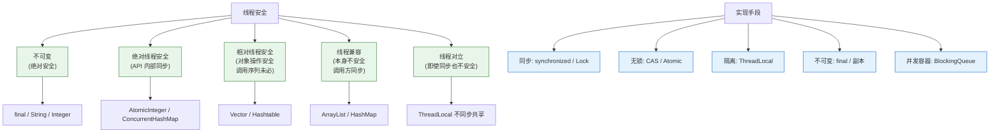
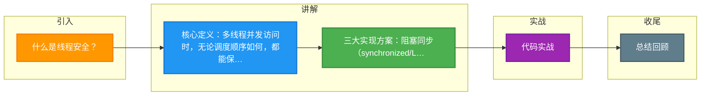

# 什么是线程安全？

线程安全指：多线程访问某个类/方法/变量时，无论调度顺序或并发多少，都能保证正确的行为（不出现数据竞争、脏读、丢失更新、死锁等）。

**判断标准（Brian Goetz）：**
- **不可变：** final 修饰、String/Integer，天然线程安全。
- **绝对线程安全：** 无论调用方如何使用都不需额外同步（极少，如 Vector 也不算）。
- **相对线程安全：** 单个操作线程安全，但连续调用需额外同步（如 Hashtable、ConcurrentHashMap）。
- **线程兼容：** 本身不安全，但调用方正确同步后可用（如 ArrayList）。
- **线程对立：** 无论是否同步都不安全（如 System.setSecurityManager）。

**Java 实现线程安全的方式：**
1. **互斥同步（阻塞式）：** 
   - `synchronized`：基于 JVM 实现，Monitor 锁，涉及用户态与内核态切换，有锁升级过程（偏向锁->轻量级锁->重量级锁）。
   - `ReentrantLock`：基于 AQS (AbstractQueuedSynchronizer) 实现，支持公平锁、可中断、超时等待。
2. **非阻塞同步：** 
   - **CAS (Compare-And-Swap)**：乐观锁机制，通过 CPU 指令（如 `cmpxchg`）保证原子性，避免挂起线程。
   - **Atomic 类**：如 `AtomicInteger`，利用 Unsafe 类操作内存偏移量。
   - *原理细节*：ABA 问题需通过版本号解决（如 `AtomicStampedReference`）；自旋等待可能消耗 CPU。
3. **无同步方案：** 
   - **ThreadLocal**：线程封闭，为每个线程提供独立变量副本。
   - **栈封闭**：局部变量，因为存储在栈帧中，不共享。
   - **不可变对象**：一旦创建状态不能修改，如 String。
4. **并发容器：** 
   - `ConcurrentHashMap`：分段锁（JDK7）或 CAS+synchronized（JDK8）。
   - `CopyOnWriteArrayList`：写时复制，适用于读多写少。

**实战案例**：在高并发场景下，曾遇到使用 `HashMap` 导致 CPU 100% 的死循环（JDK7 扩容死链问题），排查后替换为 `ConcurrentHashMap` 解决；另外，在简单的计数器场景误用 `volatile` 导致结果丢失，后改用 `AtomicInteger` 修复。

**代码示例**：
```java
// 错误示例：volatile 无法保证原子性
public class UnsafeCounter {
    private volatile int count = 0;
    public void increment() { count++; } // 非原子操作，并发会丢失更新
}

// 正确示例：使用 Atomic 类
public class SafeCounter {
    private final AtomicInteger count = new AtomicInteger(0);
    public void increment() { count.incrementAndGet(); } // CAS 保证原子性
}
```

**对比表格**：
| 特性 | synchronized | ReentrantLock |
| :--- | :--- | :--- |
| **实现层面** | JVM 关键字，底层依赖 Monitor | JDK API，基于 AQS (AbstractQueuedSynchronizer) |
| **锁释放** | 自动释放（代码块执行完或异常） | 必须在 `finally` 中手动调用 `unlock()` |
| **公平性** | 非公平锁 | 支持公平锁和非公平锁（构造器传参） |
| **中断机制** | 不可中断，必须等待锁释放 | 支持响应中断（`lockInterruptibly`） |
| **条件绑定** | 一个 Monitor 只能有一个 Condition 集 | 支持多个 Condition（`newCondition`），精细控制唤醒 |

## 常见考点
1. `synchronized` 和 `ReentrantLock` 的底层实现区别是什么？
2. 什么是 ABA 问题？如何解决？
3. 为什么 ConcurrentHashMap (JDK8) 放弃分段锁改用 CAS+synchronized？
4. volatile 能保证线程安全吗？它与 Atomic 类的区别？

### 线程安全分级与实现手段




## 记忆要点

- 核心定义：多线程并发访问时，无论调度顺序如何，都能保证行为的正确性（无数据竞争或脏读）。
- 三大实现方案：阻塞同步（synchronized/Lock）、非阻塞同步（CAS/Atomic）、无同步方案（ThreadLocal/不可变）。
- 锁对比：synchronized 是 JVM 关键字自动释放，ReentrantLock 是 API 需手动释放且支持公平与中断。
- 因为 i++ 非原子，所以 volatile 不能保证线程安全，必须用 Atomic 类或锁。

## 结构化回答


**30 秒电梯演讲：** 多个人同时改同一个文档，加锁后不会出现内容覆盖或错乱。

**展开框架：**
1. **原子性** — 原子性、可见性、有序性是核心要素
2. **CAS** — 实现手段包括互斥锁、CAS、无同步设计
3. **不可变对象天** — 不可变对象天生线程安全

**收尾：** 这是我实战中的理解，您想深入哪一段？


## 视频脚本

> 预计时长：3 分钟 | 由浅入深

| 时间 | 画面/字幕 | 口播台词 | 讲解要点 |
|------|----------|----------|----------|
| 0:00 | 标题卡：什么是线程安全 | 今天这道题：什么是线程安全。30 秒先给你讲清楚。 | 开场钩子 |
| 0:20 | 核心概念动画/示意图 | 多个人同时改同一个文档，加锁后不会出现内容覆盖或错乱。 | 核心概念 |
| 0:40 | 原子性示意图 | 原子性、可见性、有序性是核心要素 | 原子性 |
| 1:10 | 总结卡 + 下期预告 | 记住今天这几个关键词，面试一定用得上。下期见。 | 收尾 |

### 视频流程图



