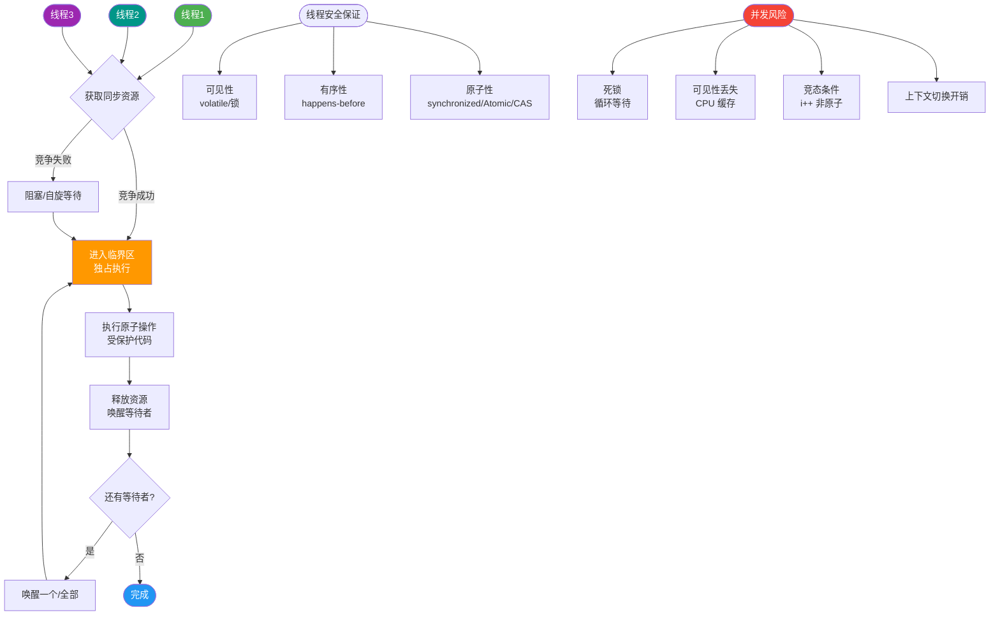

# 什么是线程的生命周期？

### Java 线程的生命周期

Java 线程（`Thread.State`）共有 6 种状态：

1. **NEW（新建）**：
   线程对象被创建，但尚未调用 `start()`。

2. **RUNNABLE（可运行）**：
   调用 `start()` 后进入此状态。它包含了操作系统的“就绪”和“运行”两种状态，表示线程正在运行或等待 CPU 调度。

3. **BLOCKED（阻塞）**：
   线程等待获取 monitor 锁（如进入 `synchronized` 块），处于锁池中。

4. **WAITING（等待）**：
   线程无限期等待其他线程唤醒。常见场景：
   - `Object.wait()`（等待 `notify`）
   - `Thread.join()`（等待目标线程终止）
   - `LockSupport.park()`

5. **TIMED_WAITING（超时等待）**：
   线程在指定时间内等待。常见场景：
   - `Thread.sleep(ms)`
   - `Object.wait(ms)`
   - `Thread.join(ms)`

6. **TERMINATED（终止）**：
   线程执行完毕或异常退出。

**状态流转详细图**：
```text
                     ┌───────────────────────────────────┐
                     │              NEW                   │
                     └───────────────┬───────────────────┘
                                     │ start()
                                     ▼
                    ┌───────────────────────────────────┐
                    │            RUNNABLE                │◀────────┐
                    └───────┬───────────────────┬───────┘         │
                            │                   │                │
               (竞争锁失败) │                   │ (yield)        │ (sleep/wait/join)
                            ▼                   │                ▼
              ┌──────────────────────┐         │    ┌───────────────────────┐
              │      BLOCKED         │         │    │    WAITING /          │
              │ (等待 synchronized锁) │         │    │ TIMED_WAITING         │
              └──────────┬───────────┘         │    │ (wait/sleep/join/park)│
                         │(获取锁)             │    └───────────┬───────────┘
                         └─────────────────────┘    │(超时/notify/park)
                                                          │
                                                          ▼
                                      ┌───────────────────────────────────┐
                                      │          TERMINATED               │
```

**实战案例**：在排查线上接口超时时，发现大量线程处于 `WAITING` 状态，堆栈显示卡在 `Object.wait()` 上。经查是第三方 SDK 内部锁未正确释放，导致调用线程无限期等待。修复后，我们在调用方增加了 `wait(timeout)` 超时机制，防止资源永久阻塞。

**代码示例**：
```java
// 线程状态监控代码片段
Thread t = new Thread(() -> {
    try {
        Thread.sleep(1000);
        synchronized (this) { wait(); }
    } catch (InterruptedException e) { e.printStackTrace(); }
});
t.start();
System.out.println(t.getState()); // 输出 TIMED_WAITING
```

## 常见考点
1. `yield()` 和 `sleep()` 的区别？
2. 为什么 `wait()` 必须在 `synchronized` 块中调用？
3. 如何区分线程是处于“正在运行”还是“准备就绪”？
4. `BLOCKED` 和 `WAITING` 的本质区别是什么？


## 核心流程图



## 记忆要点

- 六大状态口诀：新建、运行、阻塞、无限等待、限期等待、终止。
- RUNNABLE 是个大筐：Java 将操作系统的就绪和运行状态合并，甚至包含部分 I/O 阻塞。
- 因为获取 monitor 失败，所以进入 BLOCKED 状态（专指 synchronized 锁）。
- 无限期等待（WAITING）靠 notify/notifyAll 唤醒，限期等待（TIMED_WAITING）靠超时自动唤醒。

## 结构化回答

**30 秒电梯演讲：** 像玩游戏：新建角色、进场排队、战斗中、挂机等复活、暂离、退出游戏。

**展开框架：**
1. **NEW** — NEW 是对象创建未启动
2. **RUNNABLE** — RUNNABLE 涵盖就绪和运行两种系统状态
3. **BLOCKED** — BLOCKED 是等待锁，WAITING 是被动等待唤醒

**收尾：** 这块我踩过一些坑，您想深入聊哪一段——原理细节、实战案例还是常见踩坑？

## 视频脚本

> 预计时长：3 分钟 | 由浅入深

| 时间 | 画面/字幕 | 口播台词 | 讲解要点 |
|------|----------|----------|----------|
| 0:00 | 标题卡：什么是线程的生命周期 | 今天这道题：什么是线程的生命周期。30 秒先给你讲清楚。 | 开场钩子 |
| 0:20 | 核心概念动画/示意图 | 像玩游戏：新建角色、进场排队、战斗中、挂机等复活、暂离、退出游戏。 | 核心概念 |
| 0:40 | NEW示意图 | NEW 是对象创建未启动 | NEW |
| 1:10 | 总结卡 + 下期预告 | 记住今天这几个关键词，面试一定用得上。下期见。 | 收尾 |
